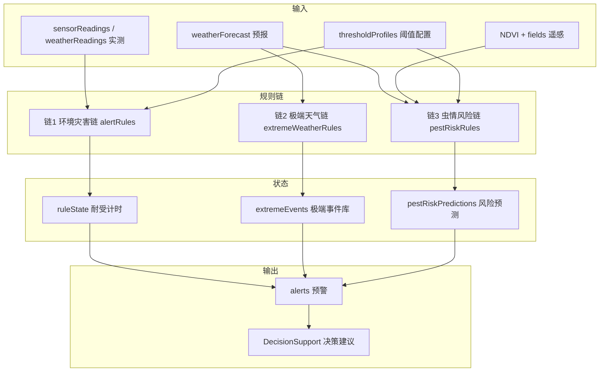

# 规则链建模与实现方案（气象 × 灾害 × 决策）

> 从 [`2.0非AI模块实现方案.md`](./2.0非AI模块实现方案.md) 提炼规则链部分，供 Mock / 前端对齐。  
> **本文管什么**：田间环境、天气预报、虫情风险 → 自动写预警 → 智慧决策页去读。  
> **本文不管什么**：上传叶子认病（PyTorch / Flask）；防治条目怎么写（见防治知识库文档）。  
> **状态**：方案已定；**网站侧规则链总线已按本方案编码**（见 [`2.0非AI模块实现方案.md`](./2.0非AI模块实现方案.md) 文首落地对照）。V1.1 只调整阅读顺序；阈值与链接口与实施计划一致。

---

## 一、先读懂：这套东西在给谁用

智慧决策页要回答：**这块地现在危不危险、该灌溉还是防高温。**  
认叶子上的病，靠 AI。田里热不热、干不干、未来会不会暴雨，**不靠神经网络**，靠人事先写好的判断，一条条串起来，所以叫 **规则链**。

可以把它想成三种「值班岗」，外加一个「闹钟」：

| 人话 | 方案里的名字 | 看什么 | 典型产出 |
|------|----------------|--------|----------|
| 现在是不是已经太干/太热（还要热够一段时间才喊） | **链 1** 环境灾害 | 此刻的气温、墒情 | 预警文案以 `[自动预警]` 开头 |
| 未来几天会不会极端天气 | **链 2** 极端天气 | 7 日预报 | `[极端天气]` |
| 病虫害风险高不高（多个迹象凑分） | **链 3** 虫情风险 | 预报 + 叶子长势 NDVI + 生育期等 | `[虫情风险]` |
| 别等人点按钮，定时把三岗都跑一遍 | **调度总线** | Mock 里约每 60 秒 | 把新预警写入 `alerts` |

三条链的结果都进 **同一张预警表**。预警中心展示列表；智慧决策按文案前缀给出灌溉、降温、防涝等建议。

和 Flask 里 P3「识病后再叠当前温湿墒」不是同一套：P3 只改 **这一次看图** 的级别；本文是 **地块自己定时冒出来的环境/天气/虫情预警**，继续走 Mock（3000 端口）。

三个容易卡住的词：

- **耐受计时**：超标不能瞬时报警（传感器抖一下会误报），要持续满若干分钟才写 `[自动预警]`。只属于链 1。
- **预报**：链 2 看的是未来 7 天，不是此刻传感器；命中就记事件，**没有**耐受。
- **虫情加权**：链 3 每条迹象 +1 分，分数加总后分成低/中/高风险，不是只看一个阈值。

数据怎么走（先有这张图，下一节起再拆开讲）：

```text
数据输入 → 规则匹配 → 状态累积（耐受）→ 预警产出 → 决策消费
```



图怎么读：左边是数据；中间三条链分开处理；链 1 还要记「已经超标多久」（`ruleState`）；最后都汇进 `alerts`，决策页只消费预警，不自己算气象。

---

## 二、三条链对照

| 链 | 触发数据 | 核心逻辑 | 输出前缀 | 实施优先级 |
|----|----------|----------|----------|------------|
| **链 1 环境灾害** | 实测温湿度 / 墒情 | 两档阈值 + 耐受时间 | `[自动预警]` | P0 |
| **链 2 极端天气** | 7 日预报 | 扫描极端条件，无耐受 | `[极端天气]` | P0 |
| **链 3 虫情风险** | 预报 + NDVI + 生育期 | 多因子各 +1 分再分级 | `[虫情风险]` | P1 |

共同约定：

- 规则定义与等级映射前后端共用（`src/utils/*.ts` 为源，Mock 侧 `require` 同逻辑或复制常量）。
- 每条自动预警带 `source: 'auto'`、`ruleId`、`pointId` / `fieldId`。
- 同规则在未恢复前不重复发（去重键：`pointId + ruleId + level`）。

---

## 三、链 1：现在的地，干不干、热不热

**作用**：拿田间 **此刻** 读数和阈值比，判断干旱、高温、涝渍；必须 **持续超标** 才自动预警。

例：墒情掉到 14%。若只维持 10 秒又回去，不报警。若一直低于告警线满 10 分钟，才写一条 `[自动预警]`。这就是耐受。

每条规则两档：轻一点的叫 **hint**（黄标），更严重的叫 **alert**（红标）。hint 要扛的时间通常更长。

### 3.1 输入 / 输出

| 方向 | 实体 | 关键字段 |
|------|------|----------|
| 输入 | `sensorReadings` 或 `weatherReadings` | `pointId`, `airTemp`, `soilVwc`, `recordedAt` |
| 配置 | `thresholdProfiles` | `hint` / `alert` 两套阈值 + `durationMinutes` |
| 状态 | `ruleState` | `pointId`, `rule`, `level`, `startedAt`, `lastSeenAt`, `alertEmitted` |
| 输出 | `alerts` | `level`, `message`, `source: 'auto'`, `ruleId` |

### 3.2 规则目录

| ruleId | 监测指标 | hint 条件 | alert 条件 | hint 耐受 | alert 耐受 |
|--------|----------|-----------|------------|-----------|------------|
| `water_stress` | `soilVwc` | < 25% | < 15% | 30 min | 10 min |
| `heat_stress` | `airTemp` | > 32℃ | > 38℃ | 30 min | 10 min |
| `waterlogging` | `soilVwc` | — | > 80% | — | 10 min |

无 `thresholdProfiles` 时用上表默认值；有配置则覆盖对应监测点。

### 3.3 耐受状态机

```text
                    ┌─────────────┐
    读数正常 ──────►│   NORMAL    │
                    └──────┬──────┘
                           │ 超 hint 阈值
                           ▼
                    ┌─────────────┐
                    │  ACCUMULATING│  记录 startedAt
                    │  (hint)      │
                    └──────┬──────┘
           恢复正常 │      │ 持续 ≥ duration 且未发过
                   │      ▼
                   │ ┌─────────────┐
                   │ │  EMITTED    │──► 写 alerts (medium/warning)
                   │ │  (hint)     │
                   │ └─────────────┘
                   │
                   │ 超 alert 阈值（更严重）
                   ▼
                    ┌─────────────┐
                    │  ACCUMULATING│
                    │  (alert)     │
                    └──────┬──────┘
                           │ 持续 ≥ duration
                           ▼
                    ┌─────────────┐
                    │  EMITTED    │──► 写 alerts (high/critical)
                    │  (alert)    │
                    └─────────────┘
```

读数回到正常，则清掉该点该规则的 `ruleState`，以后可以再触发。

```typescript
for (const rule of ENV_RULES) {
  const hit = rule.test(reading, profile)
  if (!hit) {
    clearState(pointId, rule.id)
    continue
  }
  const state = getOrCreateState(pointId, rule.id, hit.level)
  state.lastSeenAt = now
  const elapsed = minutesBetween(state.startedAt, now)
  if (elapsed >= hit.durationMinutes && !state.alertEmitted) {
    emitAlert({ pointId, ruleId: rule.id, level: hit.level, reading })
    state.alertEmitted = true
  }
}
```

### 3.4 等级与文案

| 规则层 level | 入库 `alerts.level` | UI |
|--------------|---------------------|-----|
| `hint` | `warning` 或 `medium` | 黄标 |
| `alert` | `critical` 或 `high` | 红标 |

```text
[自动预警] {pointName} - 土壤湿度 {soilVwc}% 低于告警阈值 {threshold}%，已持续 {minutes} min
[自动预警] {pointName} - 气温 {airTemp}℃ 超过告警阈值 {threshold}℃，已持续 {minutes} min
```

---

## 四、链 2：未来几天会不会极端天气

**作用**：扫 **未来 7 日预报**（最高温、最低温、降水、大风），识别区域性极端事件。预报本身已是「未来会怎样」，所以 **不做耐受**，命中就写入 `extremeEvents`，并可同步写预警。

### 4.1 输入 / 输出

| 方向 | 实体 | 关键字段 |
|------|------|----------|
| 输入 | `weatherForecast` | `pointId`, `days[]`：`tempMax`, `tempMin`, `precipMm`, `windMax` |
| 输出 | `extremeEvents` | `type`, `level`, `title`, `description`, `startAt`, `endAt` |
| 输出 | `alerts`（可选） | `[极端天气]` 前缀 |

### 4.2 规则目录

| ruleId | type | 触发条件 | 默认 level |
|--------|------|----------|------------|
| `extreme_heat_40` | `high_temperature` | 任一日 `tempMax ≥ 40` | `critical` |
| `extreme_heat_3d` | `high_temperature` | 连续 3 日 `tempMax ≥ 38` | `warning` |
| `extreme_frost` | `low_temperature` | 任一日 `tempMin ≤ -5` | `high` |
| `extreme_wind` | `strong_wind` | 任一日 `windMax ≥ 17.2`（8 级） | `warning` |
| `extreme_rain` | `heavy_rain` | 任一日 `precipMm ≥ 50` | `high` |

### 4.3 执行流程与文案

```text
weatherForecast[pointId].days
    → 逐条运行 EXTREME_RULES
    → 命中则 upsert extremeEvents（同 pointId+type+startAt 去重）
    → 若 persistAlert=true，写 alerts（source: auto, ruleId）
```

```text
[极端天气] {pointName} - {title}：{description}
```

示例：`[极端天气] 监测站 · 雄县 - 连续高温：未来 3 日最高温 ≥ 38℃`

---

## 五、链 3：病虫害风险高不高（凑分）

**作用**：把预报里的湿、雨、温度，和遥感长势、作物生育期等拼在一起，给出 **地块级** 发生风险。竞赛阶段只用能讲清楚的规则（列出命中了哪些因子），不接机器学习。

每条规则命中就 **风险分 +1** 并记一条人话原因。分数加总后定等级——这就是「加权 / 计数」。

### 5.1 输入 / 输出

| 方向 | 实体 | 关键字段 |
|------|------|----------|
| 输入 | `weatherForecast` | 7 日湿度、降水、均温 |
| 输入 | NDVI 摘要 / `ndviLayers` | 地块 `fieldId`、当前 NDVI、田间均值 |
| 输入 | `thresholdProfiles` | `crop`, `growthStage` |
| 输入 | `alerts`（可选） | 近期 `[AI识别]` 次数 |
| 输出 | `pestRiskPredictions` | `fieldId`, `riskLevel`, `factors[]`, `window` |
| 输出 | `alerts`（草稿） | `draft: true`，农技员确认后 `draft: false` |

### 5.2 规则目录与分数

| ruleId | 条件 | factor 示例 |
|--------|------|-------------|
| `humid_3d` | 连续 3 日预报湿度 > 80% | 连续 3 日湿度 > 80% |
| `rain_7d` | 7 日累计降水 > 80 mm | 7 日累计降水偏多 |
| `ndvi_low` | 地块 NDVI < 田间均值 × 0.85 | NDVI 低于田间均值 15% |
| `temp_range` | 5 日均温 22–28℃（小麦拔节–扬花期示例） | 气温处于病害流行适温区间 |
| `ai_recent` | 7 日内同地块 `[AI识别]` ≥ 2 次 | 近期 AI 已多次检出病虫害 |

| 累计分 | riskLevel |
|--------|-----------|
| 0–1 | `low` |
| 2–3 | `medium` |
| ≥ 4 | `high` |

```text
[虫情风险] 地块 {fieldName} - 风险等级：{high|medium}（{factor1}；{factor2}）
```

高风险默认写预警草稿 `draft: true`，经 `POST /alerts/{id}/publish` 确认后进入待办。

---

## 六、辅助：干旱指数（只给地图上色）

不属于独立预警链，给链 1 做空间可视化补充，**不直接写** `alerts`。

```typescript
droughtIndex = clamp(0, 100,
  (25 - soilVwc) * 2 + dryDays * 5
)
// dryDays = 预报中连续 precipMm < 1 的天数
```

用于 `useMonitorMarkers.ts` 监测点颜色。

---

## 七、调度总线：谁在什么时候跑这三条链

**总线** = 把三条链按固定节奏叫醒的那段循环，不是第四条「气象规则」。

Mock（`src/mock/server.ts`）启动后大约 **每 60 秒** 一轮：微调模拟传感 → 跑链 1 → 跑链 2 → 跑链 3 → 写回 `db.json`。前端 `stores/data.ts` 再以 30–60 秒轮询 `alerts`，竞赛演示不用 WebSocket。

```typescript
setInterval(async () => {
  tickSensorSimulation(db)           // 微调读数，追加 sensorReadings
  runChain1(db)                      // POST 内部：evaluateAllPoints
  runChain2(db, { persistAlert: true })
  runChain3(db, { draftOnly: true })
  persistDb(db)
}, 60_000)
```

| 步骤 | 调用 | 作用 |
|------|------|------|
| 采集 | `tickSensorSimulation` | 模拟 IoT 上报 |
| 链 1 | `POST /alerts/evaluate-all` | 环境灾害 |
| 链 2 | `POST /weather/extreme-events/evaluate` | 极端天气 |
| 链 3 | `POST /pest-risk/evaluate` | 虫情风险草稿 |

---

## 八、数据模型（`db.json` 扩展）

### 8.1 新增 / 扩展表

```json
{
  "thresholdProfiles": [],
  "sensorReadings": [],
  "ruleState": [],
  "weatherForecast": [],
  "extremeEvents": [],
  "pestRiskPredictions": [],
  "alerts": []
}
```

### 8.2 `alerts` 扩展字段

```json
{
  "id": 10,
  "pointId": 2,
  "fieldId": null,
  "level": "critical",
  "message": "[自动预警] 监测站 · 雄县 - 土壤湿度 12.8% ...",
  "time": 1720764000000,
  "handled": false,
  "source": "auto",
  "ruleId": "water_stress",
  "chain": "env",
  "draft": false
}
```

| 字段 | 说明 |
|------|------|
| `source` | `manual` \| `auto` |
| `ruleId` | 触发的规则标识，去重用 |
| `chain` | `env` \| `extreme` \| `pest` |
| `draft` | 链 3 草稿预警，默认 `false` |
| `fieldId` | 链 3 地块级预警时填写 |

### 8.3 实体关系

```text
monitorPoints 1 ── N sensorReadings
monitorPoints 1 ── 1 thresholdProfiles（可按作物多条）
monitorPoints 1 ── N ruleState
monitorPoints 1 ── 1 weatherForecast
monitorPoints 1 ── N extremeEvents

fields 1 ── 1 monitorPoints（monitorPointId）
fields 1 ── N pestRiskPredictions
fields 1 ── N ndviLayers

alerts N ── 1 monitorPoints（pointId）
alerts N ── 0..1 fields（fieldId，可选）
```

---

## 九、API 清单

| 方法 | 路径 | 所属链 | 说明 |
|------|------|--------|------|
| POST | `/disasterRules/evaluate` | 链 1 | 单点评估（扩展现有） |
| POST | `/alerts/evaluate-all` | 链 1 | 全站评估 + 落库 |
| GET | `/field-sensors/:pointId/thresholds` | 链 1 | 读阈值 |
| PUT | `/field-sensors/:pointId/thresholds` | 链 1 | 农技员改阈值 |
| GET | `/weather/forecast` | 链 2/3 | 7 日预报 |
| GET | `/weather/extreme-events` | 链 2 | 极端事件列表 |
| POST | `/weather/extreme-events/evaluate` | 链 2 | 扫描预报 |
| GET | `/pest-risk/predictions` | 链 3 | 地块风险 |
| POST | `/pest-risk/evaluate` | 链 3 | 批量算风险 + 草稿 |
| POST | `/alerts/:id/publish` | 链 3 | 草稿转正式 |

---

## 十、代码实现方案

### 10.1 目录结构

```text
src/
  types/
    rules.ts              # RuleHit, RuleState, ThresholdProfile, PestRisk...
  utils/
    alertRules.ts         # ★ 链1：规则定义 + evaluateReading + 耐受状态机
    extremeWeatherRules.ts# ★ 链2：预报扫描
    pestRiskRules.ts      # ★ 链3：多因子融合
    ruleLevelMap.ts       # hint/alert/extreme → alerts.level
  composables/
    useAlertEngine.ts     # 前端轮询、手动触发评估
  api/
    rules.ts              # evaluate-all、extreme、pest-risk 封装

deploy/api_mock/
  agriMockCore.cjs        # ★ 服务端调用同源规则（或复制常量）
  ruleChainRunner.cjs     # ★ 新建：调度三条链 + 写 db

src/mock/
  server.ts               # 注册路由 + setInterval 调度
  db.json                 # 扩展 schema
```

### 10.2 链 1 核心接口（`alertRules.ts`）

```typescript
export interface SensorSnapshot {
  pointId: number
  airTemp: number
  soilVwc: number
  recordedAt: string
}

export interface RuleHit {
  ruleId: string
  level: 'hint' | 'alert'
  durationMinutes: number
  reason: string
  metric: string
  value: number
  threshold: number
}

export function evaluateReading(
  reading: SensorSnapshot,
  profile: ThresholdProfile,
  states: RuleState[],
  now: Date
): {
  hits: RuleHit[]
  nextStates: RuleState[]
  alertsToCreate: NewAlert[]
}

export function buildEnvAlertMessage(
  pointName: string,
  hit: RuleHit,
  elapsedMinutes: number
): string
```

### 10.3 链 2 核心接口（`extremeWeatherRules.ts`）

```typescript
export function evaluateForecast(
  pointId: number,
  pointName: string,
  days: ForecastDay[]
): {
  events: ExtremeEvent[]
  alertsToCreate: NewAlert[]
}
```

### 10.4 链 3 核心接口（`pestRiskRules.ts`）

```typescript
export function evaluatePestRisk(input: {
  fieldId: number
  fieldName: string
  forecast: ForecastDay[]
  ndvi: number
  ndviFieldAvg: number
  crop: string
  growthStage: string
  recentAiAlertCount: number
}): {
  riskLevel: 'low' | 'medium' | 'high'
  factors: string[]
  window: string
  draftAlert?: NewAlert
}
```

### 10.5 Mock 侧改造（`agriMockCore.cjs`）

1. 将现有 `evaluateDisasterRules` 重构为调用链 1 逻辑（或内联同等规则 + 耐受）
2. 新增 `evaluateExtremeWeather(db, opts)`
3. 新增 `evaluatePestRiskAll(db, opts)`
4. 新增 `evaluateAllAndPersist(db)` 供调度器调用
5. 写 `db.json` 前对 `alerts` 做去重（`pointId + ruleId + chain`，未 handled 不重复发）

### 10.6 前端消费（决策页按前缀分支）

`DecisionSupport.vue` / `generateSuggestions()` 按 `message` 前缀：

| 前缀 | 建议来源 |
|------|----------|
| `[AI识别]` | `useTreatmentGuide`（看图识别，不是这三条链算出来的） |
| `[自动预警]` | 链 1 模板：灌溉 / 降温 / 排水 |
| `[极端天气]` | 链 2 模板：热害预案、防涝、防风 |
| `[虫情风险]` | 链 3 的 `factors` + 知识库（若已有 AI 检出） |

---

## 十一、分步实施计划

### 步骤 1：类型与链 1（约 3 天 · P0）

| 任务 | 文件 |
|------|------|
| 定义类型 | `src/types/rules.ts` |
| 实现链 1 + 耐受 | `src/utils/alertRules.ts` |
| 扩展 db + 种子数据 | `db.json`（雄县站低墒） |
| 改造 evaluate | `agriMockCore.cjs` |
| 新增 evaluate-all 路由 | `mock/server.ts` |
| 预警来源列 | `WarningSystem.vue` |

**验收**：雄县站持续低墒 → 10 min 内自动出现 `[自动预警]`。

### 步骤 2：链 2 + 预报数据（约 2 天 · P0）

| 任务 | 文件 |
|------|------|
| 实现链 2 | `src/utils/extremeWeatherRules.ts` |
| Mock 预报数据 | `db.json` → `weatherForecast` |
| API + 调度 | `mock/server.ts`、`agriMockCore.cjs` |
| 气象 Tab 展示 | `RelatedData.vue` |

**验收**：气象 Tab 见极端高温标识，预警中心有 `[极端天气]`。

### 步骤 3：调度总线（约 1 天 · P0）

| 任务 | 文件 |
|------|------|
| 60s 调度器 | `mock/server.ts` |
| 前端轮询 | `stores/data.ts`、`useAlertEngine.ts` |

**验收**：无人操作 5 min 内自动新增预警。

### 步骤 4：链 3 + 草稿发布（约 3 天 · P1）

| 任务 | 文件 |
|------|------|
| 实现链 3 | `src/utils/pestRiskRules.ts` |
| 地块高亮 | `RemoteSensingMap.vue` |
| 草稿确认 | `WarningSystem.vue` |
| 决策 factors | `DecisionSupport.vue` |

**验收**：河间田块高风险 → 草稿预警 → 确认 → 决策页见因子列表。

### 步骤 5：阈值配置 UI（约 2 天 · P1）

| 任务 | 文件 |
|------|------|
| 阈值表单 | `ThresholdSettings.vue` 或 `RelatedData.vue` Tab |
| PUT 接口 | `mock/server.ts` |

---

## 十二、验收清单

- [ ] 链 1：双阈值 + 耐受生效，瞬时抖动不误报
- [ ] 链 1：`ruleState` 恢复后清除，可再次触发
- [ ] 链 2：5 类极端规则可命中并写入 `extremeEvents`
- [ ] 链 2：预报更新后重新评估，同事件不重复入库
- [ ] 链 3：`factors` 至少 2 条可解释因子
- [ ] 链 3：高风险草稿 → 确认发布流程可用
- [ ] 调度：60s 周期内三条链均可触发
- [ ] 去重：同 `pointId+ruleId` 未处理时不重复发
- [ ] 决策页：四种前缀预警均有对应建议
- [ ] 自动预警占比 ≥ 70%（演示环境可调初始数据）

---

## 十三、与相关文档关系

| 文档 | 关系 |
|------|------|
| [`什么是规则链.md`](../概念/什么是规则链.md) | 规则链是什么；P3 与 2.0 两套如何平行 |
| [`智慧决策页面重构方案.md`](../页面/智慧决策页面重构方案.md) | 决策页消费本文产出的预警 |
| [`防治知识库实现方案.md`](./防治知识库实现方案.md) | 链 3 / `[AI识别]` 的防治文案 |
| [`新模型训后-P3-规则链与工程化实施计划.md`](../实施计划/新模型训后-P3-规则链与工程化实施计划.md) | Flask 侧「病名 × 当前环境」；**不替代**本文三条链 |
| [`规则链-2.0总线实施计划.md`](../实施计划/规则链-2.0总线实施计划.md) | 本文的可执行任务拆分（Mock 调度总线，TDD） |
| [`项目启动说明.md`](../项目启动说明.md) | Mock 3000 启动与联调 |

---

**文档版本**：V1.1（结构按阅读顺序重排；规则与接口同 V1.0）  
**最后更新**：2026-08-20  
**维护**：互联网＋项目组
