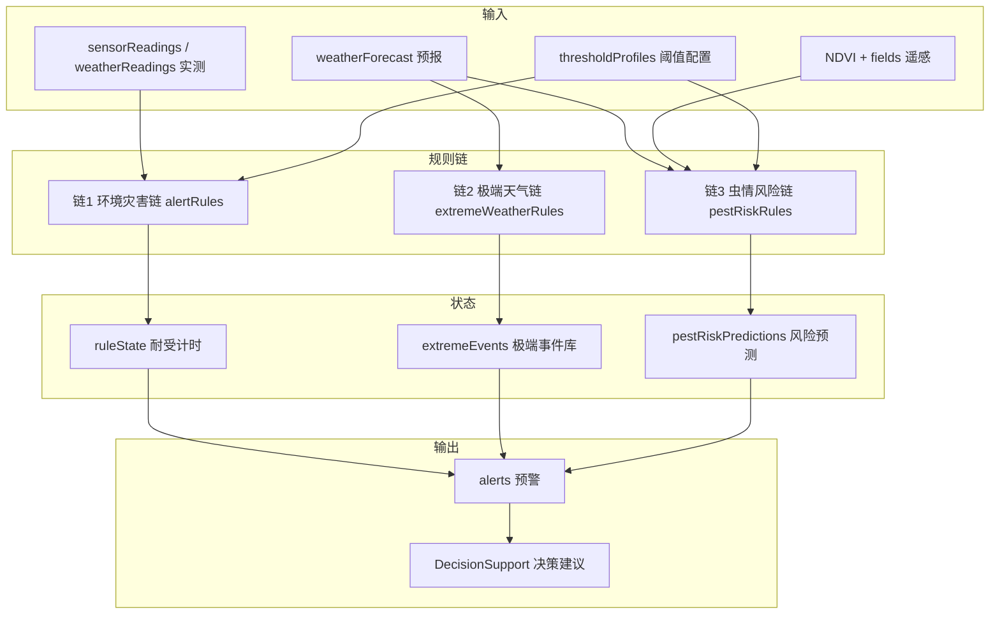

# 规则链建模与实现方案（气象 × 灾害 × 决策）

> 从 [`2.0非AI模块实现方案.md`](./2.0非AI模块实现方案.md) 提炼**规则链**部分，单独成文，供后端/Mock 与前端规则引擎开发对齐。  
> **范围**：环境传感规则链、极端天气规则链、虫情风险融合链、调度与预警落库。  
> **排除**：AI 识病推理、防治知识库内容编写（见 [`防治知识库实现方案.md`](./防治知识库实现方案.md)）。  
> **当前基准日**：2026-07-12 · **状态**：方案已定，待编码

---

## 一、规则链是什么

在本项目中，**气象和灾害的关系**不通过机器学习建模，而通过 **规则链（Rule Chain）** 表达：

```text
数据输入 → 规则匹配 → 状态累积（耐受）→ 预警产出 → 决策消费
```

系统共有 **三条规则链** + **一条调度总线**，最终统一写入 `alerts` 表，由预警中心与智慧决策页消费。



---

## 二、三条规则链总览

| 链 | 触发数据 | 核心逻辑 | 输出前缀 | 优先级 |
|----|----------|----------|----------|--------|
| **链1 环境灾害** | 实测温湿度/墒情 | 双阈值 + 耐受时间 | `[自动预警]` | P0 |
| **链2 极端天气** | 7 日预报 | 极端条件扫描（无耐受） | `[极端天气]` | P0 |
| **链3 虫情风险** | 预报 + NDVI + 生育期 | 多因子加权/计数 | `[虫情风险]` | P1 |

**统一原则**：

- 规则定义与等级映射**前后端共用**（`src/utils/*.ts` 为源，Mock 侧 `require` 同逻辑或复制常量）
- 每条自动预警带 `source: 'auto'`、`ruleId`、`pointId`/`fieldId`
- 同规则在**未恢复**前不重复发预警（去重键：`pointId + ruleId + level`）

---

## 三、链1：环境灾害规则链

### 3.1 业务语义

将**田间实测**与**阈值配置**比较，判断当前是否处于干旱、高温、涝渍等环境胁迫，并在**持续超标**后自动产生分级预警。

### 3.2 输入 / 输出

| 方向 | 实体 | 关键字段 |
|------|------|----------|
| 输入 | `sensorReadings` 或 `weatherReadings` | `pointId`, `airTemp`, `soilVwc`, `recordedAt` |
| 配置 | `thresholdProfiles` | `hint` / `alert` 两套阈值 + `durationMinutes` |
| 状态 | `ruleState` | `pointId`, `rule`, `level`, `startedAt`, `lastSeenAt`, `alertEmitted` |
| 输出 | `alerts` | `level`, `message`, `source: 'auto'`, `ruleId` |

### 3.3 规则目录（链1）

| ruleId | 监测指标 | hint 条件 | alert 条件 | hint 耐受 | alert 耐受 |
|--------|----------|-----------|------------|-----------|------------|
| `water_stress` | `soilVwc` | < 25% | < 15% | 30 min | 10 min |
| `heat_stress` | `airTemp` | > 32℃ | > 38℃ | 30 min | 10 min |
| `waterlogging` | `soilVwc` | — | > 80% | — | 10 min |

> 无 `thresholdProfiles` 时使用上表默认值；有配置则覆盖对应监测点。

### 3.4 状态机（耐受逻辑）

```text
                    ┌─────────────┐
    读数正常 ──────►│   NORMAL    │
                    └──────┬──────┘
                           │ 超 hint 阈值
                           ▼
                    ┌─────────────┐
                    │  ACCUMULATING│  记录 startedAt
                    │  (hint)      │
                    └──────┬──────┘
           恢复正常 │      │ 持续 ≥ duration 且未发过
                   │      ▼
                   │ ┌─────────────┐
                   │ │  EMITTED    │──► 写 alerts (medium/warning)
                   │ │  (hint)     │
                   │ └─────────────┘
                   │
                   │ 超 alert 阈值（更严重）
                   ▼
                    ┌─────────────┐
                    │  ACCUMULATING│
                    │  (alert)     │
                    └──────┬──────┘
                           │ 持续 ≥ duration
                           ▼
                    ┌─────────────┐
                    │  EMITTED    │──► 写 alerts (high/critical)
                    │  (alert)    │
                    └─────────────┘
```

**伪代码**：

```typescript
for (const rule of ENV_RULES) {
  const hit = rule.test(reading, profile)
  if (!hit) {
    clearState(pointId, rule.id)
    continue
  }
  const state = getOrCreateState(pointId, rule.id, hit.level)
  state.lastSeenAt = now
  const elapsed = minutesBetween(state.startedAt, now)
  if (elapsed >= hit.durationMinutes && !state.alertEmitted) {
    emitAlert({ pointId, ruleId: rule.id, level: hit.level, reading })
    state.alertEmitted = true
  }
}
```

### 3.5 等级映射

| 规则层 level | 入库 `alerts.level` | UI |
|--------------|---------------------|-----|
| `hint` | `warning` 或 `medium` | 黄标 |
| `alert` | `critical` 或 `high` | 红标 |

### 3.6 预警文案模板

```text
[自动预警] {pointName} - 土壤湿度 {soilVwc}% 低于告警阈值 {threshold}%，已持续 {minutes} min
[自动预警] {pointName} - 气温 {airTemp}℃ 超过告警阈值 {threshold}℃，已持续 {minutes} min
```

---

## 四、链2：极端天气规则链

### 4.1 业务语义

扫描**未来 7 日预报**，识别高温、暴雨、大风、冻害等**区域性极端事件**。与链1不同：**不做耐受计时**（预报本身已是未来时段判断），命中即生成 `extremeEvents` 并可同步写预警。

### 4.2 输入 / 输出

| 方向 | 实体 | 关键字段 |
|------|------|----------|
| 输入 | `weatherForecast` | `pointId`, `days[]`：`tempMax`, `tempMin`, `precipMm`, `windMax` |
| 输出 | `extremeEvents` | `type`, `level`, `title`, `description`, `startAt`, `endAt` |
| 输出 | `alerts`（可选） | `[极端天气]` 前缀 |

### 4.3 规则目录（链2）

| ruleId | type | 触发条件 | 默认 level |
|--------|------|----------|------------|
| `extreme_heat_40` | `high_temperature` | 任一日 `tempMax ≥ 40` | `critical` |
| `extreme_heat_3d` | `high_temperature` | 连续 3 日 `tempMax ≥ 38` | `warning` |
| `extreme_frost` | `low_temperature` | 任一日 `tempMin ≤ -5` | `high` |
| `extreme_wind` | `strong_wind` | 任一日 `windMax ≥ 17.2`（8 级） | `warning` |
| `extreme_rain` | `heavy_rain` | 任一日 `precipMm ≥ 50` | `high` |

### 4.4 执行流程

```text
weatherForecast[pointId].days
    → 逐条运行 EXTREME_RULES
    → 命中则 upsert extremeEvents（同 pointId+type+startAt 去重）
    → 若 persistAlert=true，写 alerts（source: auto, ruleId）
```

### 4.5 预警文案模板

```text
[极端天气] {pointName} - {title}：{description}
```

示例：`[极端天气] 监测站 · 雄县 - 连续高温：未来 3 日最高温 ≥ 38℃`

---

## 五、链3：虫情风险融合规则链

### 5.1 业务语义

将**气象预报环境**与**遥感长势**、**作物生育期**融合，输出地块级病虫害发生风险。竞赛阶段用**可解释规则**（因子列表），不接 ML。

### 5.2 输入 / 输出

| 方向 | 实体 | 关键字段 |
|------|------|----------|
| 输入 | `weatherForecast` | 7 日湿度、降水、均温 |
| 输入 | NDVI 摘要 / `ndviLayers` | 地块 `fieldId`、当前 NDVI、田间均值 |
| 输入 | `thresholdProfiles` | `crop`, `growthStage` |
| 输入 | `alerts`（可选） | 近期 `[AI识别]` 次数 |
| 输出 | `pestRiskPredictions` | `fieldId`, `riskLevel`, `factors[]`, `window` |
| 输出 | `alerts`（草稿） | `draft: true`，农技员确认后 `draft: false` |

### 5.3 规则目录（链3）

每条规则贡献 **风险分 +1** 与一条 **factor 文案**：

| ruleId | 条件 | factor 示例 |
|--------|------|-------------|
| `humid_3d` | 连续 3 日预报湿度 > 80% | 连续 3 日湿度 > 80% |
| `rain_7d` | 7 日累计降水 > 80 mm | 7 日累计降水偏多 |
| `ndvi_low` | 地块 NDVI < 田间均值 × 0.85 | NDVI 低于田间均值 15% |
| `temp_range` | 5 日均温 22–28℃（小麦拔节–扬花期示例） | 气温处于病害流行适温区间 |
| `ai_recent` | 7 日内同地块 `[AI识别]` ≥ 2 次 | 近期 AI 已多次检出病虫害 |

**风险等级**：

| 累计分 | riskLevel |
|--------|-----------|
| 0–1 | `low` |
| 2–3 | `medium` |
| ≥ 4 | `high` |

### 5.4 预警文案模板

```text
[虫情风险] 地块 {fieldName} - 风险等级：{high|medium}（{factor1}；{factor2}）
```

高风险（`high`）默认写 **预警草稿** `draft: true`，经 `POST /alerts/{id}/publish` 确认后进入待办队列。

---

## 六、辅助规则：干旱指数（空间着色）

不属于独立预警链，为链1 的**空间可视化补充**：

```typescript
droughtIndex = clamp(0, 100,
  (25 - soilVwc) * 2 + dryDays * 5
)
// dryDays = 预报中连续 precipMm < 1 的天数
```

用于 `useMonitorMarkers.ts` 监测点颜色，不直接写 `alerts`。

---

## 七、调度总线（链的触发方式）

Mock 服务启动后，**每 60 秒**执行一轮（`src/mock/server.ts`）：

```typescript
setInterval(async () => {
  tickSensorSimulation(db)           // 微调读数，追加 sensorReadings
  runChain1(db)                      // POST 内部：evaluateAllPoints
  runChain2(db, { persistAlert: true })
  runChain3(db, { draftOnly: true })
  persistDb(db)
}, 60_000)
```

前端 `stores/data.ts` 同步 **30–60s** 轮询 `alerts`、`monitorPoints`，无需 WebSocket（竞赛演示够用）。

| 步骤 | 调用 | 作用 |
|------|------|------|
| 采集 | `tickSensorSimulation` | 模拟 IoT 上报 |
| 链1 | `POST /alerts/evaluate-all` | 环境灾害 |
| 链2 | `POST /weather/extreme-events/evaluate` | 极端天气 |
| 链3 | `POST /pest-risk/evaluate` | 虫情风险草稿 |

---

## 八、数据模型（`db.json` 扩展）

### 8.1 新增 / 扩展表

```json
{
  "thresholdProfiles": [],
  "sensorReadings": [],
  "ruleState": [],
  "weatherForecast": [],
  "extremeEvents": [],
  "pestRiskPredictions": [],
  "alerts": []
}
```

### 8.2 `alerts` 扩展字段

```json
{
  "id": 10,
  "pointId": 2,
  "fieldId": null,
  "level": "critical",
  "message": "[自动预警] 监测站 · 雄县 - 土壤湿度 12.8% ...",
  "time": 1720764000000,
  "handled": false,
  "source": "auto",
  "ruleId": "water_stress",
  "chain": "env",
  "draft": false
}
```

| 字段 | 说明 |
|------|------|
| `source` | `manual` \| `auto` |
| `ruleId` | 触发的规则标识，去重用 |
| `chain` | `env` \| `extreme` \| `pest` |
| `draft` | 链3 草稿预警，默认 `false` |
| `fieldId` | 链3 地块级预警时填写 |

### 8.3 实体关系

```text
monitorPoints 1 ── N sensorReadings
monitorPoints 1 ── 1 thresholdProfiles（可按作物多条）
monitorPoints 1 ── N ruleState
monitorPoints 1 ── 1 weatherForecast
monitorPoints 1 ── N extremeEvents

fields 1 ── 1 monitorPoints（monitorPointId）
fields 1 ── N pestRiskPredictions
fields 1 ── N ndviLayers

alerts N ── 1 monitorPoints（pointId）
alerts N ── 0..1 fields（fieldId，可选）
```

---

## 九、API 清单

| 方法 | 路径 | 所属链 | 说明 |
|------|------|--------|------|
| POST | `/disasterRules/evaluate` | 链1 | 单点评估（扩展现有） |
| POST | `/alerts/evaluate-all` | 链1 | 全站评估 + 落库 |
| GET | `/field-sensors/:pointId/thresholds` | 链1 | 读阈值 |
| PUT | `/field-sensors/:pointId/thresholds` | 链1 | 农技员改阈值 |
| GET | `/weather/forecast` | 链2/3 | 7 日预报 |
| GET | `/weather/extreme-events` | 链2 | 极端事件列表 |
| POST | `/weather/extreme-events/evaluate` | 链2 | 扫描预报 |
| GET | `/pest-risk/predictions` | 链3 | 地块风险 |
| POST | `/pest-risk/evaluate` | 链3 | 批量算风险 + 草稿 |
| POST | `/alerts/:id/publish` | 链3 | 草稿转正式 |

---

## 十、代码实现方案

### 10.1 目录结构

```text
src/
  types/
    rules.ts              # RuleHit, RuleState, ThresholdProfile, PestRisk...
  utils/
    alertRules.ts         # ★ 链1：规则定义 + evaluateReading + 耐受状态机
    extremeWeatherRules.ts# ★ 链2：预报扫描
    pestRiskRules.ts      # ★ 链3：多因子融合
    ruleLevelMap.ts       # hint/alert/extreme → alerts.level
  composables/
    useAlertEngine.ts     # 前端轮询、手动触发评估
  api/
    rules.ts              # evaluate-all、extreme、pest-risk 封装

deploy/api_mock/
  agriMockCore.cjs        # ★ 服务端调用同源规则（或复制常量）
  ruleChainRunner.cjs     # ★ 新建：调度三条链 + 写 db

src/mock/
  server.ts               # 注册路由 + setInterval 调度
  db.json                 # 扩展 schema
```

### 10.2 链1 核心接口（`alertRules.ts`）

```typescript
export interface SensorSnapshot {
  pointId: number
  airTemp: number
  soilVwc: number
  recordedAt: string
}

export interface RuleHit {
  ruleId: string
  level: 'hint' | 'alert'
  durationMinutes: number
  reason: string
  metric: string
  value: number
  threshold: number
}

export function evaluateReading(
  reading: SensorSnapshot,
  profile: ThresholdProfile,
  states: RuleState[],
  now: Date
): {
  hits: RuleHit[]
  nextStates: RuleState[]
  alertsToCreate: NewAlert[]
}

export function buildEnvAlertMessage(
  pointName: string,
  hit: RuleHit,
  elapsedMinutes: number
): string
```

### 10.3 链2 核心接口（`extremeWeatherRules.ts`）

```typescript
export function evaluateForecast(
  pointId: number,
  pointName: string,
  days: ForecastDay[]
): {
  events: ExtremeEvent[]
  alertsToCreate: NewAlert[]
}
```

### 10.4 链3 核心接口（`pestRiskRules.ts`）

```typescript
export function evaluatePestRisk(input: {
  fieldId: number
  fieldName: string
  forecast: ForecastDay[]
  ndvi: number
  ndviFieldAvg: number
  crop: string
  growthStage: string
  recentAiAlertCount: number
}): {
  riskLevel: 'low' | 'medium' | 'high'
  factors: string[]
  window: string
  draftAlert?: NewAlert
}
```

### 10.5 Mock 侧改造（`agriMockCore.cjs`）

1. 将现有 `evaluateDisasterRules` **重构**为调用链1 逻辑（或内联同等规则 + 耐受）
2. 新增 `evaluateExtremeWeather(db, opts)`
3. 新增 `evaluatePestRiskAll(db, opts)`
4. 新增 `evaluateAllAndPersist(db)` 供调度器调用
5. 写 `db.json` 前对 `alerts` 做**去重**（`pointId + ruleId + chain`，未 handled 不重复发）

### 10.6 前端消费（决策页规则解析）

`DecisionSupport.vue` / `generateSuggestions()` 按 `message` 前缀分支：

| 前缀 | 建议来源 |
|------|----------|
| `[AI识别]` | `useTreatmentGuide`（已完成） |
| `[自动预警]` | 链1 模板：灌溉/降温/排水 |
| `[极端天气]` | 链2 模板：热害预案、防涝、防风 |
| `[虫情风险]` | 链3 `factors` + 知识库（若已有 AI 检出） |

---

## 十一、分步实施计划

### 步骤 1：类型与链1（约 3 天 · P0）

| 任务 | 文件 |
|------|------|
| 定义类型 | `src/types/rules.ts` |
| 实现链1 + 耐受 | `src/utils/alertRules.ts` |
| 扩展 db + 种子数据 | `db.json`（雄县站低墒） |
| 改造 evaluate | `agriMockCore.cjs` |
| 新增 evaluate-all 路由 | `mock/server.ts` |
| 预警来源列 | `WarningSystem.vue` |

**验收**：雄县站持续低墒 → 10 min 内自动出现 `[自动预警]`。

### 步骤 2：链2 + 预报数据（约 2 天 · P0）

| 任务 | 文件 |
|------|------|
| 实现链2 | `src/utils/extremeWeatherRules.ts` |
| Mock 预报数据 | `db.json` → `weatherForecast` |
| API + 调度 | `mock/server.ts`、`agriMockCore.cjs` |
| 气象 Tab 展示 | `RelatedData.vue` |

**验收**：气象 Tab 见极端高温标识，预警中心有 `[极端天气]`。

### 步骤 3：调度总线（约 1 天 · P0）

| 任务 | 文件 |
|------|------|
| 60s 调度器 | `mock/server.ts` |
| 前端轮询 | `stores/data.ts`、`useAlertEngine.ts` |

**验收**：无人操作 5 min 内自动新增预警。

### 步骤 4：链3 + 草稿发布（约 3 天 · P1）

| 任务 | 文件 |
|------|------|
| 实现链3 | `src/utils/pestRiskRules.ts` |
| 地块高亮 | `RemoteSensingMap.vue` |
| 草稿确认 | `WarningSystem.vue` |
| 决策 factors | `DecisionSupport.vue` |

**验收**：河间田块高风险 → 草稿预警 → 确认 → 决策页见因子列表。

### 步骤 5：阈值配置 UI（约 2 天 · P1）

| 任务 | 文件 |
|------|------|
| 阈值表单 | `ThresholdSettings.vue` 或 `RelatedData.vue` Tab |
| PUT 接口 | `mock/server.ts` |

---

## 十二、验收清单

- [ ] 链1：双阈值 + 耐受生效，瞬时抖动不误报
- [ ] 链1：`ruleState` 恢复后清除，可再次触发
- [ ] 链2：5 类极端规则可命中并写入 `extremeEvents`
- [ ] 链2：预报更新后重新评估，同事件不重复入库
- [ ] 链3：`factors` 至少 2 条可解释因子
- [ ] 链3：高风险草稿 → 确认发布流程可用
- [ ] 调度：60s 周期内三条链均可触发
- [ ] 去重：同 `pointId+ruleId` 未处理时不重复发
- [ ] 决策页：四种前缀预警均有对应建议
- [ ] 自动预警占比 ≥ 70%（演示环境可调初始数据）

---

## 十三、与相关文档关系

| 文档 | 关系 |
|------|------|
| [`2.0非AI模块实现方案.md`](./2.0非AI模块实现方案.md) |  parent；本文是其规则链子文档 |
| [`智慧决策页面重构方案.md`](./智慧决策页面重构方案.md) | 决策页消费规则链输出 |
| [`防治知识库实现方案.md`](./防治知识库实现方案.md) | 链3 / `[AI识别]` 的防治文案来源 |
| [`项目启动说明.md`](./项目启动说明.md) | Mock 3000 启动与联调 |

---

**文档版本**：V1.0  
**最后更新**：2026-07-12  
**维护**：互联网＋项目组
