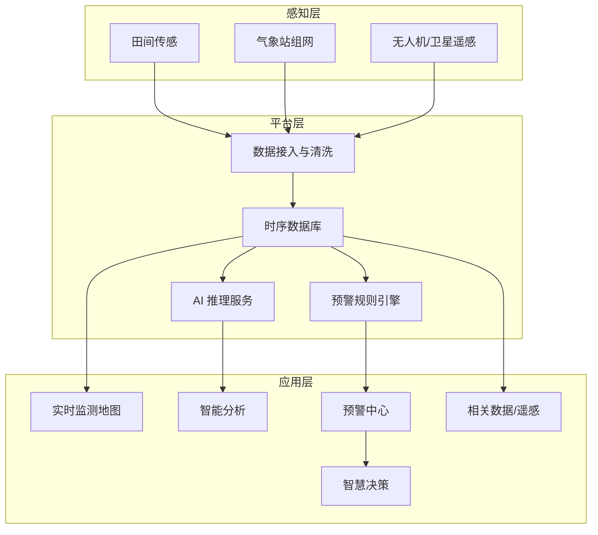

# AI 作物灾害智慧监测预警系统 — 互联网＋ 2.0 功能扩展规划

> 原始方向提纲已并入本文，不再单独维护 `2.0.md`。面向「互联网＋」竞赛申报与系统迭代，供产品、前端、后端、算法与答辩对齐。  
> **任务优先级与本周清单**见 [`下一阶段任务与流程.md`](./下一阶段任务与流程.md)。  
> **当前基准日**：2026-08-22

---

## 一、扩展背景与目标

### 1.1 竞赛定位

项目已以 **「挑战杯」（小挑）省赛一等奖** 完成 V1.0.4 系统验证（2026 年上半年）；现承接该成果，备战 **秋季中国国际大学生创新大赛（2026）**（原「互联网＋」）。2.0 扩展重点是在既有平台上补齐「空地一体、感知—识别—预警—决策」闭环。

系统在 V1.0.4 基础上，从「灾害监测预警演示平台」升级为「**空地一体、感知—识别—预警—决策闭环**」的智慧农业解决方案，突出：

- **产业痛点**：作物灾害发现晚、防治盲目、气象与虫情数据割裂、基层农技服务覆盖不足。
- **技术亮点**：物联网传感 + 气象站组网 + 深度学习病虫害识别 + 遥感/无人机 NDVI 监测 + 多源融合预警。
- **应用价值**：服务合作社、农技员、管理部门，实现「早发现、准预警、精防治」。

### 1.2 扩展总目标

| 维度 | V1.0 当时 | 2.0 目标 | 2026-08-22（Mock / 本地） |
|------|-----------|----------|---------------------------|
| 数据来源 | Mock / 少量模拟监测点 | 田间传感 + 气象站 + 遥感/无人机 | Mock 多源已演示；**未接真实气象 API / 真设备** |
| 预警能力 | 单阈值、人工新建 | 双阈值 + 耐受时间 + 极端天气联动 | ✅ 三条规则链 + 60s 调度 |
| 智能分析 | 图片上传模拟识别 | 可训练 AI + 网站真实推理 | ✅ 阶段 A 已接 Flask；Serving 按 **23 类**；**磁盘权重仍 8 类** |
| 空间可视化 | 监测点地图 + NDVI/墒情 | 区域气象分布 + 历史回放 | ✅ 7 日传感曲线 / 多站 / 地图抽屉；❌ 插值热力图（[方案](../网站/方案/气象插值热力图方案.md)） |
| 决策支持 | 规则化建议文案 | 气象×虫情 + 针对性防治 | ✅ 防治库 23 类 + 决策页虫情因子 |
| 系统自主性 | 人工刷新、手动处理 | 自动采集、自动预警、自动推送 | ✅ 自动预警 / 铃铛 / 真日报 txt；❌ 短信微信、审计日志 |

---

## 二、现状基线（已有能力）

以下能力已在 **小挑省赛一等奖** 周期内交付（V1.0.4），互联网＋ 2.0 在此基础上增量。下表「2.0 增量」列为 2026-08-22 演示环境状态。

| 模块 | V1.0.4 已有 | 2.0 增量（演示） | 路由/入口 |
|------|-------------|------------------|-----------|
| 用户与角色 | 登录、合作社/农技员/管理员 | 未改权限模型 | `/login` |
| 实时监测 | 监测点地图、温湿度弹窗 | 在线/离线、点选抽屉 | `/map` |
| 智能分析 | 上传演示 | 真实 Flask 推理、作物掩码、topk、防治、batch；**须 23 类权重才能启动 :5000** | `/analysis` |
| 预警中心 | 分级列表、新建/处理 | `[自动预警]` / `[极端天气]` / `[AI识别]` / 虫情草稿 | `/warnings` |
| 智慧决策 | 规则建议 | 防治知识库 + 虫情因子 | `/decision` |
| 相关数据 | NDVI、墒情、气象快照 | 7 日预报表、传感双轴、NDVI 高风险描边、真日报 | `/related-data` |

**2.0 原则**：在现有 Vue 3 + Pinia + Leaflet + Ant Design Vue 上增量；非 AI **不改 Flask**。

---

## 三、功能扩展详述

勾选含义：**演示环境（Mock + 本地权重）已具备**。未勾选 = 仍缺或仅方案级。

### 3.1 田间检测（环境感知层）

#### 3.1.1 监测指标

- [x] **空气温湿度**：与 `weatherReadings.airTemp`、`airRh` 对齐，相关数据有趋势曲线。
- [x] **土壤温湿度**：`soilTemp10cm`、`soilVwc`（Mock 种子 + 7 日曲线）。
- [ ] **辅助指标**（可选）：土壤电导率 EC、光照、叶面湿度。

#### 3.1.2 双阈值预警机制

| 级别 | 触发条件示例 | 耐受时间 | 系统行为 |
|------|--------------|----------|----------|
| 提示（黄） | 土壤湿度 &lt; 25% 或 气温 &gt; 32℃ | 持续 30 min | 站内消息 + 仪表盘黄标 |
| 告警（红） | 土壤湿度 &lt; 15% 或 气温 &gt; 38℃ | 持续 10 min | 写入预警中心；短信/微信仍可选未接 |

- [x] 阈值支持按作物类型、生育期配置（气象 Tab 下拉 + 推荐四档；一站一行，链 1 仍读数字）。
- [x] 气象 Tab 可改阈值（无独立权限页、无角色强校验）。
- [x] 与 `alertLevel.ts`、`WarningSystem.vue` 打通（链 1 提示→`warning`，告警→`high`）。

#### 3.1.3 天气预报集成

- [ ] 接入第三方气象 API（和风、彩云等）。
- [x] 展示 7 d：**气温、降水等**（Mock `weatherForecast` + 气象 Tab 表）。
- [x] **极端天气标识**：链 2；橙标可跳转预警中心。
- [x] 「相关数据」气象 Tab 展示；地图侧重传感抽屉而非预报全文。

#### 3.1.4 接口与数据模型（建议 vs 实际）

原文 REST 路径多为方案名。落地走 json-server 集合：`/weatherForecast`、`/sensorReadings`、`/alerts/evaluate-all`（仅链 1）等，见 [`2.0非AI模块实现方案.md`](../网站/方案/2.0非AI模块实现方案.md)。

---

### 3.2 病虫害识别（AI 智能层）

#### 3.2.1 识别模块升级

- [ ] **识别类别**扩到营养缺乏、草害等五类（当前仍是病虫害/健康分类）。
- [x] **作物适配**：小麦、玉米、番茄、水稻（`cropType` + 掩码）。
- [x] **输出字段**：病名、置信度、`needs_review`、防治与适期；❌ 受害部位 / 轻中重分级。
- [x] **批量识别**：多图入口已做；❌ 导出 PDF 简报（日报为 txt）。

#### 3.2.2 AI 模型建设

| 项目 | 规格 | 实际 |
|------|------|------|
| 算法 | 分类（EfficientNet-B0）；检测为可选后续 | 分类已上线链路；YOLO 未作主推 |
| 数据划分 | 训练集 / 验证集 | `bjj_cls`；23 类源图需 `prepare_from_class_folders.py` 重切 |
| 基线 / 目标精度 | ≥ 85% / ≥ 95% | 8 类验证集 **98.99%**；23 类待重训 |
| 部署 | Flask `:5000`；可选 ONNX | `.pt` 默认；ONNX 开关已预留 |

- [ ] 标注规范文档（检测框）——分类主路径不阻塞。
- [x] 模型文件可切换（ckpt + meta）；v2 27 类仅对照。
- [x] 低置信度进入复核标记（`needs_review`）；难例目录约定见 v3.1 文档。

#### 3.2.3 针对性防治措施

- [x] **化学 / 生物 / 农艺**文案：`treatments.json` 23 类。
- [x] 与 `DecisionSupport.vue` 集成。

---

### 3.3 气象站（空间气象层）

#### 3.3.1 空间分布图

- [x] **干旱指数**：站点着色（`droughtIndex.ts`）。
- [ ] **降水 / 气温插值热力图**（格点）。方案见 [`气象插值热力图方案.md`](../网站/方案/气象插值热力图方案.md)（推荐浏览器 IDW，首版用干旱指数面）。
- [x] **极端天气**：预报链写入预警，非地图圈层。

#### 3.3.2 实时监测与历史查询

- [x] 监测站在线/离线、`lastSeenAt`（灰点 `#8c8c8c`）。
- [x] Mock 60s tick + 前端约 30s 拉预警。
- [x] **时间段查询**：传感器 Tab 7 日双轴。
- [x] 多站对比：最多 3 站叠加。

#### 3.3.3 与监测点联动

- [x] 点击地图气象站 → 抽屉实时读数 + 迷你趋势。
- [ ] 点击遥感地块 → 关联站 7 d 气象摘要（未做独立联动）。

---

### 3.4 遥感与无人机（空天感知层）

#### 3.4.1 数据能力扩展

- [x] **多时相 NDVI**：日期切换资产模式。
- [x] **高风险征象**：横幅「建议地面复核」+ 地块红框描边。
- [x] **无人机航迹**：雄县演示 `droneMissions` 折线。
- [x] **数据源标注**：与 `remoteSensingLayers.ts` 一致。

#### 3.4.2 气象 × 病虫害关联建模

- [x] **预测—预警**：链 3 高风险 → `draft: true`，农技员确认发布。
- [x] **防治指导**：决策页可解释 `factors`。
- [x] 规则可解释（非机器学习贡献度）。

---

### 3.5 系统自主性（自动化运营层）

| 能力 | 说明 | 演示状态 |
|------|------|----------|
| 自动采集 | 传感/气象/遥感定时入库 | Mock tick |
| 自动预警 | 双阈值 + 极端 + 虫情 | ✅ 三条链 |
| 自动推送 | 站内信、邮件、短信、企微 | ✅ 铃铛；❌ 外部通道 |
| 自动报告 | 日报/周报 | ✅ 真实 `.txt` Blob |
| 自动闭环 | 预警 → 决策 → 反馈 | 部分（处理状态） |
| 自愈与降级 | 遥感兜底 | 已有图层兜底 |

- [ ] 后台调度改为 Celery / 独立任务中心（现为 Mock 60s + 浏览器轮询）。
- [ ] 操作审计 `auditLogs`。

---

## 四、系统架构升级示意

**技术栈（与现网一致，非远期替换清单）**：

- 前端：Vue 3 + TypeScript + Pinia + Leaflet + ECharts
- 业务后端：json-server Mock `:3000`（竞赛演示）
- AI：Flask `ml-bjj/serving` `:5000` + PyTorch
- 规则：浏览器/Node 侧三条链，不经 Flask 落库

---

## 五、实施路线图

> 承接小挑省一 V1.0.4，面向 **2026 年秋季互联网＋**。开发窗口 **2026 年 7 月 — 10 月**。  
> **当前**：阶段一～三的 **Mock 演示闭环已完成**；阶段二的 **23 类权重**与阶段四 **竞赛材料**为剩余主线。

### 5.0 大赛关键节点对照（2026 · 互联网＋）

| 赛段 | 预估时间 | 与本项目关系 |
|------|----------|--------------|
| 小挑省赛（已完成） | 2026 年上半年 | V1.0.4；**省赛一等奖** |
| 互联网＋ 报名 / 省赛推荐 | 7 月 | 基于小挑成果填报 |
| 互联网＋ 省赛网评 | 7 月 — 8 月 | 2.0 增量截图、演示视频 |
| 互联网＋ 省赛决赛 | 8 月 | 规则链 + 识别 + 遥感全链路 |
| 全国总决赛 | 9 月 — 10 月 | 材料定稿、23 类权重、备用环境 |

**开发阶段与赛段映射**：

| 开发阶段 | 日历周期 | 对齐赛段 | 2026-08-22 |
|----------|----------|----------|------------|
| 阶段零 | 至 2026-06-30 | 小挑省赛 | ✅ |
| 阶段一 | 7 月 | 报名 / 省赛材料 | ✅ Mock 预警+预报+传感 |
| 阶段二 | 7–8 月 | 省赛网评 AI 可演示 | ✅ 8 类已接入；⬜ 23 类权重 |
| 阶段三 | 8–9 月 | 空地一体 | ✅ NDVI/虫情/航迹演示 |
| 阶段四 | 9–10 月 | 国赛 | ⬜ 视频/PPT；部分自主性已提前做完 |

---

### 阶段零：小挑基线（已完成）

**完成时间**：2026 年 6 月底前  
**交付物**：V1.0.4、相关数据页、预警与决策、`docs/小挑/交付/`

### 阶段一：数据与预警夯实（✅ Mock）

- 双阈值 + 耐受时间预警引擎
- 天气预报 Mock UI 与极端天气规则
- 气象站历史查询与趋势图

**里程碑**：田间异常在演示时钟下自动产生分级预警 — **已达成**。

### 阶段二：AI 与知识库

**已完成**：v2 27 类归档；v3 8 类 98.99% 训练并接入网站；防治库；作物掩码与 23 类 serving 代码。

**未完成**：23 类 `pest-cls-best.pt` + 更新 `pest-cls-meta.json`（否则 `:5000` 无法启动）。

**里程碑**：现场上传叶片，数秒内返回识别与防治 — **8 类时期已达成**；23 类需重训后再验。

### 阶段三：遥感融合与预测（✅ 演示）

- 多时相 NDVI、高风险描边
- 气象×虫情规则、草稿预警
- 雄县航迹元数据

**里程碑**：「遥感异常 → 地面复核提示 → 预警 → 防治」可演示 — **已达成**。

### 阶段四：自主运营与竞赛打磨

**已提前完成**：站内铃铛、真日报 txt。

**仍待**：网评视频、PPT、指标页（分开写 8 类 / 23 类）、真实气象 API、审计日志、精度对外口径更新。

### 5.5 近期工作清单（2026-08-22 起）

| 事项 | 负责方向 | 状态 |
|------|----------|------|
| 23 类补图 + `prepare_from_class_folders.py` + 重训 | 算法 | ⬜ 最优先 |
| `/health` 核对 23 类后全链路智能分析截屏 | 算法 / 前端 | 依赖上项 |
| 演示视频 / PPT / 指标页 | 产品 / 答辩 | ⬜ 最优先 |
| 实地 25–40 张抽测、难例回流 | 算法 | 非阻塞 |
| 真实气象 API、短信微信 | 后端 | 非演示阻塞 |

---

## 六、验收指标（竞赛可量化）

| 编号 | 指标 | 目标值 | 演示备注 |
|------|------|--------|----------|
| K1 | 病虫害识别准确率（验证集） | ≥ 95% | 8 类已 98.99%；23 类重训后更新 |
| K2 | 预警误报率（双阈值+耐受） | ≤ 10% | 规则层可演示瞬时不误报 |
| K3 | 预警漏报率 | ≤ 5% | 视种子场景 |
| K4 | 传感数据刷新延迟 | ≤ 1 min | Mock 60s tick |
| K5 | 覆盖监测点 | ≥ 3 站 | 已满足 |
| K6 | 遥感图层加载 | ≤ 3 s | 预生成资产 |
| K7 | 自动预警占比 | ≥ 70% | 视种子，代码不保证 |
| K8 | 端到端演示时长 | ≤ 5 min | 脚本见下一阶段 §6.2 |

---

## 七、团队分工建议

| 方向 | 主要职责 | 与 2.0 模块对应 |
|------|----------|-----------------|
| 产品/答辩 | 需求优先级、竞赛叙事、演示脚本 | 全局 · 阶段 D |
| 前端 | 地图图层、图表、预警 UI、识别上传 | 3.1–3.4 展示层 |
| 后端 | Mock API、调度、消息 | 3.1–3.5 平台层 |
| 算法 | 23 类重训、部署、难例 | 3.2 |
| 硬件/物联 | 真设备（非当前阻塞） | 3.1、3.3 |
| 遥感/GIS | NDVI 资产、航迹 | 3.4 |

详细人力若仍用 Word 分工表，与本规划冲突时 **以代码与落地对照为准**。

---

## 八、竞赛展示建议

### 8.1 演示 storyline（推荐）

1. **开场**：地图总览多监测点，指出干旱/高温/离线站。
2. **感知**：点开气象站抽屉；相关数据看 7 日预报与传感双轴；切 NDVI 看高风险描边。
3. **识别**（23 类权重到位后）：选作物上传叶片，给出病名、置信度与防治。
4. **预警**：自动告警列表（耐受触发 / 极端天气 / AI / 虫情草稿）。
5. **决策**：防治建议与虫情因子；顶栏铃铛；下载日报。
6. **闭环**：标记已处理；多时相 NDVI 对比。

### 8.2 创新点表述（供申报书摘录）

- **多源融合**：地面物联 + 气象组网 + 无人机遥感。
- **分级智能预警**：双阈值与耐受时间，平衡灵敏度与误报。
- **可解释决策**：虫情规则列出气象/长势因子；识别侧作物掩码避免串作物。
- **低门槛落地**：Web 端分角色；Mock 可演示、接口可替换真源。

### 8.3 风险与应对

| 风险 | 应对 |
|------|------|
| 真实设备不足 | Mock + 局部真源，PPT 标注数据来源 |
| 8 类权重 vs 23 类门禁 | 先重训或答辩只演示非 AI 闭环 |
| 23 类精度不及 8 类 | PPT 分列两套指标，不混用 98.99% |
| 遥感处理周期长 | 预生成热力图 + 1–2 期切换 |
| 接口不稳定 | 遥感兜底图层 |

---

## 九、与原始提纲对照

| 提纲条目 | 本文档章节 |
|----------|------------|
| 田间检测：温湿度、双阈值、天气预报、极端天气 | §3.1 |
| 病虫害：识别、AI 模型、划分、精度、针对性措施 | §3.2 |
| 气象站：空间分布、实时、历史 | §3.3 |
| 遥感无人机：气象&病虫害建模、预测预警防治 | §3.4 |
| 自主性 | §3.5 |

---

## 十、后续文档

- 非 AI 落地对照 → [`网站/2.0非AI模块实现方案.md`](../网站/方案/2.0非AI模块实现方案.md)
- 插值热力图 → [`网站/方案/气象插值热力图方案.md`](../网站/方案/气象插值热力图方案.md)
- 规则链 → [`网站/方案/规则链建模与实现方案.md`](../网站/方案/规则链建模与实现方案.md)
- AI 能力与 23 类口径 → [`模型/方案/AI模型能力与本土化测试说明.md`](../模型/方案/AI模型能力与本土化测试说明.md)
- 作物掩码 → [`模型/方案/作物掩码与推理接入.md`](../模型/方案/作物掩码与推理接入.md)
- 启动 → [`网站/项目启动说明.md`](../网站/项目启动说明.md)

---

**文档版本**：V2.3（同步 Mock 2.0 闭环与 23 类门禁）  
**最后更新**：2026-08-22  
**维护**：互联网＋项目组
