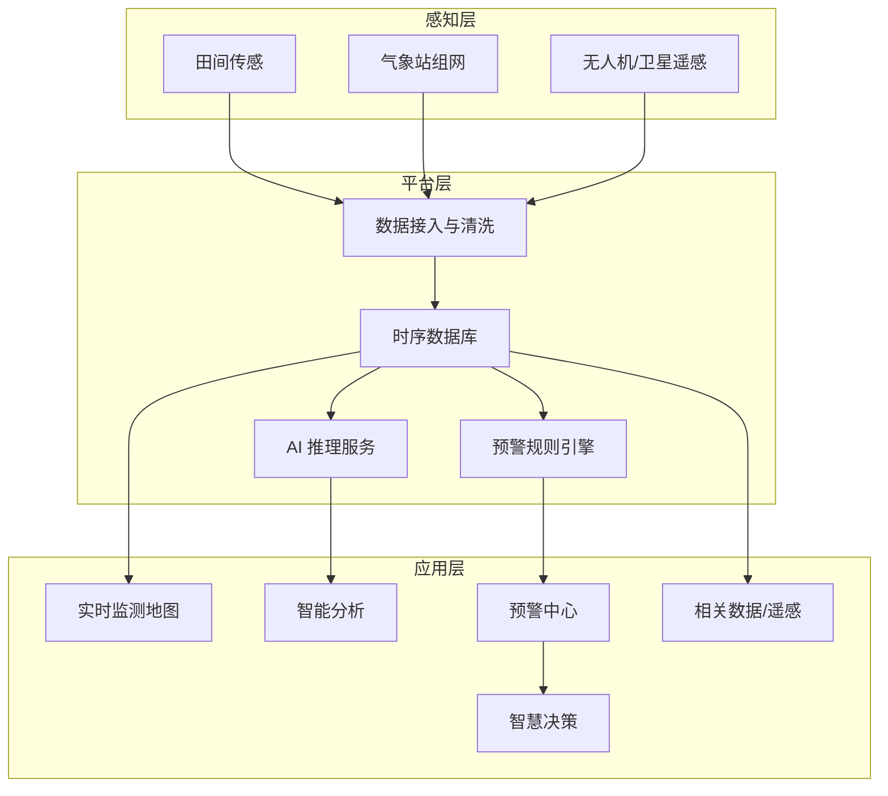

# AI 作物灾害智慧监测预警系统 — 互联网＋ 2.0 功能扩展规划

> 本文档在 [`2.0.md`](./2.0.md) 方向提纲基础上展开，面向「互联网＋」竞赛申报与系统迭代开发，供产品、前端、后端、算法与答辩团队统一对齐。

---

## 一、扩展背景与目标

### 1.1 竞赛定位

项目已以 **「挑战杯」（小挑）省赛一等奖** 完成 V1.0.4 系统验证（2026 年上半年）；现承接该成果，备战 **秋季中国国际大学生创新大赛（2026）**（原「互联网＋」）。2.0 扩展重点是在既有平台上补齐「空地一体、感知—识别—预警—决策」闭环，形成与互联网＋赛题（新农科 / 人工智能+）更契合的技术叙事。

系统在 V1.0.4 基础上，从「灾害监测预警演示平台」升级为「**空地一体、感知—识别—预警—决策闭环**」的智慧农业解决方案，突出：

- **产业痛点**：作物灾害发现晚、防治盲目、气象与虫情数据割裂、基层农技服务覆盖不足。
- **技术亮点**：物联网传感 + 气象站组网 + 深度学习病虫害识别 + 遥感/无人机 NDVI 监测 + 多源融合预警。
- **应用价值**：服务合作社、农技员、管理部门，实现「早发现、准预警、精防治」。

### 1.2 扩展总目标

| 维度 | V1.0 现状 | 2.0 目标 |
|------|-----------|----------|
| 数据来源 | Mock / 少量模拟监测点 | 田间传感 + 气象站 + 遥感/无人机多源接入 |
| 预警能力 | 单阈值、人工新建预警 | 双阈值 + 耐受时间 + 极端天气联动 |
| 智能分析 | 图片上传模拟识别 | 可训练 AI 模型，**v2 已 27 类 / 97.53%（2026-07-07），待接入网站** |
| 空间可视化 | 监测点地图 + NDVI/墒情图层 | 区域气象空间分布 + 历史回放 |
| 决策支持 | 规则化建议文案 | 气象×虫情关联模型 + 针对性防治方案 |
| 系统自主性 | 人工刷新、手动处理 | 自动采集、自动预警、自动推送 |

---

## 二、现状基线（已有能力）

以下能力已在 **小挑（挑战杯）省赛一等奖** 周期内交付（V1.0.4），互联网＋ 2.0 在此基础上增量建设。开发扩展前应明确「可复用」与「需新建」的边界：

| 模块 | 已有实现 | 路由/入口 |
|------|----------|-----------|
| 用户与角色 | 登录、合作社/农技员/管理员权限 | `/login` |
| 实时监测 | 监测点地图、温度/土壤湿度弹窗 | `/map` |
| 智能分析 | 图片上传、灾害/病虫害/气候分类识别（演示）；**本地 v2 模型 27 类 / 97.53% 已训练，待接入网站** | `/analysis` |
| 预警中心 | 分级预警列表、新建/处理/删除 | `/warnings` |
| 智慧决策 | 基于预警与监测数据的规则建议 | `/decision` |
| 相关数据 | 无人机 NDVI、土壤墒情图层；气象站读数 Tab | `/related-data` |
| 遥感 API | 地块、NDVI 图层、墒情查询 | `src/api/remoteSensing.ts` |

**2.0 原则**：在现有 Vue 3 + Pinia + Leaflet + Ant Design Vue 架构上增量扩展，避免推倒重来。

---

## 三、功能扩展详述

### 3.1 田间检测（环境感知层）

#### 3.1.1 监测指标

- [ ] **空气温湿度**：与现有 `weatherReadings.airTemp`、`airRh` 对齐，支持趋势曲线。
- [ ] **土壤温湿度**：10 cm 土壤温度、体积含水率（`soilTemp10cm`、`soilVwc`），可扩展多层深度。
- [ ] **辅助指标**（可选）：土壤电导率 EC、光照、叶面湿度，为精准灌溉与病害预警提供输入。

#### 3.1.2 双阈值预警机制

建立「提示」与「告警」两级阈值，并引入**耐受时间**，避免瞬时波动误报：

| 级别 | 触发条件示例 | 耐受时间 | 系统行为 |
|------|--------------|----------|----------|
| 提示（黄） | 土壤湿度 < 25% 或 气温 > 32℃ | 持续 30 min | 站内消息 + 仪表盘黄标 |
| 告警（红） | 土壤湿度 < 15% 或 气温 > 38℃ | 持续 10 min | 推送预警中心 + 短信/微信（可选） |

- [ ] 阈值支持按作物类型、生育期配置（如小麦拔节期 vs 灌浆期）。
- [ ] 阈值配置页：农技员可编辑，合作社只读。
- [ ] 与现有 `alertLevel.ts`、`WarningSystem.vue` 打通，统一等级枚举。

#### 3.1.3 天气预报集成

- [ ] 接入第三方气象 API（如和风、彩云、国家气象信息中心开放接口）。
- [ ] 展示未来 24 h / 7 d：**气温、风速、降水量**。
- [ ] **极端天气标识**：冰雹、大风（≥ 8 级）、高温（≥ 40℃）、低温冻害（≤ -5℃）等，自动写入预警候选队列。
- [ ] 在「相关数据」气象 Tab 与「实时监测」地图侧边栏同步展示，点击可跳转预警详情。

#### 3.1.4 接口与数据模型（建议）

```text
GET  /field-sensors/{pointId}/readings?from=&to=     # 历史时序
GET  /field-sensors/{pointId}/thresholds              # 阈值配置
PUT  /field-sensors/{pointId}/thresholds              # 更新阈值（农技员）
GET  /weather/forecast?lat=&lng=&days=7               # 预报
GET  /weather/extreme-events?region=                  # 极端天气事件
```

---

### 3.2 病虫害识别（AI 智能层）

#### 3.2.1 识别模块升级

在现有 `DataAnalysis.vue` 图片分析流程上扩展：

- [ ] **识别类别**：病害、虫害、营养缺乏、草害、健康对照五类。
- [ ] **作物适配**：桃、苹果、小麦、水稻（与现有 `cropType` 一致），支持扩展经济作物。
- [ ] **输出字段**：病虫名称、置信度、受害部位、严重程度（轻/中/重）、推荐防治窗口期。
- [ ] **批量识别**：支持多图上传、历史记录检索、导出 PDF 简报（可复用相关数据页简报逻辑）。

#### 3.2.2 AI 模型建设

| 项目 | 规格 |
|------|------|
| 算法 | 深度学习（推荐 YOLOv8 / EfficientNet 分类 + 检测双任务） |
| 数据划分 | 训练集 75% / 验证集 25% |
| 基线精度 | ≥ 85%（mAP@0.5 或 Top-1 Accuracy） |
| 目标精度 | ≥ 95%（数据增广 + 难例挖掘 + 模型蒸馏） |
| 部署 | ONNX / TensorRT 推理服务，前端上传 → 后端异步推理 → WebSocket 回传结果 |

- [ ] 建立标注规范文档（边界框、类别、生育期标签）。
- [ ] 模型版本管理：v1 演示模型 / v2 竞赛展示模型可切换。
- [ ] 低置信度（< 70%）样本自动进入「人工复核」队列。

#### 3.2.3 针对性防治措施

识别结果与知识库联动，输出可执行建议：

- [ ] **化学防治**：药剂名称、稀释倍数、安全间隔期、轮换用药建议。
- [ ] **生物/物理防治**：性诱剂、杀虫灯、天敌释放等绿色方案。
- [ ] **农艺措施**：修剪、清园、水肥调控、适期播种等。
- [ ] 与 `DecisionSupport.vue` 集成：从识别记录一键生成防治任务单。

---

### 3.3 气象站（空间气象层）

#### 3.3.1 空间分布图

在 Leaflet 地图上叠加气象专题图层（可参考现有 NDVI 热力图实现）：

- [ ] **干旱指数**：基于土壤含水率、降水距平、连续无雨天数综合计算。
- [ ] **降水分布**：小时/日累计降水插值热力图。
- [ ] **空气温度**：日最高/最低/平均气温格点或站点着色。
- [ ] **极端天气**：冰雹、强风、高低温事件点位标注 + 影响范围圈。

#### 3.3.2 实时监测与历史查询

- [ ] 监测站状态：在线/离线、最后上报时间、数据质量标识。
- [ ] 自动刷新：WebSocket 或 30 s 轮询（可配置）。
- [ ] **时间段查询**：支持按日/周/月/自定义区间查看历史曲线与统计（最大值、均值、累计降水）。
- [ ] 多站对比：同一指标多站折线图，服务区域农技推广。

#### 3.3.3 与监测点联动

延续 `RelatedData.vue` 中「监测站 ↔ 地块/遥感」联动设计：

- [ ] 点击地图气象站 → 右侧抽屉展示实时读数 + 24 h 迷你趋势。
- [ ] 点击遥感地块 → 显示关联气象站与最近 7 d 气象摘要。

---

### 3.4 遥感与无人机（空天感知层）

#### 3.4.1 数据能力扩展

在现有 NDVI、土壤墒情图层基础上：

- [ ] **多时相 NDVI**：支持日期切换（已有 `ndvi-heatmap-may20` 资产模式），展示作物长势变化。
- [ ] **病虫害遥感征象**：叶片枯黄度、冠层异常斑块（可与地面 AI 识别交叉验证）。
- [ ] **无人机航迹**：任务航线、飞行高度、重叠率、重建质量报告。
- [ ] **数据源标注**：DJI Mavic 3M、Sentinel-2 等，保持与 `remoteSensingLayers.ts` 一致。

#### 3.4.2 气象 × 病虫害关联建模

构建「环境驱动虫情」的预测逻辑（可先规则引擎，后机器学习）：

```text
输入：未来 7 d 气温/降水/湿度预报 + 历史 NDVI + 当前虫口密度 + 作物生育期
输出：病虫害发生风险等级（低/中/高）+ 预计爆发时间窗口 + 防治优先级地块列表
```

- [ ] **预测—预警**：高风险地块自动生成预警草稿，农技员确认后发布。
- [ ] **防治指导**：按地块推送差异化施药/巡田建议，减少全域普防。
- [ ] 模型可解释：展示关键因子贡献（如「连续 3 日湿度 > 80%」）。

#### 3.4.3 接口扩展（建议）

```text
GET  /ndviLayers?fieldId=&from=&to=
GET  /pest-risk/predictions?fieldId=&horizon=7d
POST /drone-missions                        # 上传航测任务元数据
GET  /drone-missions/{id}/orthomosaic         # 正射影像/指数图层
```

---

### 3.5 系统自主性（自动化运营层）

「自主性」指减少人工值守，形成 7×24 闭环：

| 能力 | 说明 | 优先级 |
|------|------|--------|
| 自动采集 | 传感/气象/遥感数据定时拉取与入库 | P0 |
| 自动预警 | 双阈值 + 极端天气 + 虫情风险触发，无需人工新建 | P0 |
| 自动推送 | 站内信、邮件、短信、企业微信/webhook | P1 |
| 自动报告 | 日报/周报：监测摘要、预警统计、防治执行情况 | P1 |
| 自动闭环 | 预警 → 决策建议 → 任务下发 → 处理反馈 → 效果评估 | P2 |
| 自愈与降级 | 接口失败时本地缓存/演示数据兜底（已有遥感兜底模式） | P1 |

- [ ] 后台调度：推荐 Celery / Spring `@Scheduled` / Node cron 统一任务中心。
- [ ] 操作审计：自动预警与人工干预均留痕，便于答辩展示「人机协同」。

---

## 四、系统架构升级示意



**技术栈建议（与现有团队能力衔接）**：

- 前端：Vue 3 + TypeScript + Pinia + Leaflet + ECharts（保持）
- 后端：Spring Boot 或 Node（json-server 逐步替换为真实 API）
- AI：Python FastAPI + PyTorch/Ultralytics
- 数据：MySQL（业务）+ InfluxDB/TimescaleDB（时序）+ MinIO（影像）
- 消息：Redis + WebSocket / MQTT（传感上报）

---

## 五、实施路线图

> **编制说明**：本路线承接 **小挑（挑战杯）省赛一等奖** 交付的 V1.0.4 系统，面向 **2026 年秋季互联网＋**（中国国际大学生创新大赛）迭代 2.0。团队已完成小挑省赛，**不再重复春季校赛培育周期**，开发窗口集中在 **2026 年 7 月 — 10 月**。  
> 教育部全国赛日程以 [全国大学生创业服务网](https://cy.ncss.cn) 及本校双创学院通知为准。  
> **当前基准日**：2026-07-07（小挑收官后，互联网＋省赛备战；**AI v2 模型已训练完成，待接入网站**）。

### 5.0 大赛关键节点对照（2026 · 互联网＋）

| 赛段 | 预估时间 | 与本项目关系 |
|------|----------|--------------|
| 小挑省赛（已完成） | 2026 年上半年 | V1.0.4 系统、软著与试点材料；**省赛一等奖** |
| 互联网＋ 报名 / 省赛推荐 | 7 月上旬 — 7 月底 | 基于小挑成果填报，确认省赛资格与推荐通道 |
| 互联网＋ 省赛网评 | 7 月 — 8 月上旬 | 提交 2.0 增量功能截图、演示视频与申报书 |
| 互联网＋ 省赛决赛（路演） | 8 月 | 阶段二、三核心能力现场演示 |
| 全国总决赛（网评 + 现场） | 9 月 — **10 月** | 阶段四：全链路闭环、95% 精度与国赛答辩 |

**与小挑的关系**：小挑阶段已完成地图监测、预警中心、智能分析（演示）、遥感/气象 Tab 等（见 §二）；互联网＋ 2.0 为**增量开发**，不必从零立项。

**开发阶段与赛段映射总览**（约 20 周工作量，**7—9 月多线并行** 以赶上 10 月国赛）：

| 开发阶段 | 日历周期 | 工期 | 对齐赛段 | 并行说明 |
|----------|----------|------|----------|----------|
| 阶段零（已完成） | 至 2026-06-30 | — | 小挑省赛 | V1.0.4 基线，不再排期 |
| 阶段一 | 2026-07-01 — 2026-07-28 | 约 4 周 | 互联网＋ 报名 / 省赛材料启动 | 优先启动 |
| 阶段二 | 2026-07-15 — 2026-08-25 | 约 6 周 | 省赛网评前 AI 可演示 | 与阶段一后期并行 |
| 阶段三 | 2026-08-01 — 2026-09-15 | 约 6 周 | 省赛决赛 → 国赛资格确认 | 与阶段二并行 |
| 阶段四 | 2026-09-01 — 2026-10-20 | 约 4 周 + 持续打磨 | 国赛网评 → 10 月总决赛 | 与阶段三后期并行 |

---

### 阶段零：小挑基线（已完成）

**完成时间**：2026 年 6 月底前  
**对应赛段**：挑战杯（小挑）省赛 — **一等奖**  
**交付物**：V1.0.4 可演示系统、相关数据页（NDVI/气象）、预警与决策模块、部署与说明书（详见 `docs/小挑/交付/`）

> 以下阶段一—四均为在阶段零之上的 **2.0 增量**，任务与里程碑不变。

### 阶段一：数据与预警夯实（约 4 周）

**计划周期**：2026-07-01 — 2026-07-28  
**对应赛段**：互联网＋ 报名与省赛材料筹备  
**交付节点**：7 月底前完成双阈值预警与天气预报接入，支撑 8 月省赛网评版系统截图

- 双阈值 + 耐受时间预警引擎
- 天气预报 API 接入与极端天气规则
- 气象站历史查询与趋势图
- Mock 数据结构扩展，前后端联调

**里程碑**：田间异常 30 分钟内自动产生分级预警（演示环境）。

### 阶段二：AI 与知识库（约 6 周）

**计划周期**：2026-07-15 — 2026-08-25  
**对应赛段**：互联网＋ 省赛网评与省赛决赛备战  
**交付节点**：8 月上旬省赛网评前 AI 识别达 85%+ 并可上传演示；8 月省赛路演可现场识别

**进度（2026-07-07）**：数据集整理与 v2 训练 **已完成**（27 类、验证准确率 97.53%）；**待完成** 推理 API 接入网站、防治知识库、`DataAnalysis` 真实联调。详见 [`下一阶段任务与流程.md`](./下一阶段任务与流程.md)。

- 病虫害数据集整理与标注
- 模型训练达到 85%+，部署推理 API
- 识别结果 → 防治知识库 → 决策建议链路
- `DataAnalysis` 对接真实推理服务

**里程碑**：现场上传叶片照片，5 s 内返回识别结果与防治建议。

### 阶段三：遥感融合与预测（约 6 周）

**计划周期**：2026-08-01 — 2026-09-15  
**对应赛段**：省赛决赛（8 月）与国赛推荐材料封装  
**交付节点**：9 月中旬前完成「空地一体」全链路演示，作为国赛推荐项目技术佐证

- 多时相 NDVI、墒情图层管理后台
- 气象×虫情规则/模型初版
- 地块级风险预警与地图高亮
- 无人机任务元数据录入（可先手工）

**里程碑**：选定 1 个示范田块，完成「遥感异常 → 地面复核 → 预警 → 防治」全链路演示。

### 阶段四：自主运营与竞赛打磨（约 4 周）

**计划周期**：2026-09-01 — 2026-10-20（9 月国赛网评，10 月总决赛冲刺）  
**对应赛段**：国赛网评 → 全国总决赛（10 月）  
**交付节点**：9 月底前完成 3—5 分钟网评演示视频；10 月国赛前完成 95% 精度与答辩材料定稿

- 自动推送、日报生成
- 性能优化、移动端适配
- 答辩 PPT、演示脚本、对比数据（防治前后 NDVI/损失率）
- 精度优化冲刺 95%

**里程碑**：互联网＋网评可演示的完整闭环视频（3–5 分钟）。

### 5.5 近期工作清单（2026-07-01 起 · 互联网＋）

| 截止日期（参考） | 事项 | 负责方向 |
|------------------|------|----------|
| 7 月 15 日 | 互联网＋ 报名材料定稿（承接小挑省一成果与 2.0 规划） | 产品 / 答辩 |
| 7 月底 | 阶段一交付：双阈值预警 + 天气预报可演示 | 后端 / 前端 |
| 8 月上旬 | 省赛网评材料：2.0 增量截图、演示视频初剪 | 产品 / 前端 |
| 8 月中旬 | 阶段二交付：AI 85%+ 现场识别；省赛路演彩排 | 算法 / 全员 |
| 8 月底 | 省赛决赛；阶段三「全链路」可演示 | 遥感 / 答辩 |
| 9 月 15 日 | 国赛推荐材料：全链路视频定稿、指标佐证 | 产品 / 算法 |
| 9 月 — 10 月初 | 精度冲刺 95%、国赛 PPT 与答辩稿 | 算法 / 答辩 |
| 10 月（总决赛前 2 周） | 国赛现场演示环境、备用样张与回退方案 | 运维 / 全员 |

---

## 六、验收指标（竞赛可量化）

| 编号 | 指标 | 目标值 |
|------|------|--------|
| K1 | 病虫害识别准确率（验证集） | ≥ 95% |
| K2 | 预警误报率（双阈值+耐受后） | ≤ 10% |
| K3 | 预警漏报率（重大灾害场景） | ≤ 5% |
| K4 | 传感数据刷新延迟 | ≤ 1 min（实时源） |
| K5 | 覆盖监测点/气象站 | ≥ 3 站（演示）/ 可扩展至 50+ |
| K6 | 遥感图层加载时间 | ≤ 3 s（百亩级） |
| K7 | 自动预警占比 | ≥ 70%（相对人工新建） |
| K8 | 端到端演示时长 | 全链路 ≤ 5 min |

---

## 七、团队分工建议

| 方向 | 主要职责 | 与 2.0 模块对应 |
|------|----------|-----------------|
| 产品/答辩 | 需求优先级、竞赛叙事、演示脚本 | 全局 |
| 前端 | 地图图层、图表、预警 UI、识别上传 | 3.1–3.4 展示层 |
| 后端 | API、调度、权限、消息推送 | 3.1–3.5 平台层 |
| 算法 | 数据集、训练、部署、虫情模型 | 3.2、3.4.2 |
| 硬件/物联 | 传感设备对接、气象站协议 | 3.1、3.3 |
| 遥感/GIS | 无人机数据处理、NDVI 生产 | 3.4 |

详细人力分工可参考同目录 [`互联网+分工.docx`](../赛事/互联网+分工.docx)，与本规划对齐后迭代。

---

## 八、竞赛展示建议

### 8.1 演示 storyline（推荐）

1. **开场**：地图总览多监测点，指出干旱/高温区域。
2. **感知**：点开气象站，展示温湿度与 7 日预报；切换 NDVI 图层显示长势异常田块。
3. **识别**：上传虫害叶片照片，AI 识别并给出置信度与防治方案。
4. **预警**：系统自动弹出告警（耐受时间触发），预警中心列表自动新增。
5. **决策**：进入智慧决策，查看地块级防治任务与资源调配建议。
6. **闭环**：标记预警已处理，展示防治后 NDVI 回升（多时相对比）。

### 8.2 创新点表述（供申报书摘录）

- **多源融合**：地面物联 + 气象组网 + 无人机遥感，打破数据孤岛。
- **分级智能预警**：双阈值与耐受时间机制，平衡灵敏度与误报率。
- **可解释决策**：虫情预测不仅给等级，还说明气象因子贡献。
- **低门槛落地**：Web 端即可用，支持合作社与农技员分角色协同。

### 8.3 风险与应对

| 风险 | 应对 |
|------|------|
| 真实设备不足 | Mock + 局部真实传感混合演示，标注数据来源 |
| 模型精度不达标 | 难例增广、集成学习；答辩侧重流程与可扩展性 |
| 遥感处理周期长 | 预生成热力图资产 + 1–2 期动态切换 |
| 接口不稳定 | 保留本地兜底（现有 `REMOTE_SENSING` 兜底模式） |

---

## 九、与原始提纲对照

以下为 [`2.0.md`](./2.0.md) 条目的落地索引：

| 2.0 提纲 | 本文档章节 |
|----------|------------|
| 田间检测：温湿度、双阈值、天气预报、极端天气 | §3.1 |
| 病虫害：识别、AI 模型、75/25 划分、85%→95%、针对性措施 | §3.2 |
| 气象站：空间分布图、实时更新、历史时间段 | §3.3 |
| 遥感无人机：气象&病虫害建模、预测预警防治 | §3.4 |
| 自主性 | §3.5 |

---

## 十、后续文档

- 各模块详细接口说明 → `docs/互联网+/接口设计/`（待建）
- **非 AI 模块实现方案** → [`网站/2.0非AI模块实现方案.md`](../网站/方案/2.0非AI模块实现方案.md)（§3.1、§3.3–§3.5 落地）
- 单模块 UI 原型与交互说明 → 按阶段补充
- 实施任务拆解 → 可基于本文档 §五 生成开发看板（Issue / 飞书多维表格）

---

**文档版本**：V2.2 规划稿（同步 AI v2 训练进度）  
**最后更新**：2026-07-07  
**维护**：互联网＋项目组
