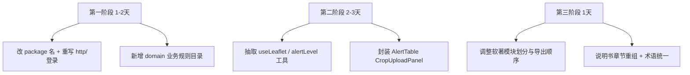

# 青禾智匠项目降重审查报告

基于对全仓库源码、文档与软著导出方案（`docs/源程序导出实现说明.md`）的审查，下面按**风险等级**给出降重思路。项目约 **4500+ 行**核心业务代码，体量适合软著申报，但**通用脚手架占比偏高**，是主要查重风险来源。

---

## 一、当前项目画像

| 维度 | 现状 |
|------|------|
| 业务定位 | 作物灾害监测预警（地图 + 预警 + 图像分析 + 决策） |
| 技术栈 | Vue 3 + TS + Vite + Ant Design Vue + Pinia + Leaflet + ECharts |
| 最大文件 | `AppLayout.vue`(621)、`RelatedData.vue`(594)、`About.vue`(587) |
| 已做差异化 | 玻璃拟态 UI、`monitorStatus.ts`、真实遥感素材、全局搜索 |
| 明显短板 | `package.json` 仍叫 `vue-demo`；基础设施层与教程高度雷同 |

---

## 二、高风险区（优先降重）

### 1. 基础设施层 — 与 Vue 教程重合度最高

以下文件几乎是「标准模板」，查重系统极易命中：

```1:22:src/utils/http.ts
import axios from 'axios'

const http = axios.create({
  baseURL: '/api',
  timeout: 5000
})
// ... Bearer token 拦截器 ...
```

```71:83:src/router/index.ts
router.beforeEach((to, _from, next) => {
  const userStore = useUserStore()
  const token = userStore.token
  const requireAuth = to.meta.requireAuth
  // ... 标准登录守卫 ...
})
```

```12:38:src/stores/user.ts
export const useUserStore = defineStore('user', () => {
  const token = ref<string>(localStorage.getItem('token') || '')
  // ... loginApi / logout ...
})
```

**降重思路：**

- 重写 `http.ts`：增加请求 ID、统一错误码映射、401 自动登出、业务层 `ApiResult<T>` 封装，而不是裸 axios
- 路由改为**按模块拆分**（`router/modules/monitor.ts`、`alert.ts`），`meta` 用 `requiresRole: 'agronomist'` 等业务字段
- 登录改为**农业场景语义**：手机号 + 验证码（Mock 即可）、角色（管理员/农技员/合作社），不要用通用 `phone/password + Bearer token` 组合
- `package.json` 的 `name` 改为 `qinghe-crop-monitor` 等，与 `vue-demo` 脱钩

### 2. Mock / Flask 后端 — 开源示例重合

```17:48:src/mock/server.ts
server.post('/login', (req, res) => {
  // 读 db.json → find user → mock-token-  典型 json-server 教程写法
})
```

```17:21:server/app.py
def run_ai_model_prediction(image_file, crop_type):
    time.sleep(1)
    return random.choice(possible), round(random.uniform(0.85, 0.99), 2)
```

**降重思路：**

- Mock 增加**农业领域接口**：`/ndvi/summary`、`/soilMoisture/trend`、`/disasterRules/evaluate`，在 server 内写阈值判定逻辑
- Flask 改为「预处理 → 特征提取 → 分类」三段式结构（即使仍是 Mock），加入作物类型枚举、置信度阈值、建议文案生成
- 把 `deploy/api_mock/server.js` 与 `src/mock/server.ts` 合并维护，避免两套重复逻辑

### 3. 软著提交策略 — 模块一权重过高

当前 9 模块划分中，**模块一（入口与配置）** 全是通用代码，且会被完整导出。建议：

| 调整 | 做法 |
|------|------|
| 压缩模块一 | 只保留 `main.ts` + 自研 `glass-theme.css` / `page-card.css`，`http.ts` 重写后再纳入 |
| 放大差异化模块 | 把 `monitorStatus.ts`、`useGlobalSearch.ts`、`GlassEmpty.vue` 并入模块二/八 |
| 新增领域模块 | 增加 `src/domain/`（预警等级规则、NDVI 色标、处置建议模板），单独成「模块十：业务规则引擎」 |
| 控制 Ant Design 样板 | 大段 `a-table` / `a-form` 可封装为 `AlertTable.vue`、`CropUploadPanel.vue`，提交时体现自研组件 |

---

## 三、中风险区（结构重复，非模板但可优化）

### 1. Leaflet 地图逻辑重复

`MapVisualization.vue` 与 `DecisionSupport.vue` 各自初始化 Leaflet，初始化、瓦片、弹窗样式高度相似。

**降重思路：**

```
src/composables/
  useLeafletBase.ts      # 地图创建、深色底图、销毁
  useMonitorMarkers.ts   # 监测点图标、聚类、popup 模板
```

两页只保留业务差异（聚类 vs 单点定位），可减 80~120 行重复，并增加**独有 composable 代码量**。

### 2. 预警相关逻辑分散

`Home.vue`、`WarningSystem.vue`、`DecisionSupport.vue` 都有预警等级样式、时间格式化、待处理筛选。

**降重思路：**

- 新建 `src/utils/alertLevel.ts`（等级中文名、颜色、CSS class）
- 新建 `src/utils/formatTime.ts`
- Store 增加 `unhandledAlerts` computed，页面不再各自 filter

### 3. 页面内联样式仍偏多

虽已提取 `page-card.css`，但各 `.vue` 的 scoped 样式仍占 40%~60% 行数，且响应式断点写法重复（`@media (max-width: 992px)` 出现多次）。

**降重思路：**

- 把重复的 `@media` 抽到 `page-card.css` 的 modifier 类（如 `.glass-panel--stack-md`）
- 页面只写**该页特有**布局，减少「复制粘贴式 CSS」被查重命中

---

## 四、低风险区（已是差异化资产，应加强而非大改）

| 文件/模块 | 说明 |
|-----------|------|
| `RelatedData.vue` | 真实 NDVI/墒情热力图、`<picture>` WebP、AI 结论区 — **核心亮点** |
| `useGlobalSearch.ts` | 菜单 + 监测点 + 预警跨模块搜索 — 教程少见 |
| `AppLayout.vue` | 汉堡抽屉、全局搜索、玻璃顶栏 — 可保留，微调命名即可 |
| `monitorStatus.ts` | 领域状态映射 — 可扩展为完整「监测点状态机」 |
| `About.vue` | 团队/技术栈介绍 — 内容原创性高 |
| 遥感素材 + `ILLUSTRATION_SOURCES.md` | 素材溯源说明，软著/答辩加分 |

这些模块在降重时应**作为软著前 30 页优先展示内容**，而不是大删大改。

---

## 五、文档降重（说明书 / README）

`软件使用说明书.md` 结构较规范（简介 → 模块 → 环境 → 操作），与大量软著说明书模板相似。

**降重思路：**

1. **改章节顺序**：先写「典型使用场景」（如「合作社管理员每日巡检流程」），再反推功能，而不是先列功能表
2. **农业术语贯穿**：用「墒情站」「灾害事件」「处置预案」替代泛化的「监测点」「预警」「建议」
3. **增加独有内容**：河北地质大学本地试验田坐标范围、团队分工细节、线上部署真实踩坑（已有 `deploy/线上故障排查笔记.md`，可摘要进说明书）
4. **减少技术栈罗列**：Ant Design / Pinia 等一行带过，重点写**业务规则**（什么条件下触发预警、NDVI 色标含义）

---

## 六、推荐实施路线图（按投入产出排序）



| 优先级 | 动作 | 预期降重效果 |
|--------|------|-------------|
| P0 | 重写 `http.ts`、登录流程、改 `package.json` name | 去掉最明显的模板指纹 |
| P0 | 新增 `src/domain/` 业务规则（预警阈值、NDVI 分级、处置建议） | 增加独有代码 + 软著亮点 |
| P1 | 抽取 Leaflet / 预警 composable，合并重复 CSS | 降低页间重复率 |
| P1 | Mock/Flask 增加农业专用接口与判定逻辑 | 后端差异化 |
| P2 | 封装 2~3 个业务组件替代裸 Ant Design | 提交代码更像自研系统 |
| P2 | 说明书按场景重写、统一领域术语 | 文档查重率下降 |

---

## 七、不建议的做法

- **只做变量重命名**（`token` → `accessKey`）：查重系统看结构，无效且伤可读性
- **从 GitHub 抄其他农业项目**：换来源不解决查重，还有版权风险
- **无意义堆代码**（大量空函数、注释块）：软著审查可能质疑真实性
- **大改 UI 框架**（换 Element Plus 等）：成本高，对降重帮助有限

---

## 八、总结

项目**业务页面（尤其 RelatedData、DecisionSupport、MapVisualization）已有较好差异化**，近期玻璃拟态重构方向正确。主要风险集中在：

1. **~200 行通用基础设施**（http / router / user store / mock login / Flask random）
2. **Leaflet 与预警逻辑的页间重复**
3. **软著导出时模块一权重过大**
4. **文档模板化结构**

降重的核心不是「换技术栈」，而是：**把通用模板代码替换为带农业语义的自研层，并把独有业务代码在提交材料中前置展示**。

如果需要，我可以按上述 P0 项直接动手改一版（例如重写 `http.ts`、新增 `src/domain/`、调整软著模块配置）。