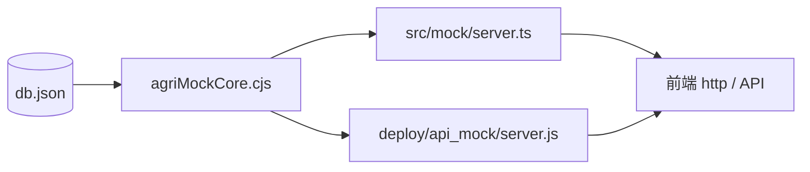

# agriMockCore.cjs 学习笔记：农业 Mock 共用业务逻辑

> **源文件**：[`deploy/api_mock/agriMockCore.cjs`](../../../deploy/api_mock/agriMockCore.cjs)  
> **被谁调用**：[`src/mock/server.ts`](../../../src/mock/server.ts)（本地 `npm run mock`）、[`deploy/api_mock/server.js`](../../../deploy/api_mock/server.js)（宝塔部署）  
> **数据依赖**：[`src/mock/db.json`](../../../src/mock/db.json)（监测点、用户、预警等）  
> **专项笔记**：[P1-4学习笔记](../前端/相关数据页/P1-4学习笔记.md)（`queryMoistureByNearestPoint` / GIS 查墒情）  
> **文档性质**：实现说明 + 学习笔记

---

## 0. 读前必读（一句话）

`agriMockCore.cjs` **不启动 HTTP 服务**，只提供一组 **纯函数**：读 `db.json` 里的数据，算出登录、NDVI 摘要、墒情趋势、灾害规则、最近站墒情等 API 的返回体。  
本地开发和线上部署 **共用这一份算法**，避免两套 Mock 逻辑漂移。

---

## 1. 它在整个 Mock 架构里的位置



| 层级 | 文件 | 职责 |
|------|------|------|
| 静态数据 | `db.json` | 用户、监测点、预警、遥感图层等 CRUD 数据源 |
| **业务逻辑** | **`agriMockCore.cjs`** | 需要「算出来」的接口：登录校验、NDVI 推算、趋势合成、规则评估、最近站查墒情 |
| HTTP 路由 | `server.ts` / `server.js` | 注册路由、读 db、调 core 函数、返回 JSON |
| 通用 CRUD | json-server `router` | `/monitorPoints`、`/alerts` 等 REST 直读 db |

**分工原则**：能直接存进 `db.json` 的用 json-server；需要公式、距离、规则判断的放进 `agriMockCore.cjs`。

---

## 2. 为什么是 `.cjs`（CommonJS）？

| 模块格式 | 语法 | 本项目中的用法 |
|----------|------|----------------|
| ES Module | `import` / `export` | 前端 `.vue`、部分 `server.ts` |
| CommonJS | `require` / `module.exports` | **`agriMockCore.cjs`** |

`server.ts` 是 ESM，通过 `createRequire` 加载 `.cjs`：

```typescript
const require = createRequire(import.meta.url)
const agriMockCore = require('../../deploy/api_mock/agriMockCore.cjs')
```

`server.js`（部署环境纯 CommonJS）直接：

```javascript
const { queryMoistureByNearestPoint } = require('./agriMockCore.cjs')
```

放在 `deploy/api_mock/` 并打成 `.cjs`，是为了 **本地与宝塔共用同一路径、同一导出方式**，改一处两边生效。

---

## 3. 导出函数与 HTTP 路由对照

| 导出函数 | HTTP | 方法 | 前端消费（当前） |
|----------|------|------|------------------|
| `handleFarmLogin` | `/login` | POST | `stores/user.ts` 登录 |
| `buildNdviSummary` | `/ndvi/summary` | GET | 说明书 / 答辩附录接口 |
| `buildSoilMoistureTrend` | `/soilMoisture/trend` | GET | 说明书 / 答辩附录接口 |
| `evaluateDisasterRules` | `/disasterRules/evaluate` | POST | 说明书 / 答辩附录接口 |
| `queryMoistureByNearestPoint` | `/moisture/value` | GET | `api/remoteSensing.ts` → GIS 地图点击（P1-4/P1-5） |

除登录和墒情查值外，后三个接口主要为 **农业领域 Mock 能力展示**；前端页面可按需接入。

---

## 4. 内部工具函数（未导出）

### 4.1 `normalizeRole(role)`

把登录请求里的 `role` 规范为 `admin` | `agronomist` | `cooperative`；未知或 `user` 映射为 `cooperative`。

### 4.2 `getMonitorPoints(db)` / `getAlerts(db)`

安全读取数组字段，非数组时返回 `[]`，避免 `db.json` 缺字段时报错。

### 4.3 `toRad(deg)` / `haversineKm(...)`

将经纬度转为弧度，用 **Haversine 公式** 计算两点球面距离（公里）。  
仅供 `queryMoistureByNearestPoint` 使用，找离点击位置最近的监测站。

---

## 5. 五个导出函数详解

### 5.1 `handleFarmLogin(db, body)`

**用途**：农场端演示登录，替代真实认证服务。

**入参**（`body`）：

| 字段 | 说明 |
|------|------|
| `phone` | 手机号，与 `db.users` 匹配 |
| `password` | 备用密码（与库中 `password` 相等） |
| `code` | 演示验证码，固定 `2026` 可通过 |
| `role` | 期望登录角色，经 `normalizeRole` 处理 |

**逻辑**：

1. 在 `db.users`（或兼容字段 `db.user`）中按手机号找用户  
2. 密码正确 **或** 验证码为 `2026` 则成功  
3. 成功返回 mock token：`qinghe-{role}-{timestamp}`  
4. 失败返回 `401`

**返回形状**（供 server 设 status）：

```javascript
{ ok: true, status: 200, body: { code, message, token, user } }
// 或
{ ok: false, status: 401, body: { message } }
```

---

### 5.2 `buildNdviSummary(db)`

**用途**：根据监测点温湿度与未处理预警，**推算**各站 NDVI 及汇总指标（非真实遥感反演）。

**算法要点**：

```text
对每个 monitorPoint：
  stressPenalty = 该站有未处理 alert ? 0.08 : 0
  ndvi = clamp(0.28, 0.86, 0.72 + moisture/300 - temp/500 - stressPenalty)
  vegetationLevel = ndvi≥0.72 旺盛 | ≥0.55 正常 | 否则 偏弱
```

**返回** `data`：

| 字段 | 含义 |
|------|------|
| `averageNdvi` | 各站 NDVI 均值 |
| `weakCount` | `vegetationLevel === '偏弱'` 的站数 |
| `samples[]` | 每站 `pointId`、`pointName`、`ndvi`、`vegetationLevel`、`sampleNo` |

改 `db.json` 里某站 `soilMoisture` / `temp`，或给该站加未处理预警，摘要 NDVI 会联动变化。

---

### 5.3 `buildSoilMoistureTrend(db)`

**用途**：生成 **7 天** 土壤湿度趋势曲线（演示用，非历史实测）。

**算法要点**：

1. `base` = 所有监测点 `soilMoisture` 平均值（无点则默认 30）  
2. 对 `index = 0..6`，`offset = index - 3`（相对「今天」前后各 3 天）  
3. `moisture = clamp(6, 85, base + offset*1.8 + sin(index)*3)`  
4. 按阈值给 `irrigationAdvice`：`<20` 建议补水、`>75` 注意排水、否则保持观察  

**返回** `data`：`stationCount`、`unit: '%'`、`trend[]`（含 `dateOffset`、`moisture`、`irrigationAdvice`）。

---

### 5.4 `evaluateDisasterRules(db, body)`

**用途**：对指定监测点做 **灾害规则阈值评估**（高温、干旱、涝渍等）。

**入参**（`body`，均可选）：

| 字段 | 默认 |
|------|------|
| `pointId` | 第一个监测点 |
| `temp` | 该点当前 `temp` |
| `soilMoisture` | 该点当前 `soilMoisture` |

**规则表**：

| 条件 | rule | level |
|------|------|-------|
| temp ≥ 38°C | `high_temperature` | critical |
| temp ≥ 32°C | `heat_attention` | warning |
| soilMoisture ≤ 10% | `drought_risk` | critical |
| soilMoisture ≤ 20% | `water_stress` | warning |
| soilMoisture ≥ 80% | `waterlogging_risk` | warning |

**汇总 `level`**：任一 critical → `critical`；否则有 rule → `warning`；否则 `normal`。  
附带中文 `advice` 处置建议。

演示：雄县（墒情 12%、temp 33）会触发 `water_stress` warning。

---

### 5.5 `queryMoistureByNearestPoint(db, lat, lng)`

**用途**：GIS「点哪查哪」的 Mock——给定经纬度，返回 **最近监测站** 的墒情（方案 A）。

**流程**：

1. 无监测点 → `404`  
2. `lat`/`lng` 非有效数字 → `400`  
3. 遍历 `monitorPoints`，`haversineKm` 算距离，取最近站  
4. 成功返回：

```json
{
  "moisture": 12,
  "source": "nearest-point",
  "nearestPointId": 2,
  "pointName": "监测站 · 雄县",
  "distanceKm": 0.8
}
```

**演示数据速查**（`db.json`）：

| 站 | soilMoisture | 大致区域 |
|----|--------------|----------|
| 河间 | 30% | 沧州一带 |
| 雄县 | 12% | 保定东侧 |
| 栾城 | 65% | 石家庄南侧 |

更完整的概念说明、冒烟测试与前端接入见 [P1-4学习笔记](../前端/相关数据页/P1-4学习笔记.md)。

---

## 6. server 如何调用（模式统一）

以本地 `server.ts` 为例，自定义路由都在 `server.use(router)` **之前**注册：

```typescript
server.get('/moisture/value', (req, res) => {
  const db = readDb(res)
  if (!db) return
  const result = agriMockCore.queryMoistureByNearestPoint(db, req.query.lat, req.query.lng)
  return res.status(result.status).jsonp(result.body)
})
```

规律：

1. `readDb` 每次请求读最新 `db.json`（改库后 GET 即生效）  
2. 调 `agriMockCore` 某函数  
3. 按返回的 `status` / `body` 写响应  

登录、查墒情等带 `ok` 字段的函数由 server 分支处理；NDVI / 趋势 / 灾害规则直接 `res.jsonp(...)`。

---

## 7. 修改与重启须知

| 改了什么 | 要不要重启 `npm run mock` |
|----------|-------------------------|
| `db.json` | 一般 **不用**（GET 会重读） |
| **`agriMockCore.cjs`** | **必须重启**（`tsx watch` 只监听 `server.ts`） |
| `server.ts` | watch 自动重启 |
| `deploy/api_mock/server.js` | 部署环境重启 PM2 |

宝塔部署需同步上传 `agriMockCore.cjs` + `server.js`，仅 sync `db.json` 不够新增路由。

---

## 8. 本地冒烟（curl 示例）

前置：`npm run mock` 运行在 `3000` 端口（或 `MOCK_PORT`）。

```powershell
# 登录
curl -X POST http://localhost:3000/login -H "Content-Type: application/json" -d "{\"phone\":\"13800000000\",\"code\":\"2026\",\"role\":\"agronomist\"}"

# NDVI 摘要
curl http://localhost:3000/ndvi/summary

# 7 天墒情趋势
curl http://localhost:3000/soilMoisture/trend

# 灾害规则（雄县 pointId=2）
curl -X POST http://localhost:3000/disasterRules/evaluate -H "Content-Type: application/json" -d "{\"pointId\":2}"

# 墒情查值（雄县附近）
curl "http://localhost:3000/moisture/value?lat=38.99&lng=116.11"
```

经 Vite 代理时路径前加 `/api`（以项目 `vite.config` 为准）。

---

## 9. 与 json-server 直出接口的区别

| 类型 | 例子 | 谁处理 |
|------|------|--------|
| 直读 db | `GET /monitorPoints` | json-server router |
| 计算型 | `GET /ndvi/summary` | agriMockCore |
| 计算型 | `GET /moisture/value?lat=&lng=` | agriMockCore |
| 写操作模拟 | `POST /login` | agriMockCore（不写回 db） |

监测点列表、预警 CRUD 仍走 json-server；**「像真实农业 API」的读法** 走 agriMockCore。

---

## 10. 学习要点小结

1. **单一事实来源**：农业计算逻辑只维护 `agriMockCore.cjs` 一处。  
2. **db 是输入，不是输出**：函数只读 `db`，不在此文件写库；登录 token 等为即时生成。  
3. **演示算法可替换**：NDVI 公式、趋势正弦波动、最近站查墒情均为答辩演示，接真 API 时替换 server 层即可。  
4. **返回形状两种风格**：`handleFarmLogin` / `queryMoistureByNearestPoint` 用 `{ ok, status, body }` 便于设 HTTP 状态码；其余直接 `{ code, message, data }`。  
5. **改 `.cjs` 记得重启 mock**，这是最常见的「改了没生效」原因。

---

## 11. 相关文档

- [P1-4学习笔记](../前端/相关数据页/P1-4学习笔记.md) — `/moisture/value` 与 GIS 查墒情  
- [P1-5学习笔记](../前端/相关数据页/P1-5学习笔记.md) — 地图点击接 API  
- [P1完成计划](../前端/相关数据页/P1完成计划.md) — P1-4 验收与部署清单  
- [部署mock.md](../Intro/部署/部署mock.md) — 宝塔 PM2 部署  
- [Mock.md](./Mock.md) — Mock 概念原理卡  

---

*文档版本：v1.0 · agriMockCore.cjs 学习笔记 · 2026-06-04*
