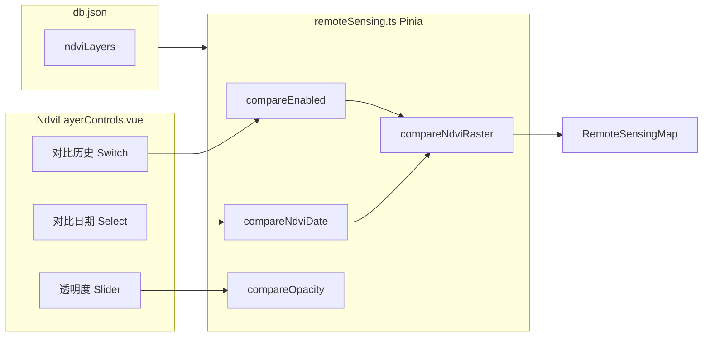

# P1-1 学习笔记：NDVI 历史对比 UI

> **对应计划**：[P1完成计划.md](./P1完成计划.md) · P1-1 / 顺带完成 P1-3  
> **前置阶段**：[P0完成计划.md](./P0完成计划.md)  
> **完成日期**：2026-06-04  
> **文档性质**：实现说明 + 学习笔记（非验收清单）

---

## 1. 这项功能要解决什么问题

P0 已在「无人机遥感」Tab 做了 Leaflet 地图 + 地块/日期下拉，但**一次只能看一期 NDVI**。答辩或分析时，常需要回答：

> 「这块地上一期长什么样？两期之间变化大不大？」

P1-1 的目标是：在**不改地图底层**的前提下，先把**对比相关的控件和状态**做出来——用户能打开「对比历史」、选另一期日期、调历史层透明度。  
真正把两期影像叠到地图上，属于下一步 **P1-2**（`RemoteSensingMap` 双 `imageOverlay`）。

---

## 2. 完成情况一览

| 范围 | 状态 | 说明 |
|------|------|------|
| 对比历史开关 | ✅ 已完成 | 仅当前地块 ≥2 期影像时可开 |
| 对比日期下拉 | ✅ 已完成 | 选项 = 当前地块日期 **减去** 已选「影像日期」 |
| 历史透明度滑块 | ✅ 已完成 | 0.2–0.8，默认 0.5；状态已写入 Store |
| Tooltip 条件渲染 | ✅ 已完成 | 仅不可对比时包 `a-tooltip`，避免空气泡 |
| Pinia 对比状态（P1-3） | ✅ 已完成 | 见 [P1-3学习笔记.md](./P1-3学习笔记.md) |
| 地图双层叠加（P1-2） | ✅ 已完成 | 见 [P1-2学习笔记.md](./P1-2学习笔记.md) |
| 副标题 / AI 对比文案（P1-7） | ⏳ 未做 | `RelatedData.vue` 副标题 / AI 尚未读取对比状态 |

**结论**：P1-1「控件 + 状态机」已闭环；P1-2 已接地图双层叠加，拖动滑块可见 NDVI 变化（详见 [P1-2学习笔记.md](./P1-2学习笔记.md)）。

---

## 3. 改了哪些文件

| 文件 | 改动性质 |
|------|----------|
| `src/stores/remoteSensing.ts` | 新增对比用 ref、computed、action |
| `src/components/remote-sensing/NdviLayerControls.vue` | 新增开关、对比日期、透明度滑块 |

未改动的相关文件（便于对照）：

- `src/views/user/RelatedData.vue` — 已传 compare props；caption 含对比信息（P1-2）  
- `src/components/remote-sensing/RemoteSensingMap.vue` — 已支持双 `imageOverlay`（P1-2）

---

## 4. 整体数据流（先建立心智模型）



设计原则：**UI 只负责展示和触发 action，业务规则集中在 Store**。  
P1-2 已在 `RelatedData` 里把 `compareNdviRaster`、`compareOpacity` 传给地图（见 [P1-2学习笔记.md](./P1-2学习笔记.md)）。

---

## 5. Store 如何实现（`remoteSensing.ts`）

### 5.1 新增状态

```typescript
const compareEnabled = ref(false)      // 是否开启对比
const compareNdviDate = ref('')      // 选中的历史期日期
const compareOpacity = ref(0.5)      // 历史层透明度，P1-2 才作用于地图
```

与 P0 已有的 `selectedFieldId`、`selectedNdviDate` 并列，专门描述「对比模式」。

### 5.2 派生数据：谁能对比、能选哪些日期

```typescript
const compareDatesForField = computed(() =>
  layersForField.value
    .map((l) => l.date)
    .filter((date) => date !== selectedNdviDate.value)
)

const canCompareNdvi = computed(() => compareDatesForField.value.length > 0)
```

要点：

- `layersForField` 是 P0 就有的「当前地块全部 NDVI 图层」。  
- **对比日期不能和「影像日期」相同**，否则两期是同一层，没有对比意义。  
- `canCompareNdvi` 为 false 时，说明该地块只有 1 期（雄县、栾城），UI 上禁用开关。

Mock 数据里，只有河间 `hejian` 有两条记录（`2026-05-20`、`2026-05-01`），因此**只有河间能开对比**——这是数据设计，不是 bug。

### 5.3 给 P1-2 预留的栅格视图

```typescript
const compareNdviLayer = computed(() =>
  compareEnabled.value && compareNdviDate.value
    ? layersForField.value.find((l) => l.date === compareNdviDate.value) ?? null
    : null
)

const compareNdviRaster = computed(() =>
  compareNdviLayer.value ? toRasterView(compareNdviLayer.value) : null
)
```

`toRasterView` 复用 P0 逻辑：把 `imageAsset` 转成 Vite 打包后的 `imageUrl`。  
P1-2 只要读 `compareNdviRaster?.imageUrl` 和 `compareOpacity` 即可叠第二层。

### 5.4 状态同步规则（核心逻辑）

| 场景 | 调用 | 行为 |
|------|------|------|
| 用户打开对比 | `setCompareEnabled(true)` | 若无可对比期则直接 return；否则 `syncCompareDateForField()` 自动选默认对比日期 |
| 用户关闭对比 | `setCompareEnabled(false)` | `compareNdviDate` 清空 |
| 换地块 | `selectField(id)` | 先 `resetCompare()`，再同步 NDVI 日期 |
| 换「影像日期」且对比仍开着 | `onNdviDateChange()` | 若原对比日期与新区冲突，自动换成另一个可选日期 |
| 对比开着但已无其他日期 | `syncCompareDateForField()` | 自动 `resetCompare()` |

`syncCompareDateForField` 里默认选「可选日期中最新的」：

```typescript
if (!options.includes(compareNdviDate.value)) {
  compareNdviDate.value = latestDate(options)
}
```

这样用户把影像日期从 `2026-05-20` 改成 `2026-05-01` 时，对比日期会自动切到 `2026-05-20`，不会出现两期相同的情况。

---

## 6. UI 如何实现（`NdviLayerControls.vue`）

### 6.1 控件布局

```text
[地块 ▼]  [影像日期 ▼]  [对比历史 ☐]
                              ↓ 仅 compareEnabled 为 true 时显示
                    [对比日期 ▼]  [历史透明度 ━━━●━━ 50%]
```

P0 已有两个下拉；P1-1 在其后追加 Switch，并用 `v-if="compareEnabled"` 折叠对比日期和滑块，避免单期地块界面过于拥挤。

### 6.2 与 Store 的绑定方式

组件使用 `storeToRefs`，保证模板里的 `v-model` 双向绑定到 Pinia：

```typescript
const {
  selectedFieldId,
  selectedNdviDate,
  compareEnabled,
  compareNdviDate,
  compareOpacity,
  canCompareNdvi
} = storeToRefs(store)
```

事件尽量走 Store action，而不是在组件里改多个 ref：

| 用户操作 | 组件 | Store |
|----------|------|-------|
| 换地块 | `@change="onFieldChange"` | `selectField` |
| 换影像日期 | `@change="onNdviDateChange"` | `onNdviDateChange` |
| 切换对比开关 | `@change="onCompareToggle"` | `setCompareEnabled` |

Switch 使用 `:checked` + `@change`，而不是 `v-model:checked`，是因为 Ant Design Vue 的 Switch 与 Pinia 组合时，通过 action 统一收口更清晰。

### 6.3 禁用与提示（Tooltip 条件渲染）

「对比历史」Switch 在**单期地块**（雄县、栾城）时要灰掉，并告诉用户为什么点不了。Ant Design Vue 用 `a-tooltip` 的 `title` 实现悬停说明。

#### 初版写法的问题

初版**无论能不能对比**，都把 Switch 包在 `a-tooltip` 里，用计算属性动态给 `title`：

```vue
<!-- 初版（已废弃） -->
<a-tooltip :title="compareDisabledTip">
  <a-switch
    :checked="compareEnabled"
    :disabled="!canCompareNdvi"
    @change="onCompareToggle" />
</a-tooltip>
```

```typescript
const compareDisabledTip = computed(() =>
  canCompareNdvi.value ? undefined : '当前地块仅一期影像'
)
```

| 地块 | `canCompareNdvi` | `title` 值 | 实际表现 |
|------|------------------|------------|----------|
| 雄县 / 栾城 | false | 「当前地块仅一期影像」 | ✅ 正常提示 |
| 河间（2 期） | true | `undefined` | ⚠️ 悬停仍可能弹出**空 tooltip 气泡** |

原因：`a-tooltip` 组件只要包在外面，即使 `title` 是 `undefined`，鼠标悬停时仍可能渲染一个**没有文字的小框**，看起来像 UI bug。  
这与对比功能逻辑无关，但影响河间（唯一能开对比的地块）的操作体验。

#### 改法：需要提示时才包 Tooltip

原则：**需要提示时才加 tooltip；不需要时不要包 tooltip。**

```vue
<!-- 当前实现 -->
<a-tooltip
  v-if="!canCompareNdvi"
  title="当前地块仅一期影像">
  <a-switch
    :checked="compareEnabled"
    disabled
    size="small" />
</a-tooltip>
<a-switch
  v-else
  :checked="compareEnabled"
  size="small"
  @change="onCompareToggle" />
```

| 情况 | 渲染方式 | 悬停行为 |
|------|----------|----------|
| **不能对比**（`!canCompareNdvi`） | `a-tooltip` + **disabled** Switch | 显示「当前地块仅一期影像」 |
| **能对比**（河间） | 普通 Switch，**不包** tooltip | 无任何 tooltip |

注意 disabled 分支里的 Switch **不绑** `@change`——反正点不了，避免误触发。

#### 顺带修正：`compareDateOptions` 排序

`compareDatesForField` 是 `string[]`（日期字符串），排序应写 `b.localeCompare(a)`，不能写 `b.date.localeCompare(a.date)`（那是图层对象的写法）。

### 6.4 样式约定

延续 P0 地图浮层风格：

- 半透明黑底 + `backdrop-filter: blur`  
- `pointer-events: auto`（与 `.map-caption` 的 `pointer-events: none` 区分，保证下拉可点）  
- 滑块轨道 / 手柄用绿色系，与 NDVI 主题一致  

---

## 7. 与 Mock 数据的对应关系

`src/mock/db.json` 中 NDVI 按地块分布：

| 地块 | fieldId | 影像期数 | P1-1 表现 |
|------|---------|----------|-----------|
| 1号地块（河间市） | `hejian` | 2 期 | 可开对比 |
| 2号地块（雄县） | `xiongxian` | 1 期 | 开关 disabled |
| 3号地块（栾城区） | `luancheng` | 1 期 | 开关 disabled |

河间两期影像（2026-06 调整）：

| 日期 | `imageAsset` | 文件 |
|------|--------------|------|
| 2026-05-01 | `ndvi-heatmap` | 基准主图 `ndvi-heatmap.webp` |
| 2026-05-20 | `ndvi-heatmap-may20` | 衍生图 `ndvi-heatmap-may20.webp`（偏绿，便于对比） |

详见 [P1-2学习笔记.md](./P1-2学习笔记.md) §7。

---

## 8. 本地如何自测

**前置**：农技员登录；`npm run dev` + `npm run mock` 同时运行。

1. 导航 → **相关数据** → **无人机遥感**。  
2. 地块选 **1号地块（河间市）** → 打开 **对比历史** → 应出现「对比日期」「历史透明度」。  
3. 影像日期 `2026-05-20` 时，对比日期应只有 `2026-05-01`（反之亦然）。  
4. 换 **2号地块（雄县）** → 对比自动关闭，开关不可点，悬停 tooltip「当前地块仅一期影像」。  
5. 回到 **河间** → 打开对比，悬停 Switch **不应**再出现空气泡。  
6. 拖动透明度滑块 → 地图 NDVI 叠加变化（P1-2）。

---

## 9. 尚未完成的部分（后续任务怎么接）

### ~~P1-2：地图双层叠加~~ ✅ 已完成

详见 [P1-2学习笔记.md](./P1-2学习笔记.md)。

### P1-7：文案联动

`currentSubtitle` / `aiConclusion` 在对比开启时可追加「对比 2026-05-01」类描述，读取 `compareEnabled`、`compareNdviDate` 即可，无需再改 Store。

---

## 10. 学习要点小结

1. **先状态、后视图**：历史对比涉及多个控件联动，把规则放进 Pinia，UI 保持薄，后续地图/AI 都能复用同一套 state。  
2. **用 computed 表达业务约束**：「可对比日期 = 全部日期 − 当前期」比在下拉里手写 filter 更不易出错。  
3. **换上下文要 reset**：换地块时 `resetCompare()`，避免带着河间的对比状态去看雄县。  
4. **禁用比隐藏更诚实**：单期地块禁用开关 + tooltip，比做了却报错更符合演示数据口径。  
5. **Tooltip 按需包裹**：`title` 为 `undefined` 时仍包 `a-tooltip` 可能出空气泡；用 `v-if` 分两支渲染更稳妥。  
6. **分阶段交付**：P1-1 管「能选、能存」；P1-2 管「能看见」。

---

## 11. 相关文档

- [P1完成计划.md](./P1完成计划.md) — 全阶段任务与验收  
- [P1-3学习笔记.md](./P1-3学习笔记.md) — Store 对比状态详解  
- [P0完成计划.md](./P0完成计划.md) — Leaflet 地图与 NDVI 控件基线  
- [监测点联动.md](./监测点联动.md) — 历史对比的原始方案描述（第二节）

---

*文档版本：v1.1 · P1-1 实现学习笔记 · 含 Tooltip 条件渲染说明 · 2026-06-04*
