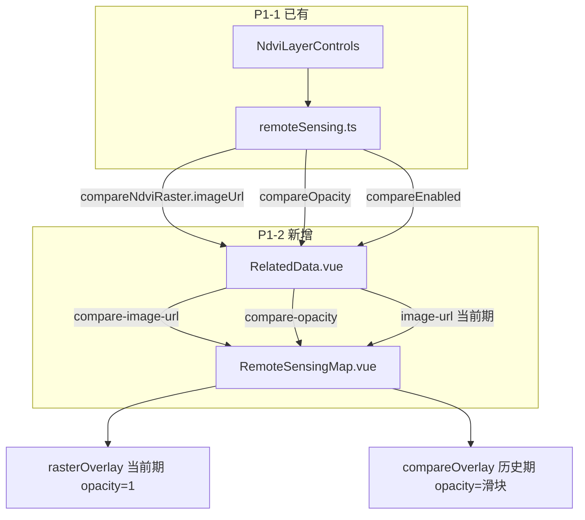

# P1-2 学习笔记：NDVI 双图层透明度叠加

> **对应计划**：[P1完成计划.md](./P1完成计划.md) · P1-2  
> **前置笔记**：[P1-1学习笔记.md](./P1-1学习笔记.md)（控件 + Store 状态）  
> **完成日期**：2026-06-04  
> **文档性质**：实现说明 + 学习笔记（非验收清单）

---

## 1. 这项功能要解决什么问题

P1-1 已在 Pinia 和 `NdviLayerControls` 里存好了对比状态（`compareEnabled`、`compareNdviDate`、`compareOpacity`、`compareNdviRaster`），但地图仍只贴**一层** NDVI。  
P1-2 的任务是：**把 Store 里的对比期影像真正叠到 Leaflet 上**，拖动「历史透明度」滑块时，地图上的两期影像要有可见变化。

验收口径（来自 P1 计划 §8.1）：

- 河间地块开启对比后，地图上有双层 NDVI  
- 拖动透明度滑块，叠加效果变化  
- 关闭对比后恢复单层  

---

## 2. 完成情况一览

| 范围 | 状态 | 说明 |
|------|------|------|
| `RemoteSensingMap` 双 `imageOverlay` | ✅ 已完成 | 当前期 + 对比期 |
| `RelatedData` 传入 compare props | ✅ 已完成 | `ndviCompareImageUrl` + `compareOpacity` |
| 滑块联动地图透明度 | ✅ 已完成 | `setOpacity`，不重建整图 |
| 关对比恢复单层 | ✅ 已完成 | `compareImageUrl` 为空时移除第二层 |
| 左下 caption 对比说明 | ✅ 已完成 | 显示对比日期与透明度百分比 |
| 河间两期不同影像 | ✅ 已完成 | 5-1 → `ndvi-heatmap`；5-20 → `ndvi-heatmap-may20` |
| 副标题 / AI 对比文案（P1-7） | ⏳ 未做 | 仍属后续任务 |

**结论**：P1-1 + P1-2 组成完整的「无人机历史对比」演示链路；GIS Tab 不受影响。

---

## 3. 改了哪些文件

| 文件 | 改动 |
|------|------|
| `src/components/remote-sensing/RemoteSensingMap.vue` | 新增 `compareImageUrl` / `compareOpacity` props；双 overlay 同步逻辑 |
| `src/views/user/RelatedData.vue` | 计算 `ndviCompareImageUrl` 并传给地图；caption 追加对比信息 |
| `src/constants/remoteSensingLayers.ts` | 注册 `ndvi-heatmap-may20` |
| `src/mock/db.json` | 河间 5-1 / 5-20 分别绑定两图 |
| `src/assets/ndvi-heatmap-may20.webp` | 由主图调色生成，1600px WebP |
| `deploy/api_mock/db.json` | 经 `pnpm sync:mock-db` 同步 |

未改动：`remoteSensing.ts`、`NdviLayerControls.vue`（P1-1 已就绪，P1-2 只消费其输出）。

---

## 4. 端到端数据流



**关键设计**：父组件 `RelatedData` 负责「何时传对比层」——只有 **无人机 Tab** 且 **`compareEnabled === true`** 才把 `compareImageUrl` 传给地图；否则传 `undefined`，地图自动回到单层。

---

## 5. `RelatedData.vue` 如何接 Store

### 5.1 计算对比层 URL

```typescript
const ndviCompareImageUrl = computed(() => {
  if (currentTab.value !== 'drone' || !remoteStore.compareEnabled) return undefined
  return remoteStore.compareNdviRaster?.imageUrl
})
```

- `undefined` → 地图不创建第二层（关对比、换 Tab、单期地块等场景统一处理）。  
- 不在 `RemoteSensingMap` 里读 Pinia，保持地图组件**纯 props 驱动**，便于复用和测试。

### 5.2 模板传参

```vue
<RemoteSensingMap
  :image-url="remoteRasterLayer.imageUrl"
  :bounds="remoteRasterLayer.bounds"
  :compare-image-url="ndviCompareImageUrl"
  :compare-opacity="remoteStore.compareOpacity"
  ... />
```

当前期仍走 P0 的 `remoteRasterLayer`（`currentNdviRaster`）；对比期走 P1-1 的 `compareNdviRaster`。两期 bounds 在同地块下相同，共用 `remoteRasterLayer.bounds`。

### 5.3 Caption 反馈

左下「影像日期」行在对比开启时追加：

```text
影像日期：2026-05-20 · 对比 2026-05-01 · 历史透明度 50%
```

让用户不只看地图，也能从文案确认当前对比配置（部分 P1-7 文案需求的轻量实现）。

---

## 6. `RemoteSensingMap.vue` 核心实现

> **组件结构**：template 仅一个 `ref="mapRef"` 容器，图层由 script 在 `onMounted` / `watch` 里用 Leaflet 命令式渲染；props 与 `emit` 如何与 template、父组件连接，见 [P1-5学习笔记 §5.0](./P1-5学习笔记.md#50-vue-template-与-script-如何连接)。

### 6.1 新增 props

```typescript
compareImageUrl?: string
compareOpacity?: number   // 默认 0.5，来自 Store
```

### 6.2 图层叠放顺序（实现细节 vs 计划文字）

计划文档写的是：

```text
底图 → 历史层（半透明）→ 当前层（opacity=1）
```

若两期都是**不透明矩形贴图**，当前层完全不透明时会**完全盖住**下层，滑块调节历史层透明度将**看不到任何变化**（P1-1 笔记已提到这一物理限制）。

实际实现采用更常见的透明度对比方式：

```text
底图 (gaodeSatellite)
  → rasterOverlay   当前期（影像日期），opacity = 1
  → compareOverlay  历史期（对比日期），opacity = compareOpacity，叠在上层
```

含义：滑块越大，历史期越「盖」在当前期上；滑块越小，越接近只看当前期。  
这与 UI 标签「历史透明度」一致，且 slider 拖动立刻有视觉反馈。

Leaflet 中**后 `addTo(map)` 的 overlay 在上层**，因此代码顺序为：先加当前层，再加对比层。

### 6.3 同步函数拆分

```typescript
function syncRasterOverlays(options: { fitView?: boolean } = {}) {
  // 1. 移除旧层
  // 2. 重建当前层 rasterOverlay
  // 3. 若有 compareImageUrl，重建 compareOverlay
  // 4. 可选 fitBounds（换地块/换日期/imageUrl 变化时）
}

function syncCompareOpacity() {
  compareOverlay?.setOpacity(compareRasterOpacity())
}
```

| 变化类型 | 调用 | 原因 |
|----------|------|------|
| `imageUrl` / `bounds` / `compareImageUrl` | `syncRasterOverlays({ fitView: true })` | 需换图或换范围，并 `fitBounds` |
| 仅 `compareOpacity` | `syncCompareOpacity()` | 只改透明度，避免闪烁和重复 `fitBounds` |

P0 单层模式下，当前层仍用 `opacity ?? 0.92`；**开启对比时当前层固定为 1**，保证与历史层叠加关系清晰。

### 6.4 watch 分工

```typescript
watch(() => [props.imageUrl, props.bounds, props.compareImageUrl], ...)
watch(() => props.compareOpacity, ...)
```

滑块高频拖动时只触发第二个 watch，性能更稳。

---

## 7. Mock 数据与图片资源

河间两期若共用同一 WebP，叠层对比肉眼几乎看不出差别。因此为两期配置了**不同 `imageAsset`**：

| 日期 | 角色 | `imageAsset` | 文件 |
|------|------|--------------|------|
| 2026-05-01 | 较早一期（基准） | `ndvi-heatmap` | `ndvi-heatmap.webp` |
| 2026-05-20 | 较新一期（长势更好） | `ndvi-heatmap-may20` | `ndvi-heatmap-may20.webp` |

**`src/mock/db.json` 片段：**

```json
{ "fieldId": "hejian", "date": "2026-05-20", "imageAsset": "ndvi-heatmap-may20" },
{ "fieldId": "hejian", "date": "2026-05-01", "imageAsset": "ndvi-heatmap" }
```

**`remoteSensingLayers.ts`：**

```typescript
'ndvi-heatmap': ndviHeatmap,
'ndvi-heatmap-may20': ndviHeatmapMay20
```

`ndvi-heatmap-may20.webp` 由主图程序化生成（偏绿、1600×1067、约 480KB），**规格已与** `soil-moisture-heatmap.webp` **对齐**，无需再跑 `optimize-assets`（该脚本只处理 jpg 源 → webp，见 §7.1）。

改 Mock 后执行：

```bash
pnpm sync:mock-db
```

刷新浏览器即可；**不必重启 `npm run mock`**（GET 会重读 `db.json`），也**不必重启 `npm run dev`**（Vite 热更新静态 import）。

### 7.1 要不要对 `ndvi-heatmap-may20.webp` 跑 `optimize-assets`？

**不必。** `npm run optimize-assets` 的流程是：

```text
ndvi-heatmap.jpg / soil-moisture-heatmap.jpg
  → sharp 缩至宽 1600px
  → 输出 *.webp (quality 82)
```

`ndvi-heatmap-may20.webp` 已是 WebP、1600px 宽，体积约 480KB，与 `ndvi-heatmap.webp`（467KB）、`soil-moisture-heatmap.webp`（432KB）同级。  
若将来改为「jpg 源 + 脚本生成 webp」的统一维护方式，可把 `ndvi-heatmap-may20.jpg` 加入 `scripts/optimize-assets.mjs`，属可选工程规范，非功能必须。

### 7.2 改前端 / Mock 时要不要重启 mock？

| 改动类型 | 要不要重启 mock |
|----------|-----------------|
| `.vue` / `.ts` / 新增 `.webp` | **否**（Vite 管前端） |
| `src/mock/db.json` | **否**（GET 自动重读，刷新页面即可） |
| `src/mock/server.ts` | **通常否**（`tsx watch` 自动重启） |
| `deploy/api_mock/agriMockCore.cjs` | **可能要**手动重启 mock |

---

## 8. 本地如何自测

**前置**：农技员登录；`npm run dev` + `npm run mock`。

1. **相关数据 → 无人机** → **1号地块（河间市）**。  
2. 影像日期 `2026-05-20`，打开 **对比历史**，对比日期 `2026-05-01`。  
3. 地图上应看到 NDVI 叠加；拖动 **历史透明度**，色块明暗/纹理应变化。  
4. 关闭对比 → 恢复单层。  
5. 换 **雄县** → 对比不可用（P1-1 行为），地图单层正常。  
6. 切 **GIS** 再回 **无人机** → 对比状态若仍开启，叠加应恢复。

---

## 9. 与 P1-1 的分工关系

| 层级 | P1-1 | P1-2 |
|------|------|------|
| 用户操作 | 开关、日期、滑块 | （无新控件） |
| 状态 | Pinia `compare*` | 只读 Store |
| 视图 | 控件显隐 | Leaflet 双层贴图 |
| 文档 | [P1-1学习笔记.md](./P1-1学习笔记.md) | 本文 |

可以记一句：**P1-1 管「选什么比」，P1-2 管「比在哪里显示」。**

---

## 10. 尚未完成 / 可优化项

| 项 | 说明 |
|----|------|
| P1-7 副标题 / AI | 如「对比 2026-05-01」「两期间 NDVI 变化」写入 `currentSubtitle` / `aiConclusion` |
| 更明显的历史图 | 可单独导出一张色调不同的 WebP 替代 JPG |
| 分屏对比 | `leaflet-side-by-side`，属 P1 可选 |
| 计划 z-order 字面实现 | 若坚持历史在下、当前在上，需当前层也半透明或改用分屏，否则 opaque 贴图无效 |

---

## 11. 学习要点小结

1. **Props 向下、事件向上**：地图不直接依赖 Pinia，由页面把 Store 算成 props，组件边界清晰。  
2. **不透明贴图的叠图顺序很重要**：上层 opacity 才有意义；写文档时要结合渲染原理，不能只看逻辑顺序。  
3. **watch 粒度**：换图整层重建，改透明度只 `setOpacity`，避免 slider 卡顿和地图跳动。  
4. **用 `undefined` 表示「功能关闭」**：比传空字符串更利于 `Boolean(props.compareImageUrl)` 判断。  
5. **演示数据要配合功能**：两期同图会导致「做了但看不出」；Mock 里换 `imageAsset` 成本低、答辩收益高。  
6. **分阶段交付可验证**：P1-1 先验收控件，P1-2 再验收地图，每步都有明确测试点。

---

## 12. 相关文档

- [P1完成计划.md](./P1完成计划.md) — P1-2 验收标准 §8.1  
- [P1-1学习笔记.md](./P1-1学习笔记.md) — 对比控件  
- [P1-3学习笔记.md](./P1-3学习笔记.md) — Store 对比状态  
- [P1-5学习笔记.md](./P1-5学习笔记.md) — template/script 连接、GIS 点击查墒情  
- [P0完成计划.md](./P0完成计划.md) — 单层 `imageOverlay` 基线  

---

*文档版本：v1.2 · P1-2 实现学习笔记 · 含河间双图与 dev/mock 说明 · 2026-06-04*
