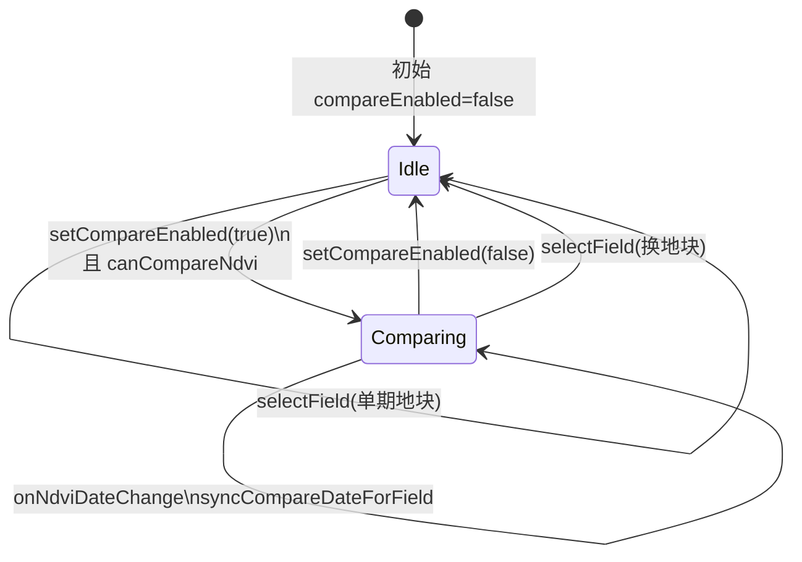

# P1-3 学习笔记：Pinia 对比状态（`remoteSensing.ts`）

> **对应计划**：[P1完成计划.md](./P1完成计划.md) · P1-3  
> **前置笔记**：[P0完成计划.md](./P0完成计划.md) · [P1-1学习笔记.md](./P1-1学习笔记.md)  
> **消费方**：[P1-2学习笔记.md](./P1-2学习笔记.md)（地图读 `compareNdviRaster`）  
> **完成日期**：2026-06-04（与 P1-1 同批落地；v1.1 补 `initSelection` 同步）  
> **文档性质**：实现说明 + 学习笔记

---

## 1. P1-3 要解决什么问题

P1-1 的控件（开关、对比日期、透明度滑块）需要在多个组件间共享，且规则复杂：

- 对比日期不能等于当前「影像日期」
- 换地块要清空对比
- 单期地块不能开对比
- 关闭对比要清空 `compareNdviDate`

若把这些逻辑散在 `NdviLayerControls.vue` 和 `RelatedData.vue` 里，P1-2 地图、P1-7 文案还要再抄一遍。

**P1-3 的职责**：在 `remoteSensing.ts` 里集中管理「历史对比」相关的 **state + computed + action**，UI 只读/写 Store。

---

## 2. 完成情况一览

| 计划交付项 | 状态 | 代码位置 |
|------------|------|----------|
| `compareEnabled` | ✅ | `ref(false)` |
| `compareNdviDate` | ✅ | `ref('')` |
| `compareOpacity` | ✅ | `ref(0.5)`，P1-1 滑块绑定 |
| `compareNdviLayer` / `compareNdviRaster` | ✅ | computed → `toRasterView` |
| 换地块 `resetCompare` | ✅ | `selectField` |
| 关对比清空日期 | ✅ | `setCompareEnabled(false)` |
| `canCompareNdvi` / `compareDatesForField` | ✅ | 超出计划的最小集，供 P1-1 UI |
| `fetchAll` 后同步对比合法性 | ✅ v1.1 | `initSelection` 内校验 |

**结论**：P1-3 已闭环；P1-1 负责控件，P1-2 负责地图，**共用同一 Store**。

---

## 3. 状态一览

### 3.1 对比专用 ref

```typescript
const compareEnabled = ref(false)   // 是否开启历史对比
const compareNdviDate = ref('')     // 对比期日期（≠ selectedNdviDate）
const compareOpacity = ref(0.5)     // 历史层透明度，0.2–0.8 由 UI 限制
```

与 P0 已有字段并列：

```typescript
const selectedFieldId = ref('')
const selectedNdviDate = ref('')      // 当前期「影像日期」
const selectedMoistureDate = ref('')  // GIS 用，与 NDVI 对比无关
```

### 3.2 派生 computed

```text
ndviLayers + selectedFieldId
        ↓
  layersForField          当前地块全部 NDVI 记录
        ↓
  compareDatesForField    排除 selectedNdviDate 后的日期列表
        ↓
  canCompareNdvi          compareDatesForField.length > 0

selectedNdviDate + layersForField → currentNdviLayer → currentNdviRaster
compareEnabled + compareNdviDate  → compareNdviLayer → compareNdviRaster
```

`compareNdviRaster` 是 P1-2 的输入：

```typescript
// RelatedData.vue
remoteStore.compareEnabled ? remoteStore.compareNdviRaster?.imageUrl : undefined
```

### 3.3 两个日期字段：`selectedNdviDate` 与 `compareNdviDate`

界面有两个下拉，Store 里对应两个**独立**的 ref，不要混为一谈：

| Store 字段 | 界面控件 | 含义 |
|------------|----------|------|
| `selectedNdviDate` | **影像日期** | 当前正在看的那一期 NDVI（主图层） |
| `compareNdviDate` | **对比日期** | 要和当前期叠在一起比较的**另一期**（对比图层） |

河间（`hejian`）Mock 里有两期：`2026-05-20`、`2026-05-01`。

**用户操作示例**：影像日期选 `2026-05-20`，再打开「对比历史」开关。Store 应变为：

```text
compareEnabled   = true
selectedNdviDate = "2026-05-20"   ← 当前期
compareNdviDate  = "2026-05-01"   ← 对比期，必须是另一期
```

自测句「开对比 → 应出现 `compareNdviDate`（与 `selectedNdviDate` 不同）」的意思是：

1. **`compareNdviDate` 不能仍是 `""`** — 开对比后会走 `setCompareEnabled(true)` → `syncCompareDateForField()`，自动填入可选的另一期。  
2. **两期不能相同** — 若都是 `2026-05-20`，等于自己和自己比，没有意义。因此 `compareDatesForField` 会**排除**当前 `selectedNdviDate`，只留另一期供选。

若用户把影像日期从 `2026-05-20` 改成 `2026-05-01`，且对比仍开着，会走 `onNdviDateChange()` → `syncCompareDateForField()`，对比日期自动切到 `2026-05-20`，始终保持两期不同。

---

## 4. Action 与状态机

### 4.1 核心函数

| 函数 | 作用 |
|------|------|
| `resetCompare()` | `compareEnabled=false`，`compareNdviDate=''` |
| `setCompareEnabled(on)` | 开：校验 `canCompareNdvi` 后 `syncCompareDateForField`；关：`resetCompare` 前半 |
| `syncCompareDateForField()` | 对比日期非法或无可选期时修正 / 关闭对比 |
| `selectField(id)` | 换地块 → **先** `resetCompare()` → 再 `syncNdviDateForField()` |
| `onNdviDateChange()` | 当前期变了且对比仍开着 → 重新 `syncCompareDateForField()` |
| `initSelection()` | 拉数后默认选中；v1.1 增加对比合法性校验 |

### 4.2 状态转移（简图）



### 4.3 v1.1：`initSelection` 补全

P1-1 初版在 `fetchAll()` 后只同步 NDVI/墒情日期，未校验对比状态。若 Mock 数据变更导致当前地块只剩 1 期，可能出现「对比仍开着但已无对比期」的中间态。

```typescript
syncNdviDateForField()

if (!canCompareNdvi.value) {
  resetCompare()
} else if (compareEnabled.value) {
  syncCompareDateForField()
}
```

**注意：这段不是用户点「开对比」时走的逻辑**，而是 **`fetchAll()` 拉完数据、`initSelection()` 被调用时** 的校验（例如进入页面、刷新后重新请求接口）。

| 场景 | 走哪段代码 |
|------|------------|
| 用户打开「对比历史」 | `setCompareEnabled(true)` → `syncCompareDateForField()` |
| 用户改「影像日期」且对比仍开着 | `onNdviDateChange()` → `syncCompareDateForField()` |
| 用户换地块 | `selectField()` → `resetCompare()` |
| 页面加载 / `fetchAll()` 完成之后 | `initSelection()` → 上表 140–144 行：不可对比则关掉；仍对比则再校正日期 |

140–144 行的含义：

- **`!canCompareNdvi`**（雄县/栾城等仅 1 期）→ `resetCompare()`，强制关掉对比，避免非法状态残留。  
- **`compareEnabled` 仍为 true 且还能对比** → 再跑一遍 `syncCompareDateForField()`，防止数据变更后 `compareNdviDate` 与 `selectedNdviDate` 撞车或变成空。

---

## 5. 与 Mock / 图片资源的配合

Store **不直接读图片文件**，只读 `ndviLayers[].imageAsset`，经 `toRasterView` → `resolveImageAsset()` 得到 URL。

河间两期当前配置（2026-06 调整）：

| 日期 | `imageAsset` | 说明 |
|------|--------------|------|
| 2026-05-01 | `ndvi-heatmap` | 基准图 |
| 2026-05-20 | `ndvi-heatmap-may20` | 较新一期，视觉更易对比 |

改 `db.json` 后：

- Store 下次 `fetchAll()` 或页面刷新即拿到新 `imageAsset`
- **不必改 Store 代码**
- 执行 `pnpm sync:mock-db` 同步部署包；本地 **不必重启 mock**（GET 重读 json）

详见 [P1-2学习笔记.md](./P1-2学习笔记.md) §7。

---

## 6. 谁在读 Store？

| 消费者 | 读取字段 | 用途 |
|--------|----------|------|
| `NdviLayerControls.vue` | `compareEnabled`、`compareNdviDate`、`compareOpacity`、`canCompareNdvi` | 控件双向绑定 / 禁用 |
| `RelatedData.vue` | `compareEnabled`、`compareNdviRaster`、`compareOpacity`、`selectedNdviDate`… | 传地图 props、caption |
| `RemoteSensingMap.vue` | **不读 Store** | 纯 props（P1-2 设计） |

---

## 7. 验收对照（P1 计划 §8.1 相关项）

- [x] `compareEnabled` / `compareNdviDate` / `compareNdviRaster` 存在且导出  
- [x] 换地块对比关闭（`selectField` → `resetCompare`）  
- [x] 关对比清空 `compareNdviDate`  
- [x] 河间可选两期日期互不冲突（`syncCompareDateForField`）  
- [x] 雄县/栾城 `canCompareNdvi === false`  

---

## 8. 本地如何自测（Store 行为）

1. 打开 Vue DevTools → Pinia → `remoteSensing`。  
2. **河间 · 开对比**（见 §3.3）：  
   - 影像日期 `2026-05-20` → 开对比 → `compareNdviDate` 应为 `2026-05-01`，且 `compareEnabled === true`。  
   - 若 `compareNdviDate === selectedNdviDate` 或仍为空，说明 `syncCompareDateForField` 有问题。  
3. 换影像日期 → `compareNdviDate` 自动切换到另一期（两期始终不同）。  
4. 换雄县 → `compareEnabled` 变 `false`，`compareNdviDate` 变 `''`。  
5. 刷新页面 → 对比默认关闭；重新开启后 `compareNdviRaster.imageUrl` 应对应 Mock 里该日期的 `imageAsset`。

---

## 9. 学习要点小结

1. **对比是独立状态域**：不要塞进 `selectedNdviDate`，用 `compareNdviDate` 并列更清晰。  
2. **computed 表达约束**：「可对比日期 = 全部日期 − 当前期」一处定义，UI 和 raster 共用。  
3. **换上下文先 reset**：`selectField` 第一件事 `resetCompare()`，避免状态泄漏。  
4. **Raster 视图与原始 layer 分离**：`compareNdviLayer`（Mock 元数据）→ `compareNdviRaster`（含 `imageUrl`），地图只关心后者。  
5. **拉数后也要校验**：`initSelection` 不仅设默认选中，还要保证对比状态与数据仍合法。

---

## 10. 相关文档

- [P1-1学习笔记.md](./P1-1学习笔记.md) — 控件如何调 Store  
- [P1-2学习笔记.md](./P1-2学习笔记.md) — `compareNdviRaster` 如何进地图  
- [P1完成计划.md](./P1完成计划.md) — P1-3 原始条目  

---

*文档版本：v1.1 · P1-3 Store 对比状态 · 含双日期字段与 initSelection 说明 · 2026-06-04*
