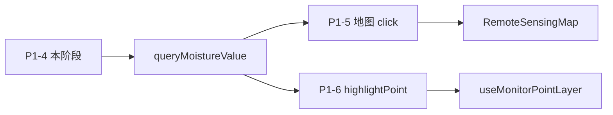

# P1-4 学习笔记：墒情查值 Mock API（`GET /moisture/value`）

> **对应计划**：[P1完成计划.md](./P1完成计划.md) · P1-4  
> **前置阶段**：[P0完成计划.md](./P0完成计划.md)（GIS 墒情栅格 + 监测点）  
> **后续消费**：[P1-5](./P1完成计划.md) 地图点击、[P1-6](./P1完成计划.md) 监测点联动  
> **完成日期**：2026-06-04  
> **文档性质**：实现说明 + 学习笔记

---

## 0. 读前必读（概念白话）

### 0.1 墒情是什么？

**墒情** = **土壤湿度 / 土壤含水量**（农业常用说法）。

在本项目里，下面这些都指同一件事——**土里有多少水**，单位一般是 **%**：

- GIS Tab 标题：「土壤墒情分布」
- 右下角色标：「墒情 (%)」
- 监测点 Popup 里的「土壤湿度」
- P1-4 接口返回的 `moisture` 字段

| 监测站（演示数据） | soilMoisture | 大致含义 |
|--------------------|--------------|----------|
| 雄县 | 12% | 偏干 |
| 河间 | 30% | 适中 |
| 栾城 | 65% | 偏湿 |

### 0.2 Popup 里不是已经有墒情了吗？和 P1-4 有什么区别？

**有一部分已经有了，但使用场景不同。**

**监测点 Popup（P0 已有）**

- 操作：点击地图上的 **监测站圆点**
- 内容：该站传感器的 `soilMoisture`（例如雄县 12%）
- 含义：**「这个固定站点测到的墒情」**

**GIS 上另外还有**

- **墒情热力图**：栾城附近一片颜色，表示空间分布（遥感演示图层）
- **3 个监测点**：只有圆点位置有地面传感器读数

**P1-4 要补的能力**

- 操作（P1-5 接上后）：在地图 **任意位置** 点一下（不必点在圆点上）
- 问题：「这一点墒情是多少？」
- Mock 回答（方案 A）：找 **最近的监测站**，用该站 `soilMoisture` 作为这一点的墒情

| | 监测点 Popup | P1-4 查值（P1-5 接地图后） |
|--|-------------|---------------------------|
| 怎么触发 | 点圆点 | 点地图任意处 |
| 表示什么 | 该站传感器实测 | 该点附近墒情（演示：最近站代填） |
| 当前有没有 | ✅ 有 | 接口有，**页面上还没有** |

可以这么记：

- **Popup** = 已知站点上的传感器数据  
- **P1-4** = 为「地图上随便点」准备的 **查询接口**；要在页面上看到效果，还需 **P1-5** 接地图点击  

答辩话术：热力图看 **空间趋势**，监测点看 **地面校准**；点击查值是把两者 **串起来** 的演示。

### 0.3 P1-4 到底做了什么？（一句话 + 分层）

```text
P1-4：先把「查墒情」的电话线接通（API）
P1-5：用户在地图上点一下（点击地图 → Popup）
P1-6：查完后自动定位到最近监测站（高亮联动）
```

P1-4 **只做了「电话线」**，所以打开 GIS Tab 时 **界面和改之前一样是正常的**。

| 做了 | 没做 |
|------|------|
| 定义 `/moisture/value` 问法与答法 | GIS 地图点击绑定 |
| Mock 里实现「最近监测点」算法 | 页面上新的查值 Popup |
| 本地 + 部署 server 注册路由 | flyTo 监测站 |
| 前端 `queryMoistureValue(lat, lng)` 函数 | AI / caption 联动（P1-7） |

### 0.4 `.cjs` 是什么文件？

`agriMockCore.cjs` 里的 **`.cjs`** = **CommonJS** 格式的 JavaScript，Node.js 用 `require` / `module.exports` 加载。

| 类型 | 写法 | 本项目例子 |
|------|------|------------|
| ES Module | `import` / `export` | `src/mock/server.ts`、前端 `.vue` |
| CommonJS | `require` / `module.exports` | `deploy/api_mock/agriMockCore.cjs` |

查墒情逻辑写在 `.cjs` 里，是为了 **本地 Mock 和宝塔部署 Mock 共用同一份算法**，不用维护两套代码。详见 §5.1。

### 0.5 「冒烟」是什么意思？

**冒烟测试（smoke test）** 是开发俗语：做完一小块功能后，用 **最简单的方式** 试一下「能不能跑」，不追求测全所有细节。

名字来自「通电后先看会不会冒烟」—— **没有大毛病就行**。

本文 §8.2 的 `curl` 就是在做 P1-4 冒烟：

- 不打开完整页面、不点地图  
- 只问 Mock：**接口通不通？返回是不是合理 JSON？**  

若雄县附近返回 `moisture: 12`、`nearestPointId: 2`，说明 P1-4 基本可用，可继续做 P1-5。

---

## 1. P1-4 要解决什么问题（技术表述）

P0/P1-2 的 GIS Tab 能看**墒情热力图**和**监测点 Popup**，但用户无法在地图上「点哪里查哪里」（概念说明见 §0.2）。

P1-4 先落地**后端契约 + Mock 实现 + 前端 API 封装**，不接地图点击（属 P1-5）。  
答辩时可先用 curl / 浏览器验证接口，再接 GIS 交互。

**方案 A（最近监测点）**：点击坐标 → 找最近的 `monitorPoints` → 返回该点 `soilMoisture` 作为墒情演示值。

---

## 2. 完成情况一览

| 范围 | 状态 | 说明 |
|------|------|------|
| `queryMoistureByNearestPoint` | ✅ | `deploy/api_mock/agriMockCore.cjs` |
| `GET /moisture/value` 本地 Mock | ✅ | `src/mock/server.ts` |
| `GET /moisture/value` 部署 Mock | ✅ | `deploy/api_mock/server.js` |
| `MoistureQueryResult` 类型 | ✅ | `src/types/remoteSensing.ts` |
| `queryMoistureValue(lat, lng)` | ✅ | `src/api/remoteSensing.ts` |
| GIS 地图点击 / Popup | ✅ | 见 [P1-5学习笔记.md](./P1-5学习笔记.md) |
| 监测点 `highlightPoint` | ⏳ P1-6 | 尚未实现 |

---

## 3. 改了哪些文件

| 文件 | 改动 |
|------|------|
| `deploy/api_mock/agriMockCore.cjs` | `haversineKm` + `queryMoistureByNearestPoint` |
| `src/mock/server.ts` | 注册 `GET /moisture/value` |
| `deploy/api_mock/server.js` | 同上（部署与本地双端一致） |
| `src/types/remoteSensing.ts` | `MoistureQueryResult` |
| `src/api/remoteSensing.ts` | `queryMoistureValue` |

**未改动**：`db.json`（复用现有 3 个 `monitorPoints`）、地图组件、Store。

---

## 4. 接口契约

### 4.1 请求

```http
GET /api/moisture/value?lat=38.99&lng=116.10
```

前端经 Vite 代理：`/api` → `http://localhost:3000`。

| 参数 | 类型 | 必填 |
|------|------|------|
| `lat` | number | 是 |
| `lng` | number | 是 |

### 4.2 成功响应（200）

```json
{
  "moisture": 12,
  "source": "nearest-point",
  "nearestPointId": 2,
  "pointName": "监测站 · 雄县",
  "distanceKm": 0.5
}
```

| 字段 | 含义 |
|------|------|
| `moisture` | 最近监测点 `soilMoisture`（%） |
| `source` | 固定 `nearest-point`（方案 A 标识） |
| `nearestPointId` | 监测点 id，供 P1-6 `highlightPoint` |
| `pointName` | 监测站名称，供 Popup / AI 文案 |
| `distanceKm` | 点击坐标到该站的 Haversine 距离（km） |

### 4.3 错误响应

| 状态 | 场景 | body 示例 |
|------|------|-----------|
| 400 | `lat` / `lng` 缺失或非数字 | `{ "message": "请提供有效的 lat、lng 查询参数" }` |
| 404 | `db.json` 无监测点 | `{ "message": "无监测点数据" }` |

---

## 5. Mock 算法（`agriMockCore.cjs`）

### 5.1 为何放在 `agriMockCore.cjs`

与 `handleFarmLogin`、`buildNdviSummary` 等同文件，**本地 `src/mock/server.ts` 与部署 `deploy/api_mock/server.js` 共用一份逻辑**，避免两套算法漂移。

`.cjs` 含义见 §0.4。

### 5.2 最近点查找

```text
读取 db.monitorPoints
  → 校验 lat、lng 为有效数字
  → 对每个监测点算 Haversine 距离（km）
  → 取距离最小者
  → moisture = 该点 soilMoisture
```

Haversine 比平面欧氏距离更适合经纬度演示（GIS 答辩话术更站得住）。

### 5.3 与 `db.json` 监测点的对应

| id | 名称 | lat / lng | soilMoisture |
|----|------|-----------|--------------|
| 1 | 监测站 · 河间市 | 38.4467, 116.0994 | 30 |
| 2 | 监测站 · 雄县 | 38.994, 116.1077 | 12 |
| 3 | 监测站 · 栾城区 | 37.9002, 114.6478 | 65 |

示例：查询 `lat=38.99&lng=116.10`（雄县附近）→ 应返回 **id=2，moisture=12**。

---

## 6. Server 路由注册

本地与部署结构一致：

```typescript
server.get('/moisture/value', (req, res) => {
  const db = readDb(res)
  if (!db) return
  const result = queryMoistureByNearestPoint(db, req.query.lat, req.query.lng)
  return res.status(result.status).jsonp(result.body)
})
```

须写在 `server.use(router)` **之前**，否则会被 json-server 默认路由覆盖。

---

## 7. 前端 API 封装

**类型**（`src/types/remoteSensing.ts`）：

```typescript
export interface MoistureQueryResult {
  moisture: number
  source: 'nearest-point' | string
  nearestPointId: number
  pointName: string
  distanceKm: number
}
```

**调用**（`src/api/remoteSensing.ts`）：

```typescript
export function queryMoistureValue(lat: number, lng: number) {
  return http.get<MoistureQueryResult>('/moisture/value', { params: { lat, lng } })
}
```

P1-5 在 GIS 地图 `click` 里使用：

```typescript
const { data } = await queryMoistureValue(lat, lng)
// data.moisture / data.pointName / data.nearestPointId
```

---

## 8. 本地如何自测

### 8.1 前置

`npm run mock` 运行中。若刚改 `agriMockCore.cjs`，需**重启 mock**（`tsx watch` 只监听 `server.ts`，不监听 `.cjs`）。

### 8.2 curl 冒烟（smoke test）

「冒烟」含义见 §0.5。下面命令不打开页面，只验证接口是否可用：

```bash
# 雄县附近 → 应返回 nearestPointId: 2, moisture: 12
curl "http://localhost:3000/moisture/value?lat=38.99&lng=116.10"

# 栾城附近 → 应返回 nearestPointId: 3, moisture: 65
curl "http://localhost:3000/moisture/value?lat=37.90&lng=114.65"

# 缺参数 → 400
curl "http://localhost:3000/moisture/value?lat=38.99"
```

**Windows 说明**：PowerShell 里 `curl` 实际是 `Invoke-WebRequest` 的别名，可能弹出「脚本执行风险」提示，输入 `Y` 继续即可；或改用：

```powershell
curl.exe "http://localhost:3000/moisture/value?lat=38.99&lng=116.10"
```

#### 实测参考（2026-06-04 · 雄县附近坐标）

本地 `npm run mock` 运行后，在项目根目录执行：

```powershell
curl "http://localhost:3000/moisture/value?lat=38.99&lng=116.10"
```

节选终端输出（`StatusCode: 200` 即冒烟通过）：

```text
StatusCode        : 200
StatusDescription : OK
Content           : {
                      "moisture": 12,
                      "source": "nearest-point",
                      "nearestPointId": 2,
                      "pointName": "监测站 · 雄县",
                      "distanceKm": 0.8
                    }
```

与 `db.json` 中雄县监测站 `soilMoisture: 12`、`id: 2` 一致，说明 P1-4 Mock 查值链路正常。

### 8.3 浏览器

登录后打开开发者工具 Console（需农技员 token 时走 `/api` 代理）：

```javascript
fetch('/api/moisture/value?lat=38.99&lng=116.10').then(r => r.json()).then(console.log)
```

---

## 9. 部署注意（P1-8 相关）

| 改动类型 | 操作 |
|----------|------|
| 仅 `db.json` 监测点数值 | `pnpm sync:mock-db` + 上传部署包 |
| `agriMockCore.cjs` 或 `server.js` | **必须上传** `deploy/api_mock/` 并重启 PM2 |
| 前端 `queryMoistureValue` | 正常 `pnpm build` 部署前端 |

`sync:mock-db` **不会**复制 server 代码，自定义路由需单独部署。

---

## 10. 与 P1-5 / P1-6 的分工



P1-4 只保证 **`queryMoistureValue` 能调通**；地图 Popup 与 flyTo 在后续阶段接入。

---

## 11. 学习要点小结

1. **先定契约、再做 Mock**：`MoistureQueryResult` 稳定后，P1-5 只关心调用与展示。  
2. **共用 `agriMockCore.cjs`**：本地与宝塔部署同一套查值逻辑。  
3. **自定义路由写在 `router` 之前**：json-server 顺序敏感。  
4. **方案 A 够用演示**：最近监测点墒情；IDW / 栅格采样留 P2。  
5. **改 `.cjs` 要重启 mock**：与改 `db.json`（GET 自动重读）不同。

---

## 12. 相关文档

- [P1完成计划.md](./P1完成计划.md) — P1-4 条目与 §3.3  
- [监测点联动.md](./监测点联动.md) — 方案 A/B/C 原始描述  
- [P1-2学习笔记.md](./P1-2学习笔记.md) — §7.2 mock 重启说明  

---

*文档版本：v1.2 · P1-4 Mock 墒情查值 · 含 §8.2 实测终端节选 · 2026-06-04*
