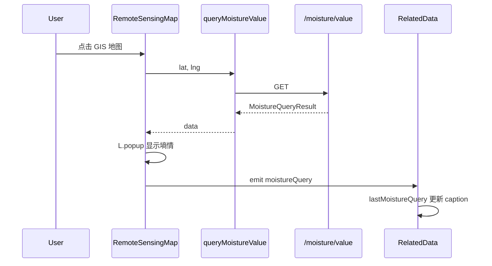
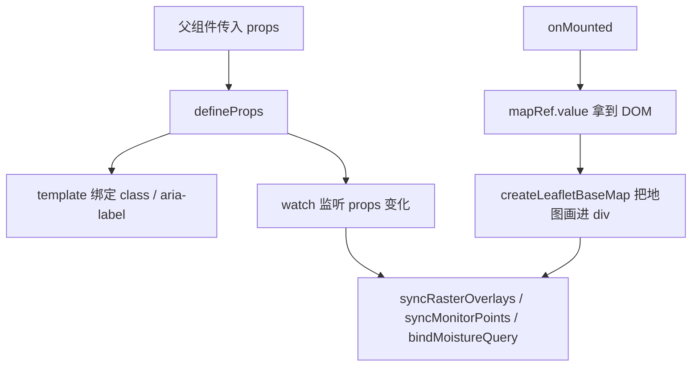

# P1-5 学习笔记：GIS 地图点击查墒情

> **对应计划**：[P1完成计划.md](./P1完成计划.md) · P1-5  
> **前置笔记**：[P1-4学习笔记.md](./P1-4学习笔记.md)（`GET /moisture/value` + `queryMoistureValue`）  
> **后续任务**：[P1-6](./P1完成计划.md) 监测点 `highlightPoint` 联动  
> **完成日期**：2026-06-04  
> **文档性质**：实现说明 + 学习笔记

---

## 1. P1-5 要解决什么问题

P1-4 只把「查墒情接口」接好了，页面上还点不出结果。

P1-5 的任务：**在 GIS Tab 里，用户点击地图任意位置 → 调 P1-4 接口 → 弹出墒情结果**，并在左下 caption 显示最近一次查值。

| 阶段 | 用户能做什么 |
|------|--------------|
| P0 | 看墒情热力图；点监测站圆点看 Popup |
| P1-4 | 开发者用 curl 测接口 |
| **P1-5** | **在 GIS 地图上点击 → 出现查值 Popup + caption 更新** |
| P1-6（未做） | 查值后自动 flyTo 最近监测站 |

---

## 2. 完成情况一览

| 范围 | 状态 | 说明 |
|------|------|------|
| GIS 地图 `click` 绑定 | ✅ | `RemoteSensingMap` + `enableMoistureQuery` |
| 调用 `queryMoistureValue` | ✅ | 点击后请求 P1-4 接口 |
| 查值 Leaflet Popup | ✅ | 独立于监测点 Popup，可并存 |
| 拖动误触过滤 | ✅ | 按下与抬起位移 > 5px 不查值 |
| `@moisture-query` 事件 | ✅ | 向 `RelatedData` 上报结果 |
| caption 提示与最近查值 | ✅ | 左下文案 |
| 监测点 flyTo 高亮 | ⏳ P1-6 | 未在本阶段实现 |
| GIS AI 动态文案 | ⏳ P1-7 | 未在本阶段实现 |

---

## 3. 改了哪些文件

| 文件 | 改动 |
|------|------|
| `src/components/remote-sensing/RemoteSensingMap.vue` | `enableMoistureQuery`、点击查值、Popup、`moistureQuery` 事件 |
| `src/views/user/RelatedData.vue` | 传 prop、监听事件、`lastMoistureQuery`、caption |

**未改动**：`agriMockCore.cjs`、`queryMoistureValue`（P1-4 已就绪）。

---

## 4. 端到端数据流



---

## 5. `RemoteSensingMap.vue` 实现要点

### 5.0 Vue template 与 script 如何连接

本组件的 `<template>` 很薄，只有一个带 `ref` 的 `<div>`；地图图层、监测点、墒情 Popup 都在 `<script setup>` 里用 Leaflet **命令式**画进这个容器。理解连接方式分两层。

#### 5.0.1 Vue SFC 的自动绑定（`<script setup>`）

`<script setup>` 里声明的变量、props、函数会**自动暴露给同文件的 `<template>`**，无需 `return` 或手动注册。

| Template 里写的 | Script 里对应的 |
|----------------|----------------|
| `ref="mapRef"` | `const mapRef = ref<HTMLDivElement \| null>(null)` |
| `:class="{ 'remote-sensing-map--queryable': enableMoistureQuery }"` | `defineProps` 里的 `enableMoistureQuery` |
| `:aria-label="mode === 'ndvi' ? ..."` | `defineProps` 里的 `mode` |

- `ref="mapRef"`：挂载后 Vue 把真实 DOM 赋给 `mapRef.value`，供 `initMap()` 使用。  
- `:class` / `:aria-label`：响应式绑定，props 变化时 template 自动更新。

父组件传入的 props 经 `defineProps` 进入 script，再被 template 绑定或 `watch` 监听。

#### 5.0.2 「空容器 + Leaflet 命令式渲染」

template 不提供 `<div>瓦片</div><div>标记</div>` 结构，只提供挂载点：

```vue
<template>
  <div
    ref="mapRef"
    class="remote-sensing-map"
    :class="{ 'remote-sensing-map--queryable': enableMoistureQuery }"
    role="application"
    :aria-label="mode === 'ndvi' ? 'NDVI 遥感地图' : '土壤墒情地图'" />
</template>
```

挂载后的调用链：



| 层级 | 职责 |
|------|------|
| **template** | 固定大小 DOM 容器 + 少量 UI 状态（如十字光标 class） |
| **script** | 在容器内创建瓦片、影像层、监测点、墒情 Popup |

因此很多 props **不驱动 template 子节点**，而是通过 `watch` 驱动 Leaflet：

```typescript
watch(() => [props.imageUrl, props.bounds, props.compareImageUrl], () => {
  if (map) syncRasterOverlays({ fitView: true })
})

watch(() => props.enableMoistureQuery, () => {
  if (map) bindMoistureQuery()
})
```

父组件改 `imageUrl` → script 更新图层；打开 `enableMoistureQuery` → script 绑定/解绑点击；template 本身几乎不变。

#### 5.0.3 事件如何回到父组件（不经过 template）

template 里没有 `@click`，但 script 在查值成功后 `emit`：

```typescript
emit('moistureQuery', data)
```

父组件：

```vue
<RemoteSensingMap @moisture-query="onMoistureQuery" />
```

`defineEmits` 定义事件名，script 调用 `emit`，父组件用 kebab-case 监听。这是 **script → 父组件** 的连接。

#### 5.0.4 一句话小结

- **Vue 层面**：template 通过 `ref`、`:class`、`:aria-label` 绑定 `mapRef` 与 `props`。  
- **业务层面**：template 只是地图挂载点；图层与交互由 `onMounted` + `watch` + Leaflet API 写入 `mapRef.value`。  
- **与父组件**：props 由外向内，事件经 `emit` 由内向外。

> 双 overlay、监测点层等更早的地图逻辑见 [P1-2学习笔记.md §6](./P1-2学习笔记.md#6-remotesensingmapvue-核心实现)。

### 5.1 新增 prop 与事件

```typescript
enableMoistureQuery?: boolean   // GIS Tab 时为 true

const emit = defineEmits<{
  moistureQuery: [result: MoistureQueryResult]
}>()
```

只在 `enableMoistureQuery === true` 时绑定点击；无人机 Tab 不传，避免误触。

### 5.2 点击与拖动区分

```text
mousedown → 记录屏幕坐标 pointerDown
click     → 若 |pointerDown - up| > 5px，视为拖动，不查值
          → 否则调用 queryMoistureValue
```

避免拖地图松手时误触发查询。

### 5.3 查值 Popup（与监测点 Popup 独立）

- 使用 `L.popup()` 临时实例，**不修改** marker 上绑定的 Popup。  
- 监测点 Popup（点圆点）与查值 Popup（点空白处）**可同时存在**（计划 §3.3）。  
- 墒情热力图 overlay 仍为 `interactive: false`，点击会穿透到底图，能触发 `map.click`。

Popup 内容示例：

```text
墒情查询
墒情：12%
来源：最近监测点（演示）
参考站：监测站 · 雄县
距离：0.8 km
```

### 5.4 样式

- GIS 可查询时地图容器 `cursor: crosshair`（类名 `remote-sensing-map--queryable`）。  
- 查值 Popup 使用 `moisture-query-leaflet-popup` 类（挂在 Leaflet 外层 `.leaflet-popup` 上）。  
- 全局 `leaflet-theme.css` 默认给**所有** Popup 深色毛玻璃底 + `backdrop-filter: blur`，监测点 Popup 沿用该风格；墒情查值 Popup 在全局样式中**单独覆盖**为浅色不透明底 `#f8faf6`、深色字，避免与深色文字叠在一起发糊、难读。  
- Popup 内容 HTML 使用 `moisture-query-popup` / `moisture-query-title` / `moisture-query-value` 等类名（由 `buildMoisturePopupHtml` 生成，样式在 `leaflet-theme.css`，因 Leaflet 动态插入 DOM 须全局样式）。

### 5.5 生命周期

| 时机 | 行为 |
|------|------|
| `initMap` | `bindMoistureQuery()` |
| `enableMoistureQuery` 变化 | 重新 bind / unbind |
| `onBeforeUnmount` | `unbindMoistureQuery()`，移除 Popup |

---

## 6. `RelatedData.vue` 接入

### 6.1 模板

```vue
<RemoteSensingMap
  :enable-moisture-query="currentTab === 'gis'"
  @moisture-query="onMoistureQuery"
/>
```

### 6.2 状态与 caption

```typescript
const lastMoistureQuery = ref<MoistureQueryResult | null>(null)

function onMoistureQuery(result: MoistureQueryResult) {
  lastMoistureQuery.value = result
}
```

左下新增两行（`pointer-events: none` 不变）：

```text
点击地图可查询该位置墒情（演示：最近监测点）
最近查值：12% · 监测站 · 雄县        ← 点击后出现
```

离开 GIS Tab 时清空 `lastMoistureQuery`，避免切回时显示旧数据。

---

## 7. 与监测点 Popup 的区别（复习）

| | 监测点 Popup | P1-5 查值 Popup |
|--|-------------|-----------------|
| 触发 | 点 **圆点** | 点 **地图任意处** |
| 数据 | 该站固定传感器 | 最近站代填（P1-4 方案 A） |
| 实现 | marker.bindPopup | 临时 `L.popup()` |

---

## 8. 本地如何自测

**前置**：`npm run dev` + `npm run mock`（P1-4 接口可用）。

1. 登录农技员 → **相关数据** → **GIS 数据**。  
2. 鼠标移到地图上应为 **十字光标**。  
3. 在雄县附近 **点击**（不要拖太远）→ 出现白色查值 Popup，约 **12%**、**监测站 · 雄县**。  
4. 左下 caption 出现「最近查值：12% · …」。  
5. 再点 **监测站圆点** → 监测点 Popup 仍正常，**无操作按钮**（P0）。  
6. 拖到河间附近点击 → 查值应接近河间站 **30%**。  
7. 切到 **无人机** 再回 **GIS** → 「最近查值」行应已清空。  
8. 关掉 `npm run mock` 再点击 → Popup 提示查询失败。

---

## 9. 与 P1-6 / P1-7 的分工

| 任务 | 内容 |
|------|------|
| **P1-5（本阶段）** | 点击 → API → 查值 Popup → caption |
| **P1-6** | `highlightPoint(nearestPointId)` → flyTo + 打开监测站 Popup |
| **P1-7** | `aiConclusion` 随 `lastMoistureQuery` 变化 |

P1-5 已通过 `emit('moistureQuery', data)` 把 `nearestPointId` 交给页面，P1-6 可在 `onMoistureQuery` 或地图组件内接高亮。

---

## 10. 学习要点小结

1. **接口与交互分阶段**：P1-4 通接口，P1-5 接 UI，降低一次改动的风险。  
2. **查值 Popup 与 marker Popup 分离**：不要复用 `bindPopup`，否则覆盖监测点逻辑。  
3. **拖动阈值**：地图组件必备，避免 pan 后误查询。  
4. **prop 控制能力**：`enableMoistureQuery` 比硬编码 `mode === 'moisture'` 更清晰（同一 mode 下也可关闭查询）。  
5. **事件上浮**：地图组件 `emit`，页面存 `lastMoistureQuery`，方便 P1-6/P1-7 复用。  
6. **薄 template + 命令式地图**：`ref="mapRef"` 拿 DOM，`onMounted` / `watch` 驱动 Leaflet；勿指望在 template 里写地图子结构。

---

## 11. 相关文档

- [P1-4学习笔记.md](./P1-4学习笔记.md) — 接口与冒烟  
- [P1完成计划.md](./P1完成计划.md) — §3.3、§8.1  
- [监测点联动.md](./监测点联动.md) — 原始 GIS 点击方案  

---

*文档版本：v1.1 · P1-5 GIS 点击查墒情 · 含 template/script 连接说明与 Popup 样式 · 2026-06-04*
