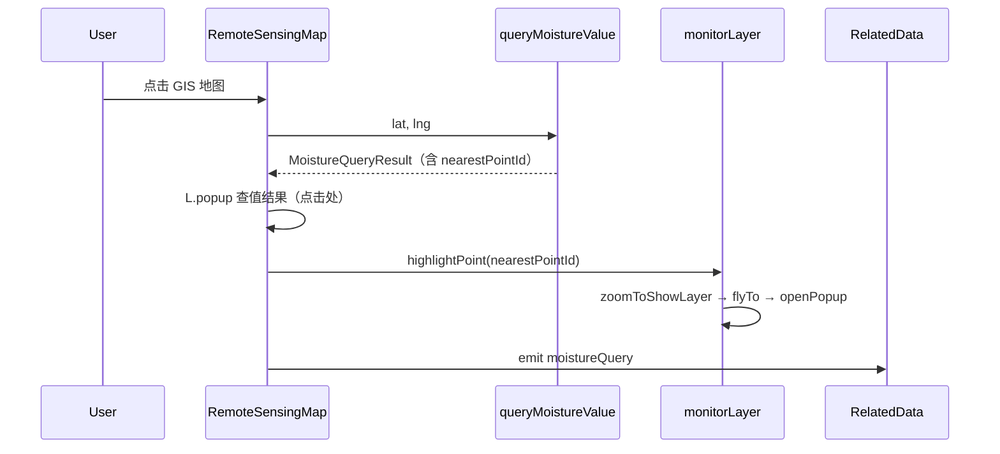

# P1-6 学习笔记：查墒情后监测点高亮联动

> **对应计划**：[P1完成计划.md](./P1完成计划.md) · P1-6  
> **前置笔记**：[P1-5学习笔记.md](./P1-5学习笔记.md)（GIS 点击查墒情）  
> **后续任务**：[P1-7](./P1完成计划.md) 动态 AI / caption 文案  
> **完成日期**：2026-06-04  
> **文档性质**：实现说明 + 学习笔记

---

## 1. P1-6 要解决什么问题

P1-5 点击地图后会在点击处弹出**查值 Popup**，并在 caption 显示最近查值，但用户还要自己找「参考站」对应的圆点。

P1-6 的任务：**查值成功后，地图自动飞到最近监测站并打开该站 Popup**，把「查值结果」和「地面传感器站点」视觉上连起来。

| 阶段 | 用户看到什么 |
|------|--------------|
| P1-5 | 点击处查值 Popup + caption「最近查值」 |
| **P1-6** | **同上 + 地图 flyTo 最近站 + 监测点 Popup 打开** |
| P1-7（未做） | AI 结论随查值变化 |

---

## 2. 完成情况一览

| 范围 | 状态 | 说明 |
|------|------|------|
| `highlightPoint(id, zoom?)` | ✅ | `useMonitorPointLayer.ts` |
| 查值后自动联动 | ✅ | `RemoteSensingMap` 在 API 成功后调用 |
| `zoomToShowLayer` 处理聚合 | ✅ | 低缩放时先展开 cluster 再 flyTo |
| 查值 Popup 与监测点 Popup 并存 | ✅ | 互不替换 |
| `defineExpose` 桥接 | ✅ | `highlightMonitorPoint` 供页面按需调用 |
| P1-7 动态 AI | ⏳ | 未在本阶段实现 |

---

## 3. 改了哪些文件

| 文件 | 改动 |
|------|------|
| `src/composables/useMonitorPointLayer.ts` | 新增 `highlightPoint` |
| `src/components/remote-sensing/RemoteSensingMap.vue` | 查值成功后 `highlightPoint`；暴露 `highlightMonitorPoint` |

**未改动**：`agriMockCore.cjs`、`RelatedData.vue`（P1-5 已接 `@moisture-query`，`nearestPointId` 已够用）。

---

## 4. 端到端数据流



---

## 5. `highlightPoint` 实现要点

### 5.1 核心代码（`useMonitorPointLayer.ts`）

```typescript
function highlightPoint(pointId: number, zoom = 14) {
  const marker = markersById.get(pointId)
  if (!marker) return

  cluster.zoomToShowLayer(marker, () => {
    map.flyTo(marker.getLatLng(), zoom, { duration: 0.8 })
    marker.openPopup()
  })
}
```

| 步骤 | 作用 |
|------|------|
| `markersById.get(pointId)` | `render` 时建立的 id → marker 索引 |
| `cluster.zoomToShowLayer` | 若 marker 被聚合隐藏，先缩放到可见 |
| `map.flyTo(..., 14)` | 飞到站点，默认 zoom 14 |
| `marker.openPopup()` | 打开监测站只读 Popup（P0 无操作按钮） |

### 5.2 为何需要 `zoomToShowLayer`

监测点使用 `markerClusterGroup`。缩放过小时多个站合成一个数字簇，直接 `openPopup()` 无效。  
`zoomToShowLayer` 是 leaflet.markercluster 提供的标准 API：先展开到能看见该 marker，再执行回调。

### 5.3 两个 Popup 并存（`addTo` 而非 `openOn`）

Leaflet 通过 `openOn(map)` / `marker.openPopup()` 打开 Popup 时，**同一地图只保留一个**（后打开的会关掉前一个）。若查值用 `openOn`、高亮再 `openPopup`，点击处 Popup 会立刻被顶掉，表现为「只有 flyTo、看不到查值 Popup」。

**做法**：两个 Popup 都用 `popup.addTo(map)` 挂到地图上，并设：

```typescript
{ autoPan: false, autoClose: false, closeOnClick: false }
```

| Popup | 锚点 | 打开方式 |
|-------|------|----------|
| 查值 | 点击坐标 | `L.popup(...).addTo(map)` |
| 监测站 | 站点坐标 | `marker.getPopup()!.addTo(map)`（`flyTo` 的 `moveend` 后） |

`autoPan: false` 避免查值 Popup 把视野拉走。高亮时用 `fitBounds(点击处, 监测站)`（`padding: 100px`、`maxZoom: 14`）让两个 Popup 都落在当前视野内，动画结束后再 `addTo` 监测站 Popup。再次点击地图时会 `remove` 旧查值 Popup 并 `dismissHighlight()`。

---

## 6. `RemoteSensingMap.vue` 接入

查值成功后、向父组件 `emit` 之前：

```typescript
if (data.nearestPointId != null) {
  monitorLayer?.highlightPoint(data.nearestPointId)
}
emit('moistureQuery', data)
```

前提：`showMonitorPoints === true`（GIS Tab 已满足），且 `monitorLayer` 已在 `syncMonitorPoints` 中创建。

对外暴露（可选手动高亮）：

```typescript
defineExpose({ invalidate, highlightMonitorPoint })
```

父组件可通过 `remoteMapRef.highlightMonitorPoint(2)` 触发，一般不必——查值已自动联动。

---

## 7. 本地如何自测

**前置**：`npm run dev` + `npm run mock`，登录农技员 → **相关数据** → **GIS 数据**。

1. 在雄县附近点击地图 → 查值 Popup 约 **12%**，同时地图 **flyTo 雄县站** 并打开监测点 Popup。  
2. 两个 Popup 同时可见（可能在屏幕不同位置）。  
3. 缩到 zoom 很小时点击查值 → 应先放大展开 cluster，再打开对应站 Popup。  
4. 点击河间附近 → 联动 **河间站（30%）**；栾城附近 → **栾城站（65%）**。  
5. 无人机 Tab 无监测点层，无查值，不涉及本功能。

---

## 8. 与 P1-5 / P1-7 的分工

| 任务 | 内容 |
|------|------|
| P1-5 | 点击 → API → 查值 Popup → caption |
| **P1-6** | `nearestPointId` → flyTo + 监测站 Popup |
| P1-7 | `lastMoistureQuery` → `aiConclusion` 动态文案 |

`nearestPointId` 由 P1-4 Mock 返回，P1-5 经 `emit` 交给页面；P1-6 在地图组件内消费，无需改 `RelatedData`。

---

## 9. 学习要点小结

1. **聚合图层要先 `zoomToShowLayer`**，再 `openPopup`，否则高亮无反应。  
2. **查值 Popup 与 marker Popup 分离**：高亮只 `openPopup`，不替换查值 Popup。  
3. **`markersById` 与 `render` 同生命周期**：`detach` 或换 Tab 后需重新 `render` 才有索引。  
4. **默认 zoom 14**：与计划一致，可按答辩需要调 `highlightPoint(id, 12)`。  
5. **expose 桥接**：自动联动为主，暴露方法便于 P1-7 或调试扩展。

---

## 10. 相关文档

- [P1-5学习笔记.md](./P1-5学习笔记.md) — GIS 点击查墒情  
- [P1-4学习笔记.md](./P1-4学习笔记.md) — `nearestPointId` 来源  
- [P1完成计划.md](./P1完成计划.md) — §3.3  
- [监测点联动.md](./监测点联动.md) — 原始联动方案  

---

*文档版本：v1.0 · P1-6 监测点高亮联动 · 2026-06-04*
