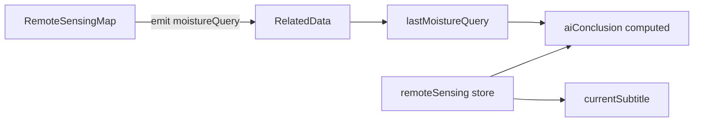

# P1-7 学习笔记：动态 AI 文案与副标题

> **对应计划**：[P1完成计划.md](./P1完成计划.md) · P1-7  
> **前置笔记**：[P1-5学习笔记.md](./P1-5学习笔记.md)（`lastMoistureQuery`）、[P1-6学习笔记.md](./P1-6学习笔记.md)（监测点联动）  
> **完成日期**：2026-06-04  
> **文档性质**：实现说明 + 学习笔记

---

## 1. P1-7 要解决什么问题

P1-5/P1-6 已在 GIS Tab 实现点击查墒情、caption「最近查值」和监测站联动，但底部 **AI 智能分析** 仍是 P0 写死的墒情分布描述；无人机 Tab 开启历史对比后，页头副标题与 AI 也未体现对比状态。

P1-7 的任务：**让 AI 文案与页头副标题随用户操作动态变化**，无操作时保留 P0 默认话术。

| 场景 | 变化 |
|------|------|
| GIS 无点击 | 默认墒情分布 AI |
| GIS 点击查值后 | AI 含墒情%、来源、干湿判断 +「已定位至传感器」 |
| 无人机开启对比 | 副标题追加对比日期；AI 描述两期 NDVI 变化 |
| 离开 GIS Tab | 清空 `lastMoistureQuery` → AI 恢复默认（P1-5 已有） |

---

## 2. 完成情况一览

| 范围 | 状态 | 说明 |
|------|------|------|
| GIS 动态 AI | ✅ | 依赖 `lastMoistureQuery` |
| GIS 默认 AI | ✅ | 无查值时保持 P0 文案 |
| 无人机对比副标题 | ✅ | `currentSubtitle` 追加对比日期 |
| 无人机对比 AI | ✅ | `compareEnabled` 时两期 NDVI 话术 |
| caption「最近查值」 | ✅ | P1-5 已实现，本阶段不重复改 |

---

## 3. 改了哪些文件

| 文件 | 改动 |
|------|------|
| `src/views/user/RelatedData.vue` | `currentSubtitle`、`aiConclusion` 及辅助函数 |

**未改动**：地图组件、Store、Mock。

---

## 4. 文案策略（与计划 §3.4 对齐）

### 4.1 GIS Tab

**无点击**（`lastMoistureQuery === null`）：

```text
土壤水分热力图显示栾城区一带墒情偏高，河间—雄县段偏干，建议分区灌溉。
```

**点击后**（模板）：

```text
{pointName} 附近墒情约 {moisture}%（{sourceLabel}），{levelHint}。已定位至 {pointName} 传感器。
```

| `moisture` | `levelHint` |
|------------|-------------|
| ≤ 20% | 墒情偏低，与参考站传感器读数一致，建议关注灌溉 |
| ≥ 60% | 墒情偏高，与参考站传感器读数一致，建议留意排水 |
| 其余 | 墒情适中，与参考站传感器读数一致 |

`source === 'nearest-point'` 显示为「最近监测点」。

### 4.2 无人机 Tab

**副标题**（`currentSubtitle`）：

```text
作物长势 NDVI 指数分析 · 河间 · 2026-05-20 · 对比 2026-05-01
```

**AI — 未开对比**：保持 P0 缺氮/变量施肥话术。

**AI — 开启对比**：

```text
{地块} 当前期 {selectedNdviDate} 与对比期 {compareNdviDate} 的 NDVI 影像叠加显示植被指数变化……
```

---

## 5. 实现要点

### 5.1 数据从哪来



- GIS AI：**不读地图组件**，只读页面级 `lastMoistureQuery`（P1-5 已写入）。  
- 无人机 AI/副标题：读 `remoteStore.compareEnabled`、`compareNdviDate`、`selectedNdviDate`。

### 5.2 辅助函数（`RelatedData.vue`）

| 函数 | 作用 |
|------|------|
| `formatMoistureSourceLabel` | `nearest-point` → 中文「最近监测点」 |
| `moistureLevelHint` | 按阈值生成偏低/偏高/适中描述 |
| `buildGisAiConclusion` | 拼装 GIS 动态 AI |
| `buildDroneAiConclusion` | 按是否对比返回无人机 AI |

`aiConclusion` 为 `computed`，Tab 切换、查值、对比开关变化时自动更新。

### 5.3 与 P1-5 caption 的分工

| 位置 | 内容 | 更新时机 |
|------|------|----------|
| 左下 `map-caption` | 「最近查值：12% · 监测站 · 雄县」 | `onMoistureQuery` |
| 底部 `ai-analysis-box` | 完整分析段落 | 同上 + 对比状态 |

caption 短、固定格式；AI 长、含建议话术。

---

## 6. 本地如何自测

**GIS**

1. 相关数据 → GIS → 未点击时，AI 为默认墒情分布描述。  
2. 在雄县附近点击 → AI 变为约 **12%**、偏低、已定位雄县站。  
3. 在栾城附近点击 → AI 约 **65%**、偏高。  
4. 切到无人机再回 GIS → AI 恢复默认（`lastMoistureQuery` 已清空）。

**无人机**

1. 河间地块 → 勾选对比历史 → 副标题出现「对比 2026-05-01」。  
2. AI 变为两期 NDVI 对比描述。  
3. 关闭对比 → AI 恢复缺氮/施肥话术。

---

## 7. 学习要点小结

1. **页面状态驱动文案**：`lastMoistureQuery` + Store 对比状态，不必让 AI 组件感知地图细节。  
2. **computed 集中拼装**：辅助函数保持 `aiConclusion` 可读，避免 template 里长字符串。  
3. **默认兜底**：无查值 / 无对比时显式回退 P0 文案，答辩时「没操作也有话说」。  
4. **与 P1-6 衔接**：「已定位至传感器」对应 flyTo + 监测站 Popup，纯文案不重复调地图 API。  
5. **caption 与 AI 互补**：同一数据源，不同信息密度。

---

## 8. 相关文档

- [P1-5学习笔记.md](./P1-5学习笔记.md) — `lastMoistureQuery`  
- [P1-6学习笔记.md](./P1-6学习笔记.md) — 监测点联动  
- [P1-1学习笔记.md](./P1-1学习笔记.md) — 对比控件与 Store  
- [P1完成计划.md](./P1完成计划.md) — §3.4、§8.1  

---

*文档版本：v1.0 · P1-7 动态 AI 与副标题 · 2026-06-04*
