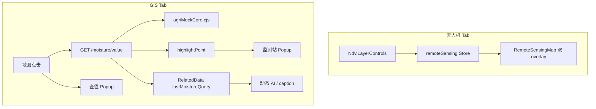

# P1 阶段学习笔记总结：相关数据页交互完善

> **阶段定位**：P0「能看地图」→ P1「能交互分析」  
> **上级方案**：[P1完成计划.md](./P1完成计划.md) · [监测点联动.md](./监测点联动.md)  
> **前置阶段**：[P0完成计划.md](./P0完成计划.md)（v1.2 · 已全部落地）  
> **验收日期**：2026-06-05  
> **文档性质**：阶段总览 + 联调验收记录 + 学习路线索引

---

## 1. P1 阶段达成了什么

在 P0 遥感地图壳、单层 NDVI/墒情栅格、只读监测点基础上，P1 补齐两条答辩主线：

| 主线 | 用户可演示的能力 |
|------|------------------|
| **无人机 NDVI** | 河间地块两期影像透明度对比（开关 + 对比日期 + 滑块） |
| **GIS 墒情** | 点击地图查墒情 → 查值 Popup → 定位最近监测站 → AI 文案更新 |



---

## 2. 子任务一览与详细笔记

| 编号 | 交付项 | 状态 | 详细笔记 |
|------|--------|------|----------|
| P1-1 | NDVI 对比 UI（开关/对比日期/透明度） | ✅ | [P1-1学习笔记.md](./P1-1学习笔记.md) |
| P1-2 | 双 `imageOverlay` 透明度叠加 | ✅ | [P1-2学习笔记.md](./P1-2学习笔记.md) |
| P1-3 | Store `compare*` 状态 | ✅ | [P1-3学习笔记.md](./P1-3学习笔记.md) |
| P1-4 | Mock `GET /moisture/value` | ✅ | [P1-4学习笔记.md](./P1-4学习笔记.md) |
| P1-5 | GIS 点击查墒情 + 查值 Popup | ✅ | [P1-5学习笔记.md](./P1-5学习笔记.md) |
| P1-6 | 监测点 `highlightPoint` 联动 | ✅ | [P1-6学习笔记.md](./P1-6学习笔记.md) |
| P1-7 | 动态 AI / 副标题 | ✅ | [P1-7学习笔记.md](./P1-7学习笔记.md) |
| P1-8 | 部署 Mock 双端一致 | ✅ | [agriMockCore学习笔记.md](../../前后端交互/agriMockCore学习笔记.md) |

**建议阅读顺序（新人）：** P1-3 → P1-1 → P1-2（无人机线）→ P1-4 → P1-5 → P1-6 → P1-7（GIS 线）。

---

## 3. 核心文件地图

| 路径 | P1 职责 |
|------|---------|
| `src/stores/remoteSensing.ts` | `compareEnabled` / `compareNdviDate` / `compareOpacity` / `canCompareNdvi` |
| `src/components/remote-sensing/NdviLayerControls.vue` | 对比控件 UI |
| `src/components/remote-sensing/RemoteSensingMap.vue` | 双 overlay、GIS 点击查值、桥接 `highlightPoint` |
| `src/composables/useMonitorPointLayer.ts` | `highlightPoint` + `fitBounds` 双 Popup 同框 |
| `src/api/remoteSensing.ts` | `queryMoistureValue` |
| `src/types/remoteSensing.ts` | `MoistureQueryResult` |
| `src/views/user/RelatedData.vue` | compare props、查值状态、动态 AI |
| `deploy/api_mock/agriMockCore.cjs` | 农业 Mock 共用逻辑（含最近站查墒情） |
| `src/mock/server.ts` / `deploy/api_mock/server.js` | 自定义路由注册 |
| `src/styles/leaflet-theme.css` | Popup 全局主题（监测点/查值统一深色风格） |

---

## 4. 两条业务闭环（答辩用）

### 4.1 无人机：两期 NDVI 对比

```text
选河间地块 → 影像日期 2026-05-20 → 勾选「对比历史」→ 对比日期 2026-05-01
→ 拖动历史透明度 → 看到 ndvi-heatmap-may20 与 ndvi-heatmap 叠图变化
→ 副标题 / AI 出现两期对比描述
```

**数据设计口径：** 仅河间有 2 期 NDVI；雄县/栾城各 1 期 → 对比开关 disabled 是**预期行为**，不是 bug。

### 4.2 GIS：点击查墒情 + 传感器联动

```text
GIS Tab → 十字光标 → 点击地图任意处
→ GET /moisture/value（方案 A：最近监测点 soilMoisture）
→ 点击处「墒情查询」Popup（addTo，不与监测站互斥）
→ fitBounds(点击处, 监测站) 两 Popup 同在视野内
→ 监测站 Popup 打开（只读，无操作按钮）
→ caption「最近查值」+ 底部 AI 动态文案
```

**Mock 演示数据：**

| 最近站 | soilMoisture | 冒烟坐标示例 |
|--------|--------------|--------------|
| 雄县 | 12% | lat=38.99, lng=116.10 |
| 河间 | 30% | lat=38.45, lng=116.10 |
| 栾城 | 65% | lat=37.90, lng=114.65 |

---

## 5. 联调验收记录（2026-06-05）

**前置：** `npm run dev` + `npm run mock`（3000 端口）；农技员登录。

### 5.1 自动化 / 工程检查

| 项 | 结果 | 说明 |
|----|------|------|
| `vue-tsc --noEmit` | ✅ 通过 | 0 TS 错误 |
| `npm run build` | ✅ 通过 | 生产构建成功 |
| `GET /moisture/value` 冒烟 | ✅ 通过 | 见下表 |
| `deploy/api_mock/server.js` 路由 | ✅ 一致 | 与 `server.ts` 同调 `agriMockCore` |

**接口冒烟实测：**

| 请求 | moisture | nearestPointId | 结论 |
|------|----------|----------------|------|
| `lat=38.99&lng=116.10` | 12 | 2（雄县） | ✅ |
| `lat=37.90&lng=114.65` | 65 | 3（栾城） | ✅ |
| `lat=38.45&lng=116.10` | 30 | 1（河间） | ✅ |

### 5.2 功能验收（§8.1 对照）

| 编号 | 验收项 | 结果 | 备注 |
|------|--------|------|------|
| P1-1 | 河间可开对比；雄县/栾城 disabled | ✅ | `canCompareNdvi` + tooltip |
| P1-2 | 透明度滑块有效；关对比恢复单层 | ✅ | 对比层在上、当前层 opacity=1 |
| P1-3 | 换地块重置对比 | ✅ | `selectField` → `resetCompare` |
| P1-4 | `/moisture/value` 合法 JSON | ✅ | 冒烟通过 |
| P1-5 | GIS 点击出查值 Popup，数值=最近站 | ✅ | 5px 拖动过滤 |
| P1-6 | flyTo + 监测站 Popup；双 Popup 同框 | ✅ | `addTo` + `fitBounds`（见 §6） |
| P1-7 | AI / caption 随查值更新 | ✅ | `lastMoistureQuery` + 对比 AI |
| 回归 | 四 Tab、传感器/气象/灾害页 Popup 按钮 | ✅ | GIS 只读；监测页保留操作按钮 |

### 5.3 建议浏览器手测清单（录屏用）

1. **无人机** §9.1：河间对比 → 滑块 → 换雄县 disabled → 关对比  
2. **GIS** §9.2：雄县点击 12% → 两 Popup 可见 → AI 更新 → 切 Tab 清空  
3. **回归** §9.3：传感器图表 x 轴、灾害页「手动触发」按钮、Tab 切换地图不空白  

---

## 6. P1 踩坑与修复（值得记住）

| 问题 | 原因 | 解决 |
|------|------|------|
| 查值 Popup 发糊 / 看不清 | 深色字叠深色毛玻璃底 | 统一 `leaflet-popup-content-themed` + 浅色字 |
| 点击处无 Popup、只 flyTo | `openOn` 与 `openPopup` 互斥 | 两 Popup 均用 `addTo(map)` |
| 飞走后看不到查值 Popup | 仅 `flyTo` 监测站 | `fitBounds(点击处, 站)` + padding |
| 改 `.cjs` 不生效 | `tsx watch` 不监听 `.cjs` | 重启 `npm run mock` |
| 两期 NDVI 看不出差别 | 同一张 WebP | 河间 5-20 换 `ndvi-heatmap-may20` |
| 对比滑块无感 | 不透明当前层盖住下层 | 当前层 opacity=1，历史层在上调透明度 |

---

## 7. 架构原则（P1 沉淀）

1. **地图组件纯 props**：`RemoteSensingMap` 不读 Pinia，由 `RelatedData` 传 compare / 监测点数据。详见 [地图组件纯props原则学习笔记.md](./地图组件纯props原则学习笔记.md)。  
2. **接口与 UI 分阶段**：P1-4 先通 API，P1-5 再接点击，降低一次改动风险。  
3. **Mock 逻辑单点维护**：`agriMockCore.cjs` 本地与宝塔共用。  
4. **查值 Popup 与 marker Popup 分离**：不复用 `bindPopup`，避免覆盖监测点逻辑。  
5. **页面状态驱动 AI**：`lastMoistureQuery` 在 `RelatedData`，地图只 `emit`。  
6. **薄 template + 命令式 Leaflet**：`ref="mapRef"` 容器 + `onMounted` / `watch` 驱动图层。

---

## 8. 本地开发速查

```bash
# 终端 1
npm run dev

# 终端 2（含 /moisture/value）
npm run mock

# 改 db.json 遥感表后
pnpm sync:mock-db
```

| 现象 | 处理 |
|------|------|
| 查值 404 | 确认 mock 运行；前端走 `/api` 代理 |
| 查值失败 Popup | 重启 mock |
| 对比无效果 | 确认河间 + 两期日期 + 对比已开 |
| 部署后查值失败 | 上传 `server.js` + `agriMockCore.cjs`，重启 PM2 |

---

## 9. P2 方向（未做）

- 墒情查值方案 B（IDW）/ C（栅格采样）  
- GeoTIFF / TiTiler 真遥感瓦片  
- `leaflet-side-by-side` 分屏对比  
- 监测点 Popup「栅格 vs 传感器」双值  
- 三地区各一张 `moistureLayers` + GIS 区域切换  

详见 [P1完成计划.md §11](./P1完成计划.md) 与 [监测点联动.md §六](./监测点联动.md)。

---

## 10. 相关文档索引

| 文档 | 用途 |
|------|------|
| [P1完成计划.md](./P1完成计划.md) | 原始计划与验收标准 |
| [P0完成计划.md](./P0完成计划.md) | P1 基线 |
| [监测点联动.md](./监测点联动.md) | GIS 点击方案来源 |
| [agriMockCore学习笔记.md](../../前后端交互/agriMockCore学习笔记.md) | Mock 业务逻辑全集 |
| P1-1～P1-7 各笔记 | 单任务实现细节 |
| [地图组件纯props原则学习笔记.md](./地图组件纯props原则学习笔记.md) | 原则一 + Pinia/Store 补课 |

---

*文档版本：v1.0 · P1 阶段总结与联调验收 · 2026-06-05*
