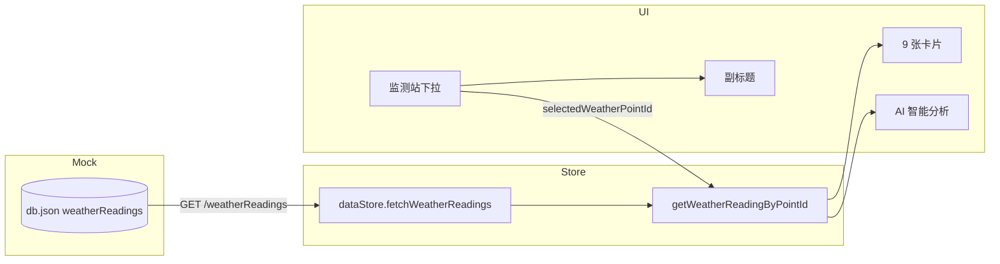

# 气象 Tab 动态数据学习笔记

> **涉及页面**：`src/views/user/RelatedData.vue` · 气象数据 (天) Tab  
> **前置笔记**：[P1-7学习笔记.md](./P1-7学习笔记.md)（动态 AI 与副标题）、[监测点联动.md](./监测点联动.md)  
> **完成日期**：2026-06-05  
> **文档性质**：实现说明 + 学习笔记

---

## 1. 要解决什么问题

气象 Tab 原先只有 3 张静态卡片（温度、湿度、降水概率），存在以下问题：

| 问题 | 说明 |
|------|------|
| 指标不全 | 无法体现农田综合监测站常见的土壤 + 大气 9 项读数 |
| 数据写死 | `weatherMetrics` 硬编码在组件内，与 Mock / Store 脱节 |
| 监测站不明 | 系统已有 3 个监测站（河间 / 雄县 / 栾城），但页面看不出数据属于哪一站 |
| 布局缺陷 | 9 卡 3×3 网格曾出现第三行重叠；纵向空白与卡片高度也曾需调优 |

本次目标：**9 项指标 × 3 个监测站，Mock 驱动，Tab 内可切换，副标题与 AI 随站变化**。

---

## 2. 业务模型：9 项 vs 3 站

**不是**把 9 项拆成「每站 3 项」，而是 **每个监测站各有一套完整 9 项读数**：

| 类别 | 指标 |
|------|------|
| 土壤（探头） | 土壤体积含水率、10cm 土壤温度、土壤 EC |
| 大气（气象传感器） | 空气温度、相对湿度、风速、风向、气压、小时降雨量 |

与 GIS / 遥感地块的对应关系（`fields.monitorPointId`）：

| 地块 | monitorPointId | 监测站 |
|------|----------------|--------|
| 1号地块（河间市） | 1 | 监测站 · 河间市 |
| 2号地块（雄县） | 2 | 监测站 · 雄县 |
| 3号地块（栾城区） | 3 | 监测站 · 栾城区 |

---

## 3. 完成情况一览

| 范围 | 状态 | 说明 |
|------|------|------|
| Mock `weatherReadings` | ✅ | 三站各 9 项，数值与 `monitorPoints` 墒情特征呼应 |
| Store 拉取 | ✅ | `fetchWeatherReadings` / `getWeatherReadingByPointId` |
| 监测站下拉 | ✅ | 标题区 `a-select`，选项来自 `monitorPoints` |
| 动态卡片 | ✅ | `weatherMetrics` 改为 `computed` |
| 动态副标题 | ✅ | `{站名} · 土壤墒情与局地小气候实时监测` |
| 动态 AI | ✅ | `buildWeatherAiConclusion` 按读数生成 |
| 地块联动 | ✅ | 切到气象 Tab 时同步 `remoteStore.selectedFieldId` 对应站 |
| 网格布局 | ✅ | `minmax(0,1fr)` 防重叠；`grid-auto-rows: 1fr` 纵向撑满 |

---

## 4. 改了哪些文件

| 文件 | 改动 |
|------|------|
| `src/mock/db.json` | 新增 `weatherReadings` 数组（3 条） |
| `deploy/api_mock/db.json` | 同上（线上 Mock 同步） |
| `src/stores/data.ts` | `WeatherReading` 类型、`weatherReadings`、`fetchWeatherReadings`、`getWeatherReadingByPointId` |
| `src/views/user/RelatedData.vue` | 监测站选择器、动态指标 / 副标题 / AI、布局样式、`onMounted` 拉取 |

---

## 5. Mock 数据结构

接口：`GET /weatherReadings`（json-server 自动生成）

单条示例：

```json
{
  "id": 1,
  "pointId": 1,
  "updatedAt": "2026-06-05T14:00:00+08:00",
  "soilVwc": 25.3,
  "soilTemp10cm": 29.1,
  "soilEc": 227,
  "airTemp": 33.2,
  "airRh": 38.7,
  "windSpeed": 2.3,
  "windDirection": 185,
  "windDirectionText": "偏南风",
  "pressure": 998.6,
  "hourlyRain": 0
}
```

三站数据设计要点（与 `monitorPoints.soilMoisture` 一致）：

| pointId | 站名 | soilVwc | 特征 |
|---------|------|---------|------|
| 1 | 河间市 | 25.3 | 中等偏干 |
| 2 | 雄县 | 12.8 | 高温低湿（warning 站） |
| 3 | 栾城区 | 38.6 | 偏湿，有 0.6mm 降雨 |

---

## 6. Store 层

```ts
export interface WeatherReading {
  id: number
  pointId: number
  updatedAt: string
  soilVwc: number
  soilTemp10cm: number
  soilEc: number
  airTemp: number
  airRh: number
  windSpeed: number
  windDirection: number
  windDirectionText: string
  pressure: number
  hourlyRain: number
}

// 拉取：http.get('/weatherReadings')
// 查询：getWeatherReadingByPointId(pointId)
```

`RelatedData.vue` 的 `onMounted` 中，若 `weatherReadings` 为空则调用 `fetchWeatherReadings()`，失败时 `message.warning`。

---

## 7. 页面层核心逻辑

### 7.1 监测站选择

```ts
const selectedWeatherPointId = ref<number>(1)

const weatherPointOptions = computed(() =>
  dataStore.monitorPoints.map((point) => ({
    value: point.id,
    label: point.name
  }))
)
```

模板：仅在 `currentTab === 'weather'` 时于 `header-actions` 渲染 `a-select`。

### 7.2 指标格式化

`formatWeatherMetrics(reading)` 将 `WeatherReading` 转为 9 张卡片的 `{ label, value }[]`：

- 数值统一 `toFixed` 展示
- `hourlyRain <= 0` 时显示 `0.0 mm（无降水）`

`weatherMetrics` 为 `computed`，依赖 `selectedWeatherPointId`。

### 7.3 副标题

```ts
if (currentTab.value === 'weather') {
  const pointName = getWeatherPointName(selectedWeatherPointId.value)
  return `${pointName} · 土壤墒情与局地小气候实时监测`
}
```

### 7.4 AI 文案

`buildWeatherAiConclusion(reading, pointName)` 规则：

| 条件 | 追加话术 |
|------|----------|
| `hourlyRain <= 0` | 当前无降水 |
| `hourlyRain > 0` | 近 1 小时降雨 X mm |
| `airRh < 40` | 空气偏干 |
| `airRh > 60` | 空气湿度较高 |
| `soilVwc < 20` | 土壤墒情偏低，建议适时补灌 |
| `soilVwc > 35` | 土壤墒情充足 |
| 其余 | 蒸腾作用较强，建议关注墒情 |

### 7.5 与遥感地块联动

```ts
watch(currentTab, (tab) => {
  if (tab !== 'weather') return
  const field = remoteStore.fields.find((item) => item.id === remoteStore.selectedFieldId)
  if (field?.monitorPointId) {
    selectedWeatherPointId.value = field.monitorPointId
  }
})
```

用户在无人机 Tab 选了「2号地块（雄县）」后切到气象 Tab，下拉会自动选中雄县监测站。

---

## 8. 布局相关改动（同次迭代）

### 8.1 卡片重叠

原因：Grid 使用 `repeat(3, 1fr)` 且卡片 `min-width: auto`，长文案撑破列宽。

修复：

```css
grid-template-columns: repeat(3, minmax(0, 1fr));
.weather-card { min-width: 0; }
```

标题 `white-space: normal`，数值 `word-break: break-word`。

### 8.2 纵向空白

- `chart-wrapper--weather`：`flex: 1` + 内部 `weather-grid` 使用 `grid-auto-rows: 1fr`，三行等高撑满中间区域
- 卡片 `min-height: 110px`，数值区 flex 居中
- **面板整体**仍与其他 Tab 一致（`chart-panel` 不单独缩小），仅内容区纵向填满

---

## 9. 数据流示意



---

## 10. 本地验证

1. 重启 Mock：`npm run mock`（新集合需重启 json-server）
2. 前端：`npm run dev`
3. 进入 **相关数据 → 气象数据 (天)**
4. 切换监测站下拉，确认：
   - 9 张卡片数值变化
   - 副标题站名变化
   - 底部 AI 文案变化
5. 先在 **无人机** 选地块，再切气象 Tab，确认联动选中对应站

可选接口自测：

```bash
curl http://localhost:3000/weatherReadings
curl "http://localhost:3000/weatherReadings?pointId=2"
```

---

## 11. 后续可扩展

| 方向 | 说明 |
|------|------|
| 按站过滤 API | json-server 支持 `?pointId=1`，可改为按需请求 |
| 与传感器 Tab 统一 | 传感器折线图也可按 `pointId` 过滤 |
| 更新时间展示 | 读取 `updatedAt` 显示在副标题或卡片角标 |
| 真站对接 | 保留 `WeatherReading` 形状，后端替换 Mock 即可 |

---

## 12. 相关代码索引

| 内容 | 位置 |
|------|------|
| Mock 数据 | `src/mock/db.json` → `weatherReadings` |
| 类型与请求 | `src/stores/data.ts` |
| 气象 Tab UI | `src/views/user/RelatedData.vue` |
| 监测点定义 | `src/mock/db.json` → `monitorPoints` |
| 地块 ↔ 站 | `src/mock/db.json` → `fields[].monitorPointId` |
