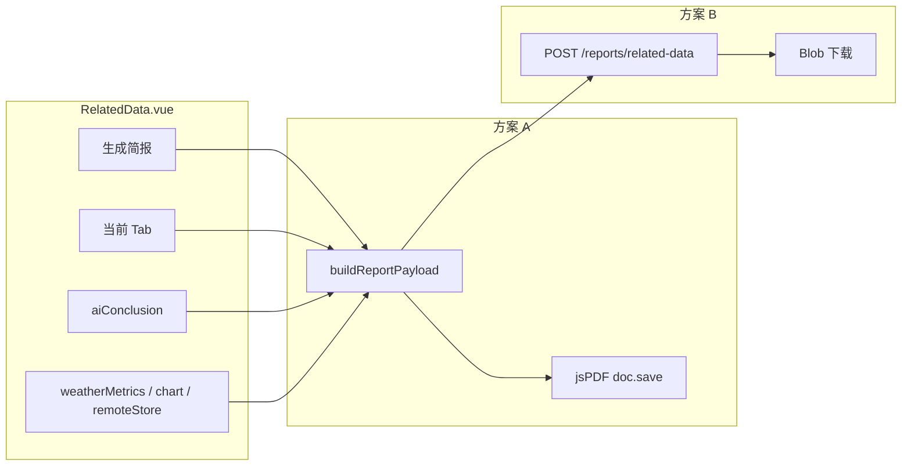

# 生成简报实现说明：从模拟下载到真实 PDF

> **涉及页面**：`src/views/user/RelatedData.vue`  
> **关联需求**：[需求确认表.md](../../Intro/需求确认表.md) · 简报管理 ·「模拟聚合 30 天数据，展示进度条并成功导出 PDF」  
> **当前状态**：**仅 UI 模拟**（进度条 + Toast，无真实文件）  
> **文档性质**：实现方案 + 分步落地指南  
> **完成日期**：2026-06-05

---

## 1. 现状：模拟实现在做什么

`RelatedData.vue` 中简报逻辑如下：

```ts
const handleGenerateReport = () => {
  reportModalVisible.value = true
  reportProgress.value = 0
  timer = setInterval(() => {
    if (reportProgress.value >= 100) clearInterval(timer)
    else reportProgress.value += 10
  }, 200)
}

const handleDownload = () => {
  reportModalVisible.value = false
  message.success(`已下载《${currentTabName.value}分析简报.pdf》`)
}
```

| 步骤 | 用户看到 | 实际发生 |
|------|----------|----------|
| 点击「生成 XXX 简报」 | 弹窗 + 进度条 | `setInterval` 假进度到 100% |
| 点击「确定」 | Toast「已下载…pdf」 | **未创建任何 Blob / 未触发浏览器下载** |

说明书与 [说明书状况.md](../../Intro/降重/说明书状况.md) 已标注：**前端模拟，不生成真实 PDF**。

---

## 2. 真实简报应包含什么

按当前 Tab 与已有数据源，建议 PDF 结构统一为：

```text
┌─────────────────────────────────────┐
│ 封面：青禾智匠 · {Tab名} 数据简报      │
│ 生成时间 / 统计周期（近 30 天）        │
├─────────────────────────────────────┤
│ 一、数据概览（表格或 KPI）             │
│ 二、可视化（折线图 / 9 项指标 / 地图截图）│
│ 三、AI 智能分析（aiConclusion 原文）   │
│ 四、数据来源说明（Mock / 监测站名）     │
└─────────────────────────────────────┘
```

### 2.1 各 Tab 数据来源（可直接复用页面现有 computed）

| Tab | 概览数据 | 图表/截图 | AI 文案 |
|-----|----------|-----------|---------|
| 传感器 (地) | `buildTrendSeries()` 7 日报警次数 | ECharts 折线图 `getDataURL()` | `aiConclusion`（sensor 分支） |
| 无人机 (空) | `remoteStore.selectedFieldId`、影像日期、是否对比 | 地图截图（可选）或 NDVI 文字摘要 | `buildDroneAiConclusion()` |
| 气象 (天) | `selectedWeatherPointId` + `weatherMetrics` 9 项 | 9 项表格即可 | `buildWeatherAiConclusion()` |
| GIS (图) | `lastMoistureQuery` 或默认墒情描述 | 地图截图（可选） | GIS AI 分支 |

**关键原则：** 简报内容应来自与页面展示**同一套** Store / computed，避免 PDF 与界面数据不一致。

---

## 3. 三种实现路线对比

| 方案 | 生成位置 | 依赖 | 优点 | 缺点 | 适用 |
|------|----------|------|------|------|------|
| **A. 纯前端 PDF** | 浏览器 | `jspdf` (+ `jspdf-autotable`, 可选 `html2canvas`) | 不改 Mock；答辩可立刻下载真 PDF | 大图表/中文需字体配置；无服务端归档 | **演示 / 小挑答辩（推荐先做）** |
| **B. Mock 接口出 PDF** | Node `server.ts` | `pdfkit` | 前后端分离清晰；可模拟「聚合 30 天」 | 需在 Mock 写 PDF 逻辑 | 与现有 json-server 架构一致 |
| **C. 生产后端** | Java / Python 等 | 报表服务 / 模板引擎 | 真聚合、权限、存档 | 工作量大 | 上线后替换 Mock |

**建议路径：** A（1～2 天可落地）→ 有需要再演进到 B 或 C。

---

## 4. 方案 A：纯前端生成 PDF（推荐首选）

### 4.1 安装依赖

```bash
pnpm add jspdf jspdf-autotable
# 若要把 ECharts / DOM 截图放进 PDF：
pnpm add html2canvas
```

### 4.2 新建工具模块

建议路径：`src/utils/report/generateRelatedDataReport.ts`

```ts
import jsPDF from 'jspdf'
import autoTable from 'jspdf-autotable'

export interface ReportPayload {
  tabLabel: string
  title: string
  subtitle: string
  period: string
  summaryRows: Array<[string, string]>
  aiConclusion: string
  chartImageBase64?: string // data:image/png;base64,...
}

export function downloadRelatedDataReport(payload: ReportPayload) {
  const doc = new jsPDF({ unit: 'mm', format: 'a4' })
  const fileName = `${payload.tabLabel}分析简报_${formatFileStamp()}.pdf`

  doc.setFontSize(16)
  doc.text('AI技术赋能下的作物灾害智慧监测预警系统', 14, 18)
  doc.setFontSize(13)
  doc.text(payload.title, 14, 28)
  doc.setFontSize(10)
  doc.text(payload.subtitle, 14, 35)
  doc.text(`统计周期：${payload.period}`, 14, 42)
  doc.text(`生成时间：${new Date().toLocaleString()}`, 14, 48)

  autoTable(doc, {
    startY: 54,
    head: [['指标', '数值 / 说明']],
    body: payload.summaryRows,
    styles: { font: 'helvetica', fontSize: 10 }
  })

  let nextY = (doc as any).lastAutoTable.finalY + 8

  if (payload.chartImageBase64) {
    doc.text('趋势图', 14, nextY)
    doc.addImage(payload.chartImageBase64, 'PNG', 14, nextY + 4, 180, 70)
    nextY += 78
  }

  doc.text('AI 智能分析', 14, nextY)
  const lines = doc.splitTextToSize(payload.aiConclusion, 180)
  doc.text(lines, 14, nextY + 6)

  doc.save(fileName)
}

function formatFileStamp() {
  const d = new Date()
  const pad = (n: number) => String(n).padStart(2, '0')
  return `${d.getFullYear()}${pad(d.getMonth() + 1)}${pad(d.getDate())}_${pad(d.getHours())}${pad(d.getMinutes())}`
}
```

> **中文显示：** jsPDF 默认 Helvetica 不支持中文。答辩若必须中文 PDF，需引入中文字体（如 Noto Sans SC 的 `.ttf`），用 `doc.addFileToVFS` + `doc.addFont` 注册后再 `setFont`。或先用英文/数字 KPI，正文 AI 结论用拼音缩写做 MVP。

### 4.3 改造 `RelatedData.vue`

**（1）组装 payload（按 Tab）**

```ts
import { downloadRelatedDataReport } from '@/utils/report/generateRelatedDataReport'

function buildReportPayload() {
  const tab = currentTab.value
  const base = {
    tabLabel: currentTabName.value ?? '相关数据',
    title: currentTitle.value ?? '数据简报',
    subtitle: currentSubtitle.value ?? '',
    period: '近 30 天',
    aiConclusion: aiConclusion.value
  }

  if (tab === 'sensor') {
    const { labels, counts } = buildTrendSeries()
    return {
      ...base,
      summaryRows: labels.map((label, i) => [`${label} 报警次数`, `${counts[i]} 次`]),
      chartImageBase64: chartInstance?.getDataURL({ type: 'png', pixelRatio: 2, backgroundColor: '#1a2a1a' })
    }
  }

  if (tab === 'weather') {
    return {
      ...base,
      summaryRows: weatherMetrics.value.map((m) => [m.label, m.value])
    }
  }

  // drone / gis：summaryRows 填地块、日期、查值结果等
  return { ...base, summaryRows: [['说明', '详见系统当前视图']] }
}
```

**（2）替换 `handleDownload`**

```ts
const handleDownload = () => {
  try {
    const payload = buildReportPayload()
    downloadRelatedDataReport(payload)
    reportModalVisible.value = false
    message.success(`已下载《${currentTabName.value}分析简报.pdf》`)
  } catch (e) {
    console.error(e)
    message.error('简报生成失败，请重试')
  }
}
```

**（3）进度条与真实生成对齐**

真生成通常 < 1s，可保留进度条体验：

```ts
const handleGenerateReport = async () => {
  reportModalVisible.value = true
  reportProgress.value = 10
  await nextTick()
  reportProgress.value = 60
  // 可选：await 预加载字体 / 导出图表
  reportProgress.value = 100
}
```

用户点「确定」时再 `handleDownload` 触发 `doc.save()`；或在进度到 100% 时自动下载并关弹窗。

### 4.4 浏览器下载原理

```ts
doc.save(fileName)
// 内部等价于：Blob → URL.createObjectURL → <a download> → click → revokeObjectURL
```

无需后端参与，文件直接落在用户「下载」目录。

---

## 5. 方案 B：Mock 接口返回 PDF 二进制

适合强调「接口化导出」或与需求表「服务端聚合 30 天」对齐。

### 5.1 Mock 路由（`src/mock/server.ts`）

```bash
pnpm add pdfkit
pnpm add -D @types/pdfkit
```

```ts
import PDFDocument from 'pdfkit'

server.post('/reports/related-data', (req: Request, res: Response) => {
  const { tab, tabLabel, title, summaryRows = [], aiConclusion = '' } = req.body ?? {}
  const doc = new PDFDocument({ margin: 50 })
  const chunks: Buffer[] = []

  doc.on('data', (chunk) => chunks.push(chunk))
  doc.on('end', () => {
    const pdf = Buffer.concat(chunks)
    res.setHeader('Content-Type', 'application/pdf')
    res.setHeader(
      'Content-Disposition',
      `attachment; filename="${encodeURIComponent(tabLabel || tab)}简报.pdf"`
    )
    res.send(pdf)
  })

  doc.fontSize(18).text('青禾智匠数据简报')
  doc.moveDown().fontSize(12).text(title || tab)
  summaryRows.forEach(([k, v]: [string, string]) => doc.text(`${k}: ${v}`))
  doc.moveDown().text('AI 分析：').text(aiConclusion)
  doc.end()
})
```

`deploy/api_mock/server.js` 需同步注册同一路由。

### 5.2 前端请求

```ts
import http from '@/utils/http'

async function downloadReportFromApi(payload: ReportPayload) {
  const res = await http.post('/reports/related-data', payload, {
    responseType: 'blob',
    timeout: 30000
  })
  const blob = new Blob([res.data], { type: 'application/pdf' })
  const url = URL.createObjectURL(blob)
  const a = document.createElement('a')
  a.href = url
  a.download = `${payload.tabLabel}分析简报.pdf`
  a.click()
  URL.revokeObjectURL(url)
}
```

`http.ts` 默认 `responseType: json`，此接口须单独指定 `blob`。

### 5.3 「近 30 天聚合」放在哪

| 层级 | 做法 |
|------|------|
| Mock | 在 `agriMockCore.cjs` 新增 `buildSensorMonthlySummary(db)`，按 `alerts.time` 过滤 30 天 |
| 前端 | 继续用 `buildTrendSeries()` 仅 7 天 → 扩展为 30 天环或按周聚合 |
| 生产 | 后端 SQL / 时序库聚合后写入 PDF 模板 |

---

## 6. 方案 C：生产环境（简述）

1. 后端提供 `POST /api/v1/reports/related-data`，Body 含 `tab`、`pointId`、`fieldId`、`dateRange`。  
2. 服务端查询真实库 → 渲染 PDF（Java iText、Python ReportLab、Node pdfkit 均可）。  
3. 返回 `application/pdf` 或先上传 OSS 再返回 signed URL。  
4. 前端仅负责传参 + Blob 下载，**不要**在生产环境用纯前端拼业务数据（易篡改、难审计）。

---

## 7. 推荐实施步骤（方案 A）

| 步骤 | 任务 | 产出 |
|------|------|------|
| 1 | `pnpm add jspdf jspdf-autotable` | 依赖就绪 |
| 2 | 新建 `src/utils/report/generateRelatedDataReport.ts` | 通用 PDF 下载函数 |
| 3 | `RelatedData.vue` 增加 `buildReportPayload()` | 四 Tab 摘要字段 |
| 4 | 传感器 Tab 接入 `chartInstance.getDataURL()` | PDF 含折线图 |
| 5 | 气象 Tab 接入 `weatherMetrics` 表格 | PDF 含 9 项 |
| 6 | 替换 `handleDownload` 调用 `downloadRelatedDataReport` | **真下载** |
| 7 | （可选）中文字体 + 封面 logo | 答辩排版 |
| 8 | 手测四 Tab 各生成一次 | 验收通过 |

---

## 8. 验收清单

- [ ] 点击「确定」后浏览器下载栏出现 `.pdf` 文件  
- [ ] 文件可本地打开，非 0 字节、非损坏  
- [ ] PDF 标题 / Tab 名 / 生成时间与当前界面一致  
- [ ] 传感器简报含 7 日（或 30 日）统计与 AI 文案  
- [ ] 气象简报含当前所选监测站 9 项与 AI 文案  
- [ ] 无人机 / GIS 简报含当前地块或查值上下文  
- [ ] 失败时有 `message.error`，不会假成功 Toast  
- [ ] 说明书 / 测试点改为「已支持 PDF 导出（前端生成）」或注明实现方式  

---

## 9. 与现有代码的关系



| 文件 | 改动类型 |
|------|----------|
| `src/views/user/RelatedData.vue` | 替换 `handleDownload`、新增 `buildReportPayload` |
| `src/utils/report/generateRelatedDataReport.ts` | **新建**（方案 A） |
| `src/mock/server.ts` | 新增 POST 路由（方案 B） |
| `deploy/api_mock/server.js` | 与本地 Mock 同步（方案 B） |
| `package.json` | 增加 `jspdf` 或 `pdfkit` |

**不必改：** `RemoteSensingMap`、Pinia Store 结构（除非要做 30 天服务端聚合）。

---

## 10. 答辩表述建议

> 「相关数据模块支持按当前数据源生成 PDF 简报，内容包含统计周期内的关键指标、趋势图（或监测站读数）及 AI 分析结论，用于归档与汇报。当前版本为前端/Mock 演示导出；生产环境可替换为服务端报表引擎，接口形状保持不变。」

与 [说明书状况.md](../../Intro/降重/说明书状况.md) 对齐：实现真 PDF 后，将「假下载」改为「前端 PDF 导出」或「Mock 接口 PDF」，避免过度承诺「云端归档」。

---

## 11. 相关文档

| 文档 | 用途 |
|------|------|
| [related-data升级.md](../../页面设置/related-data升级.md) | 简报 UI 雏形来源 |
| [P0完成计划.md](./P0完成计划.md) | 简报行为「未改逻辑」基线 |
| [气象Tab动态数据学习笔记.md](./气象Tab动态数据学习笔记.md) | 气象 Tab 9 项数据来源 |
| [需求确认表.md](../../Intro/需求确认表.md) | 原始功能需求 |

---

*文档版本：v1.0 · 生成简报真实 PDF 实现说明 · 2026-06-05*
